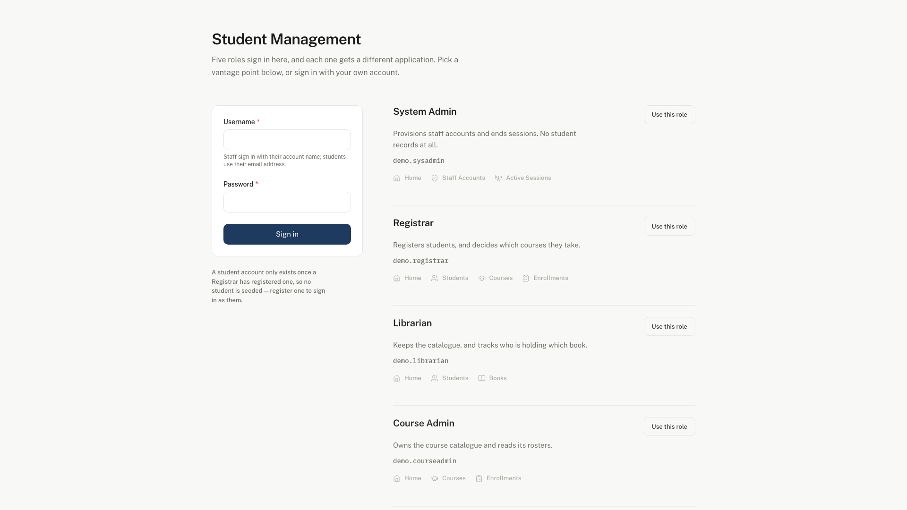
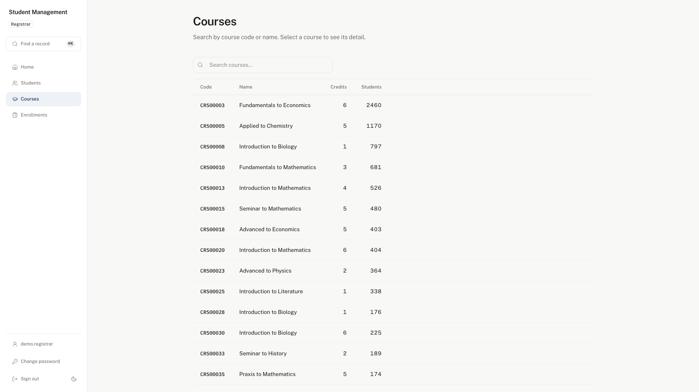
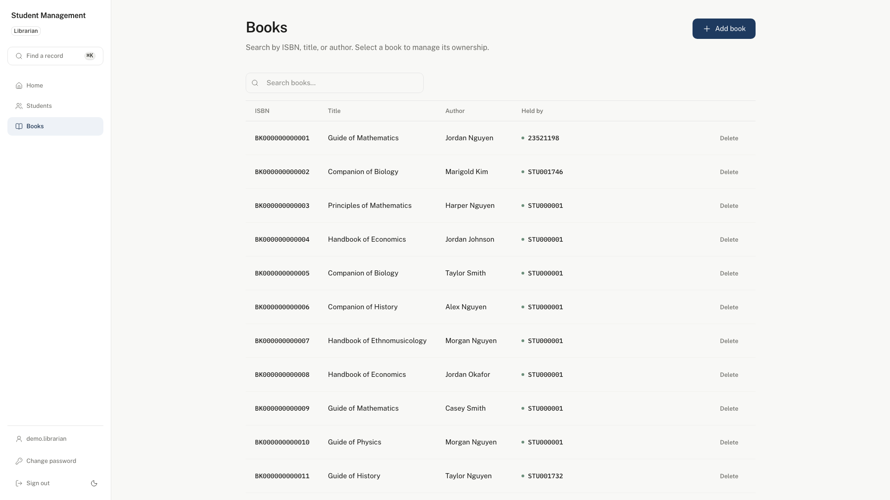
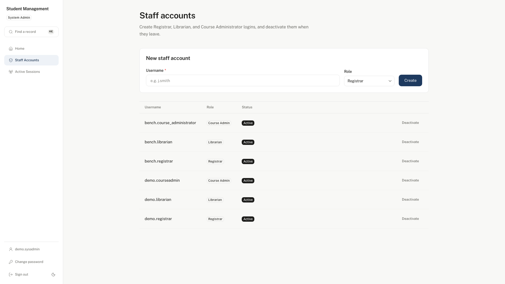

# Student Management System

## What is this?

This is a system for keeping track of **students, the books they borrow, and the courses they take** — the kind of record-keeping a school, training center, or library would need day to day.

Think of it as the digital version of three linked ledgers:

- **A student register** — who is enrolled, with their contact details and a unique student code.
- **A book log** — which books exist, and which student (if any) currently has each one checked out.
- **A course catalog** — which courses are offered, and who is enrolled in each one.

The system makes sure these three records stay consistent with each other automatically. For example, if a student leaves the school and their record is deleted, any book they had is automatically marked as "returned" (no longer assigned to them) and they're automatically removed from any course rosters — without anyone needing to update those records by hand.

## Who is it for, and what problem does it solve?

Anywhere that manually tracks "which student has which book" or "who's enrolled in which course" using spreadsheets runs into the same problems over time: duplicate entries, forgotten updates, and records that quietly go out of sync with each other (e.g., a book still shown as "borrowed" by a student who left months ago).

This system exists to prevent that by enforcing a few simple rules automatically:

- Every student, book, and course has a unique identifying code — no accidental duplicates.
- A student can't be enrolled in the same course twice.
- Returning a book or leaving a course never deletes the book or course itself — only the link between it and the student is removed.
- Removing a student or a course automatically cleans up everything connected to it, in one safe step, so nothing is left dangling.

## What can it actually do?

In plain terms, the system supports:

- **Adding, viewing, updating, and removing** students, books, and courses.
- **Assigning a book to a student** (and later marking it returned/unassigned).
- **Enrolling a student in a course** (and later unenrolling them).
- **Looking things up**, such as "which books does this student have?" or "who is enrolled in this course?"

Only authorized, logged-in users can make changes (add, edit, delete), and **each role sees only the records its own work needs**: a registrar works with students, courses, and enrollments; a librarian with books and with who is holding them; a course administrator with courses and their rosters. A student sees their own record, their own books, and their own courses — nobody else's.

Everything is addressed by a code a person can read out loud — a student code, a course code, an ISBN. Nobody using the system ever handles a database record number.

If someone tries to do something that doesn't make sense — like enrolling in the same course twice, or looking up a student that doesn't exist — the system rejects the request with a clear explanation rather than silently doing the wrong thing.

## Screenshots

One demo UI, five logins — each role sees only its own slice of the system.

 

 **Sign in** — a demo account per role, so anyone can try all five without a real registration.

 
**Registrar** — courses, enrollment counts, and (elsewhere in the app) the student register.



**Librarian** — the book catalog, who currently holds each book, and adding/removing books. 



**System Administrator** — provisioning and deactivating Registrar/Librarian/Course Administrator accounts, and (elsewhere) ending active sessions.

## How is it built? (for technical readers)

Under the hood, this is a Java/Spring Boot REST API, with a Next.js demo UI over it. It's built as a portfolio-grade example of clean, modular backend architecture, with layered code, input validation, proper error handling, and a real relational database (MySQL) enforcing data integrity.

- `management/` — the API. Spring Boot 4 / Spring Modulith, MySQL 8, Flyway.
- `management-frontend/` — the demo UI. Next.js 16, TypeScript, Chakra UI v3.
- `docs/` — Markdown sources for the BA, PM, SA, Testing, and UI-UX document sets. The HTML is generated (`make -C docs-v00 docs`), not committed.
- `util/` — build tooling; currently the docs Markdown → HTML compiler.

For architecture details, module boundaries, database design, and the technical roadmap, see the documentation: [Document](docs/).

## Engineering Highlights

This project is built the way a specification-driven team would build it — business rules and use cases written down first, code and tests traced back to them by ID, and nothing marked "done" without evidence.

- **Every requirement is traceable, both ways.** The chain runs business rule (`req.md`) → use case (`UC-1`…`UC-28`) → user story (`US-1.1`…`US-7.4`) → test case (`TC-*`), and code/Javadoc cite the same IDs back. Read [`docs/BA-docs/`](docs/BA-docs/) for the rules and flows, or [`docs/Testing/README.md`](docs/Testing/README.md) for the UC → test-case index.
- **All 28 use cases are implemented and covered by 211 automated test cases** — unit tests, Spring-Modulith Testcontainers integration tests against a real MySQL instance, and architecture-conformance tests, with 0 known gaps against `req.md`'s invariants.
- **The module architecture is enforced, not just documented.** ArchUnit and `ApplicationModules.verify()` fail the build if a module reaches into another module's internals, if a layer is skipped, or if a class is named or placed outside convention — the boundaries in [`docs/SA-docs/02-component-diagram.md`](docs/SA-docs/02-component-diagram.md) are guarantees, not diagrams someone forgot to update.
- **Role-based access is centralized and exhaustively tested.** Five roles (System Administrator, Registrar, Librarian, Course Administrator, Student), one authorization gateway, and a full RBAC matrix test that pins what every role can and cannot reach.
- **Referential integrity is automatic, not procedural.** Deleting a student cascades — books are unassigned, enrollments end, the account is removed — as one guaranteed outcome of a domain event, not a checklist a person has to remember.
- **Every pull request runs the whole suite for real**, not against a mock: architecture rules, module-boundary verification, and full integration tests against a live MySQL 8 service container, plus a JaCoCo coverage report — see [Continuous Integration](#continuous-integration) below.

## Performance

Most portfolio projects assert performance; this one measures it and writes down what it finds — including when the finding is inconvenient.

[`docs/benchmark-strategy/`](docs/benchmark-strategy/) documents a hazard-driven benchmarking practice: **eight specific, expensive code paths were identified by reading the shipped implementation** — not guessed — each cited by file and line (e.g. a leading-wildcard search that scans its table twice per request, an N+1 course lookup while listing enrollments, deep `OFFSET` pagination). Each hazard was then given a load-testing scenario and measured with **k6** against the real API and a real MySQL 8 database, at three generated dataset sizes:

| Scale | Students | Courses | Books | Enrollments |
| --- | --- | --- | --- | --- |
| S1 — smoke | 50 | 20 | 100 | ~150 |
| S2 — Institution (the scale the targets are written for) | 5,000 | 300 | 8,000 | 30,000 |
| S3 — stress probe | 50,000 | 1,000 | 80,000 | ~400,000 |

The first baseline runs (2026-08-26, recorded in [`docs/benchmark-strategy/result/`](docs/benchmark-strategy/result/)) came back with **0% errors and 100% of response-correctness checks passing** — tens of thousands of assertions across every scenario, at every scale. Latency is where it gets honest: on the shared 4-core laptop the runs were taken on, every scenario missed its proposed response-time target, including simple by-key lookups that should be flat — and the record says so plainly, rather than reporting only the numbers that looked good. The leading cause, documented rather than hidden, was a confound between genuine per-row query cost and 20 simulated users queuing against a connection pool left at its framework default of 10.

What the data *does* already show cleanly is the shape of the curve, which is exactly what this exercise was designed to find: search/list endpoints grow sharply between the 5,000-row and 50,000-row datasets — e.g. for student search, the response time faster than 95% of all requests goes from 263 ms at the 5,000-student scale to 1.65 s at the 50,000-student scale — consistent with the full-table-scan hazard the code review flagged before a single request was fired against it. That match — predicted from reading the code, then confirmed under load — is the actual point of the exercise, more than any individual millisecond figure.

A second pass (2026-08-27, same result folder) finished the job: write, login, batch, cascade-delete, and a 30-minute mixed-role soak, closing out every remaining hazard. `BM-XC-003` — a connection-pool sweep held back specifically to answer the confound above — resolved it cleanly: throughput plateaus at ~34 req/s starting at exactly 10 concurrent users (the pool size), while latency keeps climbing past that point. The 2026-08-26 numbers were real query cost *plus* pool queueing, and the two are now separable. The same pass put a number on the hazards nobody had measured yet: BCrypt at the framework's own strength-10 default costs **≈91 ms per hash** (JMH curve, doubling per strength level as the algorithm predicts), which is the floor under every login and registration number recorded; a 200-course batch enrollment costs **~2.95 s p95** against ~660 ms for 10 courses, pricing the documented trade-off in `api-specification.md` rather than arguing with it; and a 200-student bulk delete leaves **the majority of its async cascade-cleanup events permanently unresolved** in Spring Modulith's own event-publication log, even though the data itself stays consistent (the foreign keys enforce it synchronously, independent of the async listener) — a real finding about the audit trail, not about data integrity, and exactly the failure mode the hazard register predicted before a single delete was fired.

Two of those runs also found bugs in the *benchmark harness itself* — a seed-data column that silently broke every write scenario, and a signal-handling bug that silently dropped a companion script's output — both root-caused from a stack trace or a direct reproduction, fixed in the same sitting, and written up next to the numbers they affected rather than quietly patched away. That's the same standard the rest of this project holds itself to, applied to the measurement tooling too.

## Getting Started

### Prerequisites

- JDK 21
- Docker (or [Colima](https://github.com/abiosoft/colima) on macOS) — needed both to run MySQL via `docker-compose.yml` and for the [Testcontainers](https://testcontainers.com/)-backed integration tests
- The Maven wrapper (`./mvnw`) checked into `management/` — no local Maven install required
- Node.js 20+ — for the demo UI (`management-frontend/`) and the docs compiler (`util/`)

### 1. Start the database

```sh
make -C management up
```

This creates `.env` from `.env.example` if missing (see `.env.example` for the MySQL credentials/port and the `INITIAL_PASSWORD_KEY` used to encrypt students' initial passwords), starts Colima if needed, then brings up the `management-mysql` container defined in `docker-compose.yml`. The database targets live in `management/Makefile` — run them from the repo root with `-C management`, or `cd management` first.

Other useful targets: `make -C management down` (stop), `make -C management logs` (tail MySQL logs), `make -C management mysql` (open a MySQL shell), `make -C management reset` (wipe the data volume and start fresh). Run `make -C management help` to list them all.

### 2. Run the app

```sh
cd management
./mvnw spring-boot:run
```

The API listens on `http://localhost:8080` by default, backed by the MySQL instance started in step 1 (Flyway migrates the schema automatically on startup).

### 3. Run the demo UI

```sh
cd management-frontend
npm install
npm run dev
```

Open `http://localhost:3000`. The login page lists the seeded demo accounts, one per role — sign in as each in turn to see how the same system looks to a registrar, a librarian, a course administrator, and a student.

Requests are proxied to the API through Next's rewrites, because the backend authenticates with a session cookie and registers no CORS configuration; `BACKEND_ORIGIN` overrides the target if the API is not on `:8080`. See [`management-frontend/README.md`](management-frontend/README.md).

### 4. Run the test suite

```sh
cd management
./mvnw test      # unit + architecture (ArchUnit) + Testcontainers-backed integration tests
./mvnw verify     # same, plus packaging and the JaCoCo coverage report
```

The integration tests (`*IntegrationTest`) spin up their own throwaway MySQL container per class via Testcontainers — they don't need `make -C management up` to be running, just a working Docker daemon.

> **Colima users:** if a test run fails immediately with `Container startup failed for image testcontainers/ryuk:0.14.0` / `error while creating mount source path '.../docker.sock'`, Testcontainers is trying to bind-mount the host-side socket path into the Ryuk cleanup sidecar, which Colima's VM cannot do. Point it at the socket's path *inside* the VM instead:
> ```sh
> TESTCONTAINERS_DOCKER_SOCKET_OVERRIDE=/var/run/docker.sock ./mvnw verify
> ```
> `TESTCONTAINERS_RYUK_DISABLED=true` also gets the run through, but by switching off container cleanup rather than fixing the mount — prefer the override.

After `./mvnw verify`, the coverage report is at `management/target/site/jacoco/index.html`.

### 5. Build / package

```sh
cd management
./mvnw package             # produces management/target/management-<version>.jar (runs tests first)
./mvnw package -DskipTests # same, skipping tests for a faster local build

java -jar target/management-*.jar
```

## Continuous Integration

Every pull request against `main` triggers the [`CI` workflow](.github/workflows/ci.yml), which:

1. Checks out the repository and sets up JDK 21 (Temurin), matching `management/pom.xml`.
2. Starts a MySQL 8.4 service container (same defaults as `docker-compose.yml`) so Flyway-backed tests can run.
3. Runs `./mvnw verify` from `management/`, which compiles, runs the full test suite (unit tests, [ArchUnit](https://www.archunit.org/) architecture rules, the Spring Modulith module-boundary check, and the Testcontainers-backed integration suites), generates the JaCoCo coverage report, and packages the app.
4. Uploads the JaCoCo report (`management/target/site/jacoco/`) as a workflow artifact.

See [`docs/Testing/01-test-strategy.md`](docs/Testing/01-test-strategy.md) and [`docs/Testing/README.md`](docs/Testing/README.md) for the test strategy and the use-case → test-case traceability matrix. The ArchUnit rules under `management/src/test/java/org/phuchoang/management/architecture/` and the `shared/ModuleBoundaryTest` fail the build as soon as code violates the module layout.

To run the same check locally, see [Getting Started](#getting-started) above.

## Documentation

The Markdown under [`docs/`](docs/) is the source. To read it as a linked HTML site — with the mermaid and PlantUML diagrams rendered and click-to-zoom — generate it:

```sh
make -C docs-v00 docs         # compile docs/**/*.md → .html
make -C docs-v00 docs-watch   # ...and rebuild on every save
make -C docs-v00 docs-clean   # remove the generated HTML
```

The generated HTML is gitignored; edit the Markdown and regenerate. The compiler is [`util/md-to-html.js`](util/md-to-html.js), and the docs targets live in [`docs-v00/Makefile`](docs-v00/Makefile).
