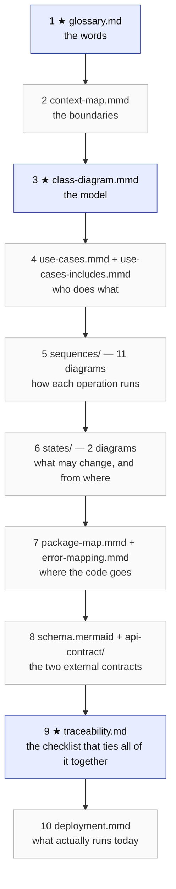

# Reading Order — start here

This folder documents one system: a Spring Boot REST API for students, books and courses. It is written to be read **in a specific order**, because each document assumes the one before it. Read it out of order and the diagrams look like they contradict each other — they don't; they are just layered.

**The rule:** *words → boundaries → structure → behaviour → the wire → what actually runs.*

Roughly 90 minutes end to end. If you have 15, read only the three files marked **★**.



---

## The path

### 1 ★ The words — [`diagram/glossary/glossary.md`](diagram/glossary/glossary.md)

*10 min.* Every other file uses these terms exactly. "Ownership", "Enrollment", "Aggregate Root", "Policy", "Conflict" all mean one specific thing here.

> Move on when you can say what an **Aggregate Root** is, and why `Book` holds an `ownerId` instead of a `Student`.

### 2 The boundaries — [`diagram/context/context-map.mmd`](diagram/context/context-map.mmd)

*5 min.* One bounded context, two modules: `academic` (Student, Course, Enrollment) and `library` (Book). Read rules **R1–R4** at the bottom of the file — they are the constraints every later diagram obeys.

> Move on when you can say why deleting a student is orchestrated in the application layer rather than by a database cascade.

### 3 ★ The model — [`diagram/classes/class-diagram.mmd`](diagram/classes/class-diagram.mmd)

*15 min.* The four aggregates, their value objects, repositories, the two policies, and the domain exceptions. The `note for ...` blocks at the bottom are the invariants — they are the actual business rules, not decoration.

> Move on when you can name the four aggregate roots and the invariant each one protects.

### 4 The use cases — [`diagram/use-cases/use-cases.mmd`](diagram/use-cases/use-cases.mmd), then [`use-cases-includes.mmd`](diagram/use-cases/use-cases-includes.mmd)

*10 min.* All 23 operations, grouped by the actor who triggers them. Association is shown by **containment**: a use case sits in its actor's lane, so there are no actor arrows to follow. The `«include»` relationships (the shared existence checks) are split into the second file on purpose.

> Move on when you can find the UC number for "assign a book to a student". (UC20.)

### 5 The behaviour — [`diagram/sequences/`](diagram/sequences/)

*30 min for all eleven.* One diagram per non-obvious operation. Read them in this order — each adds one idea to the last:

| # | File | The idea it adds |
|---|---|---|
| 1 | `create-student.mmd` | the shape of every write: validate → check uniqueness → build aggregate → save |
| 2 | `update-student.mmd` | uniqueness **excluding self** — the most-mis-implemented rule in the contract |
| 3 | `list-students.mmd` | the shape of every paged read, and why an empty result is 200 and not 404 |
| 4 | `enroll.mmd` | a domain policy enforcing an invariant (`assertNotEnrolled`) |
| 5 | `unenroll.mmd` | the mirror image, and why it 404s |
| 6 | `assign-book.mmd` | the single-owner invariant, and idempotent re-assignment |
| 7 | `unassign-book.mmd` | clearing a relationship without deleting the thing |
| 8 | `get-book-owner.mmd` | why two different 404s need two different codes |
| 9 | `delete-student.mmd`, then `delete-course.mmd`, `delete-book.mmd` | cross-module cleanup, in order, in one transaction |

`delete-student.mmd` is the hardest and most important one. Do not skip it.

> Move on when you can say where the `@Transactional` boundary opens and closes, and why it is never on a controller.

### 6 The lifecycles — [`diagram/states/`](diagram/states/)

*10 min.* [`book-ownership.mmd`](diagram/states/book-ownership.mmd) and [`enrollment.mmd`](diagram/states/enrollment.mmd). The sequences each show one operation; these show every state a relationship can be in and **all** the ways it changes — including the transitions that are rejected, with the status code each rejection produces.

> Move on when you can list the four different operations that can end an enrollment.

### 7 Where the code goes — [`diagram/architecture/package-map.mmd`](diagram/architecture/package-map.mmd), then [`error-mapping.mmd`](diagram/architecture/error-mapping.mmd)

*15 min.* The package map turns everything above into Java packages, and states the dependency rule: arrows point **inward** only. Read its bottom half too — it reconciles this structure with the flat one sketched in `req.md`, and documents the one deliberate trade-off (the domain aggregate is also the JPA entity). `error-mapping.mmd` then shows how a thrown exception becomes an HTTP response.

> Move on when you can say which layer is allowed to touch two aggregates in one call, and which layer may not import a DTO.

### 8 The two external contracts — [`database/schema.mermaid`](database/schema.mermaid) and [`api-contract/openapi.yml`](api-contract/openapi.yml)

*10 min.* The ER diagram is what the domain model looks like once it hits PostgreSQL. The OpenAPI contract is the wire format: paths in `api-contract/paths/`, schemas in `api-contract/components/schemas/`. [`api-contract-information.md`](api-contract-information.md) explains how that folder is organised and why it is split.

> Move on when you can point at the column that stores book ownership. (`books.student_id`.)

### 9 ★ The checklist — [`diagram/traceability.md`](diagram/traceability.md)

*10 min.* Every one of the 23 operations mapped to its use case, sequence diagram, service method, domain rule, success status and error statuses. **This is the working document.** Once you have read everything above, this is the only page you will keep open while implementing. Its last section lists the known implementation gaps.

### 10 What actually runs — [`diagram/deployment/deployment.mmd`](diagram/deployment/deployment.mmd)

*5 min.* Local topology: the app on the host JVM, PostgreSQL in a container under Colima, driven by the `Makefile`. It also lists what is *not* wired up yet (schema migrations, validation starter, security, Swagger UI) — read it before you try to run anything.

---

## Shortcuts by what you came here to do

| I want to… | Read, in this order |
|---|---|
| **Understand the system in 15 minutes** | `glossary.md` → `class-diagram.mmd` → `traceability.md` |
| **Implement one endpoint** | its row in `traceability.md` → its sequence diagram → its path file in `api-contract/paths/` → `package-map.mmd` for where the classes go |
| **Implement `DELETE /students/{id}`** | `delete-student.mmd` → both files in `states/` → `context-map.mmd` R4 |
| **Write tests** | `traceability.md` (coverage baseline) → `states/` (one test per transition, including the rejected ones) → `error-mapping.mmd` (one test per row) → `plan-springBootTestPlan.prompt.md` |
| **Review a pull request** | `package-map.mmd` (dependency rule) → `class-diagram.mmd` notes (invariants) → `traceability.md` (status codes) |
| **Change the domain model** | `glossary.md` first — add the term before the class → `class-diagram.mmd` → `context-map.mmd` → then everything downstream that names it |
| **Just run it** | `deployment.mmd` → the repo `README.md` and `Makefile` |

---

## How to open a `.mmd` file

The `.mmd` and `.mermaid` files are Mermaid source. Obsidian renders Mermaid **inside** a `mermaid` code fence in a Markdown note, but it does not open `.mmd` files directly. Three ways to see the picture:

- paste the file's contents into a `mermaid` code fence in any note, or
- open the file in VS Code with a Mermaid preview extension, or
- render it to an image:
  ```bash
  npx -y @mermaid-js/mermaid-cli@11 -i diagram/architecture/package-map.mmd -o package-map.png -w 2000 -b white
  ```

**Read the comments.** Every `.mmd` file here carries a `%%` header explaining how to read that specific diagram, and a `%%` footer with the rules, trade-offs and open questions that could not be drawn. In several files the footer is worth more than the picture — `package-map.mmd` and `class-diagram.mmd` especially. Comments do not appear in the rendered image, so read the source, not just the render.

---

## When two documents disagree

Later in this list wins over earlier — except that the code is never the authority on what the design *should* be.

1. [`diagram/glossary/glossary.md`](diagram/glossary/glossary.md) — the names. If the code uses a different word, the code is wrong.
2. [`api-contract/`](api-contract/) — the wire behaviour: paths, payloads, status codes.
3. The diagrams — the internal design. Where a diagram and `req.md` differ, the diagram is the decision and it says so in its footer.
4. [`req.md`](req.md) — the original brief. Still the best statement of *intent*, but its flat package layout and its `@Service`-holds-the-rules assumption were deliberately superseded; see the "Reconciling this with req.md" section of `package-map.mmd`.
5. [`plan-studentManagementDdd.prompt.md`](plan-studentManagementDdd.prompt.md) and [`plan-springBootTestPlan.prompt.md`](plan-springBootTestPlan.prompt.md) — how this documentation set was planned. Historical context, not specification. Note that the DDD plan says "two bounded contexts"; that was revised to one context with two modules — `context-map.mmd` explains why.

---

## Full inventory

| File | What it is |
|---|---|
| `diagram/glossary/glossary.md` | ubiquitous language |
| `diagram/context/context-map.mmd` | module map + the four architecture rules |
| `diagram/classes/class-diagram.mmd` | domain model, invariants as notes |
| `diagram/use-cases/use-cases.mmd` | 23 use cases in actor lanes |
| `diagram/use-cases/use-cases-includes.mmd` | the shared existence checks |
| `diagram/sequences/*.mmd` | 11 operation flows |
| `diagram/states/book-ownership.mmd` | book ownership lifecycle |
| `diagram/states/enrollment.mmd` | enrollment lifecycle |
| `diagram/architecture/package-map.mmd` | Java packages + dependency rule |
| `diagram/architecture/error-mapping.mmd` | exception → HTTP status and code |
| `diagram/deployment/deployment.mmd` | local runtime topology |
| `diagram/traceability.md` | 23 operations × use case × sequence × rule × status |
| `database/schema.mermaid` | ER diagram |
| `api-contract/` | OpenAPI 3 contract, split by path and schema |
| `api-contract-information.md` | how the contract folder is organised |
| `req.md` | the original requirements brief |
| `plan-*.prompt.md` | the plans that produced these documents |
