# Student Management System — Activity Diagrams

Derived from [use-cases.md](./use-cases.md), which remains the authoritative source (actors, flows, business-rule traceability). Where the [use-case diagrams](./use-case-diagram.md) show *what* actors can do and how use cases relate, this document shows *how* each request actually flows: the actor/system steps, the validation decisions drawn from each use case's alternate/exception flows, and where each path terminates. One activity diagram is drawn per use case (25 total), grouped into the same six functional areas as the use-case diagrams, so the two document sets read side by side.

Diagrams are drawn in standard UML activity notation (swimlanes, decision diamonds, start/stop nodes) using [PlantUML](https://plantuml.com/activity-diagram-beta). Each `.svg` below is generated from the matching `.puml` source in [activity-diagram-assets/](./activity-diagram-assets/); edit the `.puml` file and re-render with `plantuml -tsvg *.puml` to update a diagram. Running `make docs` compiles this document to HTML with the same SVGs inlined, click-to-zoom and drag-to-pan, and keyboard access to the same viewer.

---

## Notation

| Symbol | Meaning |
| ------ | ------- |
| `\|Lane\|` heading | Swimlane — the actor or "System" performing the steps beneath it |
| Rounded box, e.g. `Create student record` | An activity (a single step) |
| Diamond with `yes`/`no` (or similar) branches | A decision point — usually a validation drawn from the use case's alternate/exception flows |
| Filled circle (●) | Start node |
| Circle with ring (◉) | Stop node — either a successful completion or a terminal rejection |
| Dashed reference, e.g. `Continue at UC-17` | Hand-off to another use case's activity diagram, rather than inlining it |

The six functional areas group the 25 use cases as follows (same grouping as [use-case-diagram.md](./use-case-diagram.md)):

| Area | Use Cases |
| ---- | --------- |
| Student Management | UC-1, UC-2, UC-3, UC-13, UC-17 |
| Book Management | UC-4, UC-5, UC-6, UC-7, UC-14, UC-18 |
| Course Management | UC-8, UC-9, UC-10, UC-15, UC-19 |
| Enrollment Management | UC-11, UC-12, UC-20 |
| Student Self-Service | UC-16 |
| Identity & Access | UC-21, UC-22, UC-23, UC-24, UC-25 |

---

## 1. Student Management

### UC-1 Register Student

Four sequential validations (code, email, name, date of birth) each terminate the flow on failure; success cascades into an automatic user-account creation.

### UC-2 Update Student Details

Same validation shape as UC-1, applied only to fields that changed; student code is immutable.

### UC-3 Remove Student

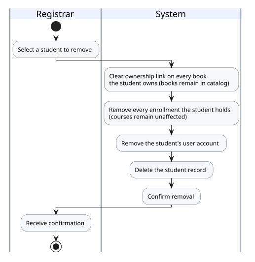

No validation branches — removal unconditionally cascades: books are unassigned (not deleted), enrollments are removed (courses untouched), and the student's user account is deleted along with the student record.

### UC-13 View/Search Students

Read-only lookup; selecting a result hands off to UC-17.

### UC-17 View Student Detail

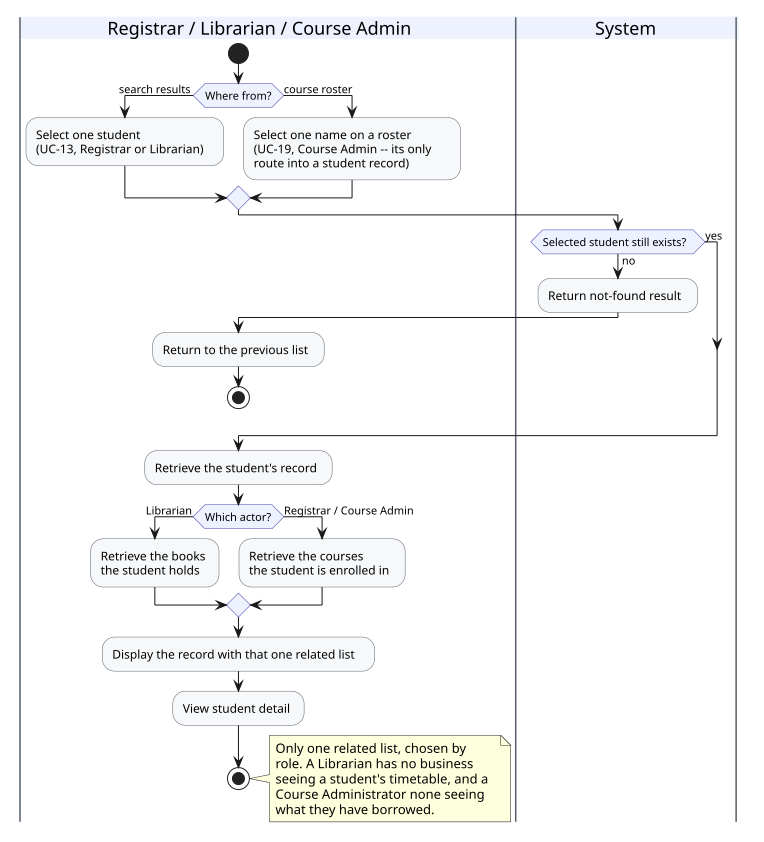

Extends UC-13. Guards against the selected student having been removed since the search ran.

---

## 2. Book Management

### UC-4 Add Book

ISBN uniqueness is always checked; the owner-existence check only applies if an owner was specified.

### UC-5 Assign Book to Student

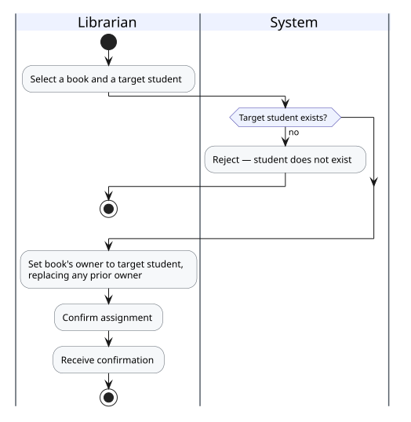

Reassignment silently replaces any prior owner — a book has at most one owner at a time.

### UC-6 Unassign Book

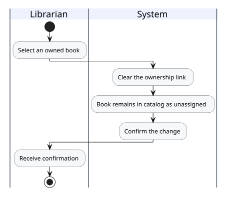

No decision branches — the book always remains in the catalog after its ownership link is cleared.

### UC-7 Remove Book

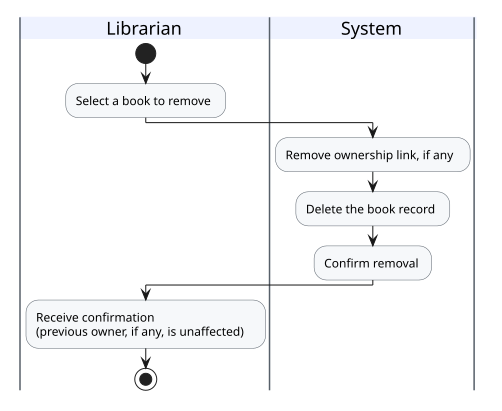

No decision branches — the previous owner, if any, is unaffected by the removal.

### UC-14 View/Search Books

Read-only lookup; selecting a result hands off to UC-18.

### UC-18 View Book Detail

Extends both UC-14 (search results) and UC-16 (a student's own book list) — reachable by either a Librarian or a Student.

---

## 3. Course Management

### UC-8 Create Course

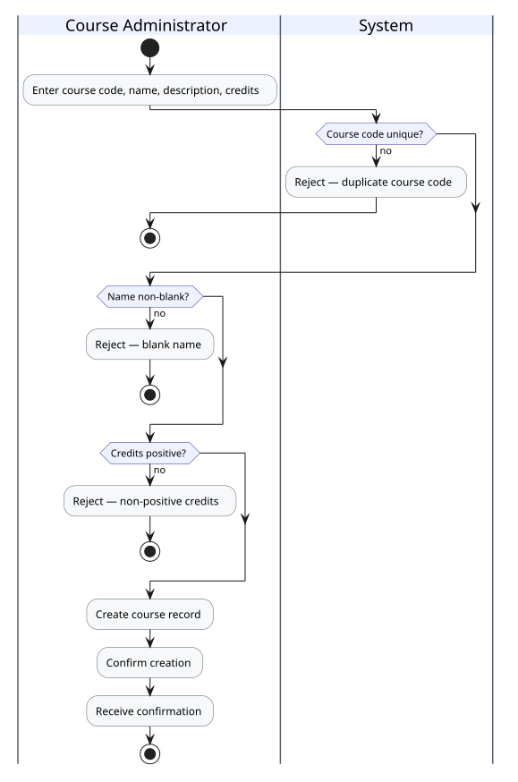

Mirrors UC-1's shape: sequential validations (code, name, credits) each terminate on failure.

### UC-9 Update Course

Validations apply only to changed fields; course code is immutable.

### UC-10 Remove Course

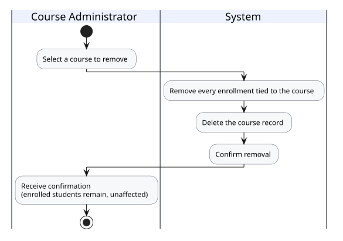

No validation branches — removal unconditionally cascades every tied enrollment; enrolled students are unaffected.

### UC-15 View/Search Courses

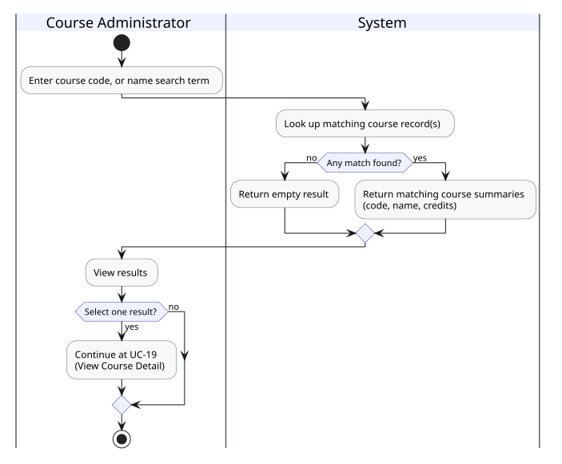

Read-only lookup; selecting a result hands off to UC-19.

### UC-19 View Course Detail

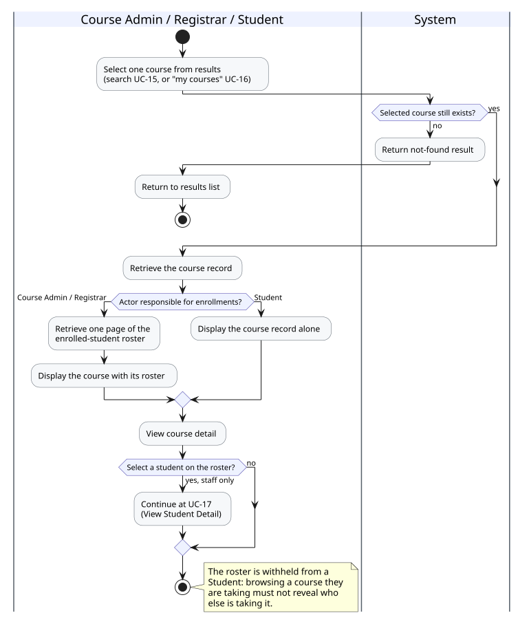

Extends UC-15 (search results) and UC-16 (a student's own course list). The roster branch is what differs by actor: staff see it, a Student does not. Selecting a name on the roster hands off to UC-17 — for a Course Administrator, the only route there.

---

## 4. Enrollment Management

### UC-11 Enroll Student in Course

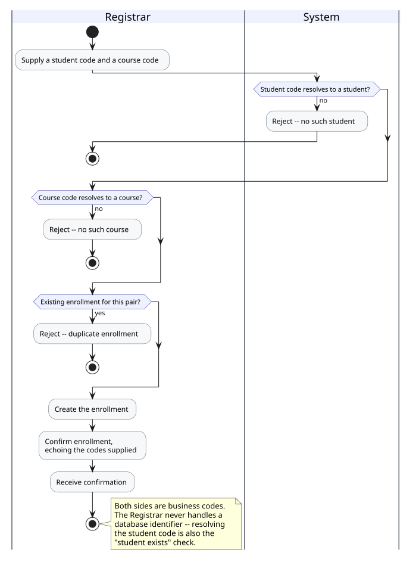

Three validations, in that order: the supplied **student code** resolves to a student, the **course code** resolves to a course, and no duplicate enrollment already exists for the pair. Registrar-only — student self-service enrollment is out of scope. Note that both inputs are business codes; resolving the student code is simultaneously the "student exists" check.

### UC-26 Enroll Student in Multiple Courses

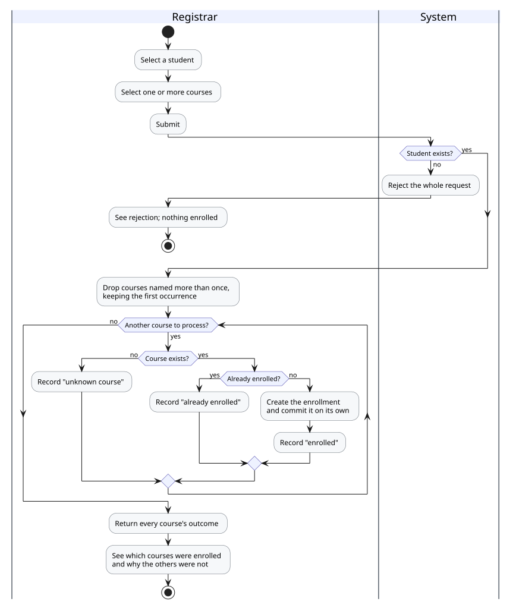

UC-11's three validations, applied once per course inside a loop. Two things the shape of the diagram is meant to make obvious. The student check sits *outside* the loop and rejects the entire request, because the student is the subject of the request rather than one of its items — an unknown student leaves every course unanswerable. The per-course checks sit *inside* it and record an outcome instead of aborting, so one duplicate or one bad code costs only itself. Each enrollment is committed on its own, which is why a course reported as enrolled stays enrolled even when a later course in the same request is rejected.

Duplicate course codes within one request are collapsed before the loop: enrolling and then immediately reporting "already enrolled" for the same code would be accurate about what happened and indistinguishable from a defect to whoever read it.

### UC-12 End Enrollment

Addressed by the same student code / course code pair as UC-11. One decision branch: an unknown student and a student who simply is not enrolled produce the *same* not-found answer, so ending an enrollment cannot be used to probe whether a student exists. Only the enrollment link is removed; the student and course records are both unaffected.

### UC-20 Look Up Enrollments

Two questions through one flow — "what is this student taking?" and "who is taking this course?" — distinguished only by which code the actor supplies. The two rejection branches at the top are the substance: exactly one code is required (neither would list every enrollment in the system; both would be the single entry the detail step already reaches), and a code matching nothing is reported as invalid rather than shown as an empty list that would read as "enrolled in nothing." Selecting either side of a result hands off to UC-17 or UC-19. A Student is not an actor here — see UC-16.

---

## 5. Student Self-Service

### UC-16 View Own Record, Books & Courses

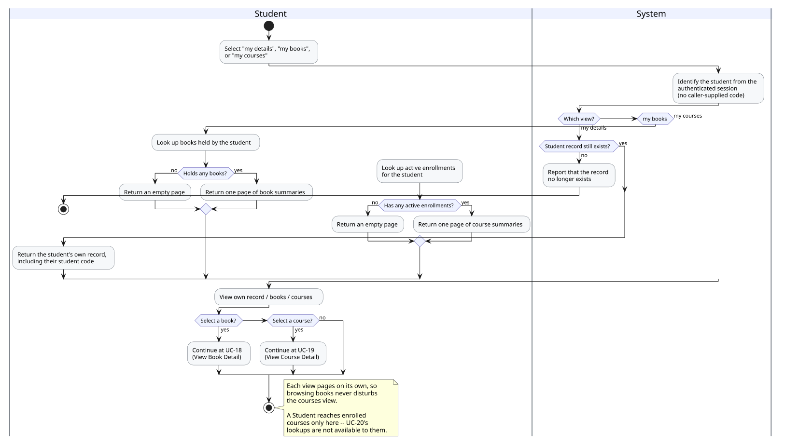

Three independent views (record, books, courses), each with its own empty-result branch; selecting an item hands off to UC-18 or UC-19. The first step is the interesting one: the system identifies the Student from the session rather than from anything they supply — the only lookup in the document set with no caller-supplied key.

---

## 6. Identity & Access

### UC-21 Login

On success, an account still on its system-issued initial password is routed straight into UC-22 — no other action is available until the password is changed.

### UC-22 Change Password

Three validations in sequence: retyped password matches, current password is correct, new password meets policy and differs from the current one.

### UC-23 View Student's Initial Password

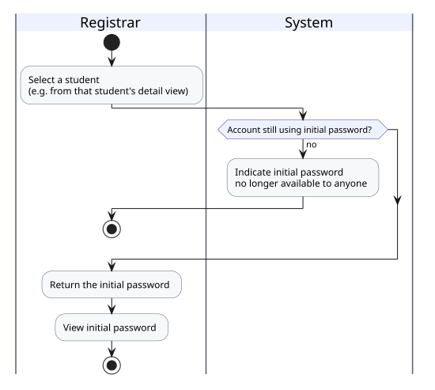

Registrar-only. The single branch reflects that this access is permanently revoked the moment the student replaces their initial password.

### UC-24 Create Staff Account

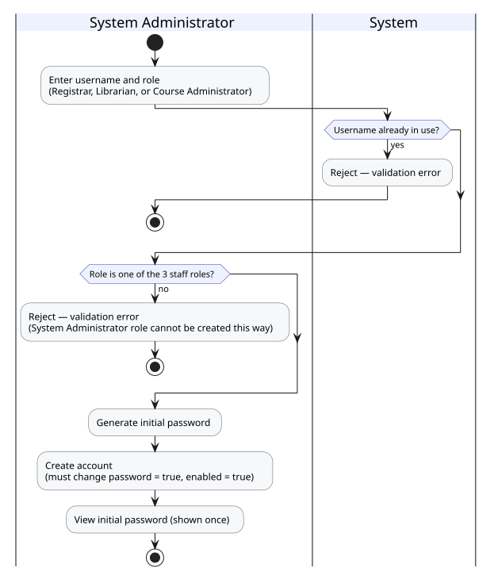

System Administrator-only. Role is restricted server-side to the 3 staff roles — a System Administrator account can never be created this way. Reuses the same initial-password generation as UC-1's provisioning tail.

### UC-25 Deactivate/Reactivate Staff Account

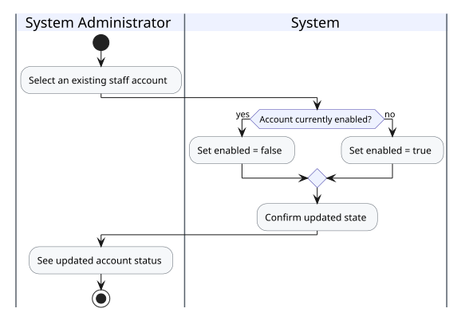

System Administrator-only. Enabling and disabling are symmetric — the same flow toggles the account's `enabled` state in either direction.

### UC-27 View Active Sessions

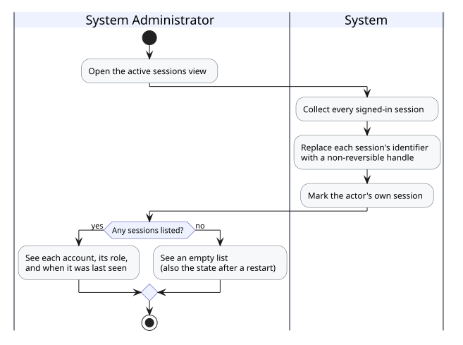

System Administrator-only, and a pure read. The one step worth its own box is replacing each session's identifier with a non-reversible handle: a session identifier is itself sufficient to impersonate its holder, so the view is built to be unable to leak one even onto a screen or into a screenshot. The empty branch is not only "nobody is signed in" — it is also the state immediately after a restart, since the record of who is signed in does not survive one, and nobody was signed out by it.

### UC-28 End an Active Session

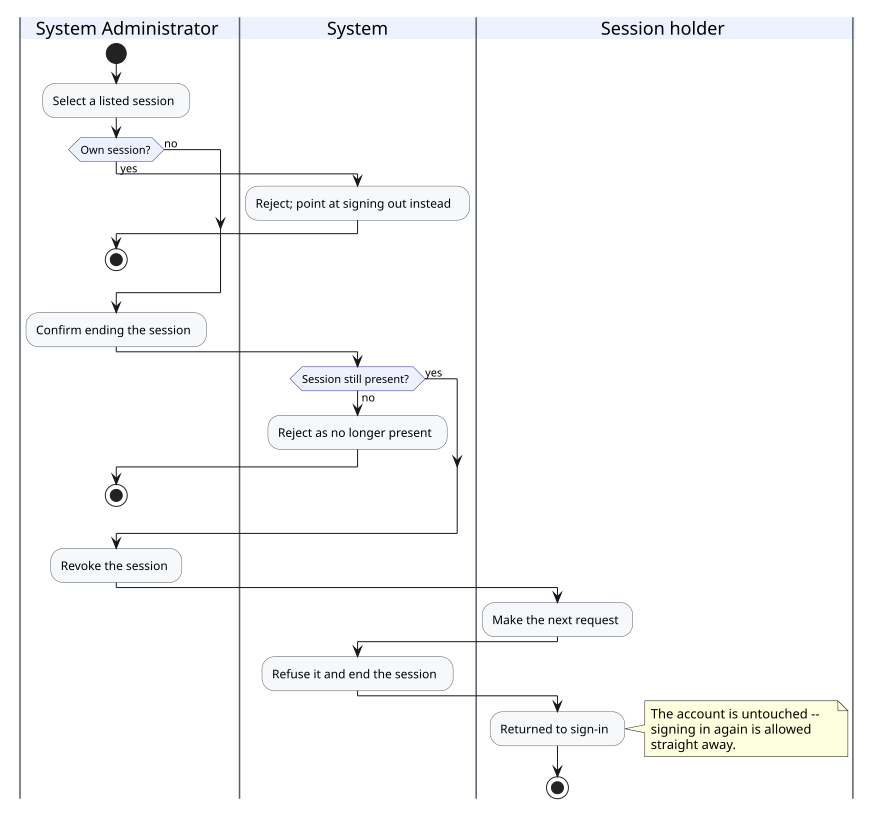

System Administrator-only. Two guards precede the act: the actor's own session is refused, since ending it from here is indistinguishable from the feature malfunctioning and signing out already does it deliberately; and a session that ended on its own between being listed and being confirmed is refused as no longer present.

The final swimlane is the part that distinguishes this from UC-25. Revocation is *deferred* — it takes effect when the holder makes their next request, not at the instant it is confirmed. Nothing can be done with the session in the meantime, which is the guarantee that matters, but "the session is gone now" would overstate it. And the account is untouched: the holder may sign in again immediately, where UC-25 would have blocked exactly that while leaving their current session running.

---

## Use Case Coverage

| Use Case | Diagram File | Primary Actor(s) |
| -------- | ------------ | ----------------- |
| UC-1 Register Student | `uc01-register-student.svg` | Registrar |
| UC-2 Update Student Details | `uc02-update-student.svg` | Registrar |
| UC-3 Remove Student | `uc03-remove-student.svg` | Registrar |
| UC-4 Add Book | `uc04-add-book.svg` | Librarian |
| UC-5 Assign Book to Student | `uc05-assign-book.svg` | Librarian |
| UC-6 Unassign Book | `uc06-unassign-book.svg` | Librarian |
| UC-7 Remove Book | `uc07-remove-book.svg` | Librarian |
| UC-8 Create Course | `uc08-create-course.svg` | Course Administrator |
| UC-9 Update Course | `uc09-update-course.svg` | Course Administrator |
| UC-10 Remove Course | `uc10-remove-course.svg` | Course Administrator |
| UC-11 Enroll Student in Course | `uc11-enroll-student.svg` | Registrar |
| UC-26 Enroll Student in Multiple Courses | `uc26-enroll-student-multiple-courses.svg` | Registrar |
| UC-12 End Enrollment | `uc12-end-enrollment.svg` | Registrar |
| UC-13 View/Search Students | `uc13-search-students.svg` | Registrar |
| UC-14 View/Search Books | `uc14-search-books.svg` | Librarian |
| UC-15 View/Search Courses | `uc15-search-courses.svg` | Course Administrator |
| UC-16 View Own Record, Books & Courses | `uc16-view-own.svg` | Student |
| UC-17 View Student Detail | `uc17-view-student-detail.svg` | Registrar / Librarian / Course Administrator |
| UC-18 View Book Detail | `uc18-view-book-detail.svg` | Librarian / Student |
| UC-19 View Course Detail | `uc19-view-course-detail.svg` | Course Administrator / Registrar / Student |
| UC-20 Look Up Enrollments | `uc20-view-enrollment-detail.svg` | Registrar / Course Administrator |
| UC-21 Login | `uc21-login.svg` | All actors |
| UC-22 Change Password | `uc22-change-password.svg` | All actors |
| UC-23 View Student's Initial Password | `uc23-view-initial-password.svg` | Registrar |
| UC-24 Create Staff Account | `uc24-create-staff-account.svg` | System Administrator |
| UC-25 Deactivate/Reactivate Staff Account | `uc25-deactivate-staff-account.svg` | System Administrator |
| UC-27 View Active Sessions | `uc27-view-active-sessions.svg` | System Administrator |
| UC-28 End an Active Session | `uc28-end-active-session.svg` | System Administrator |
