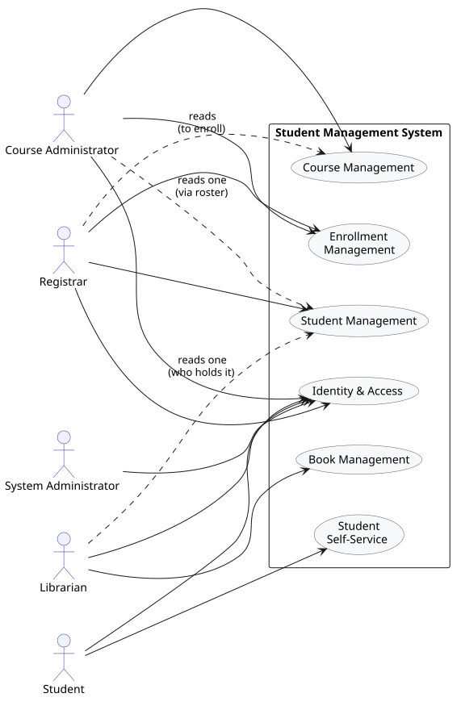
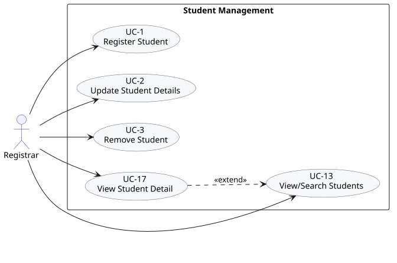
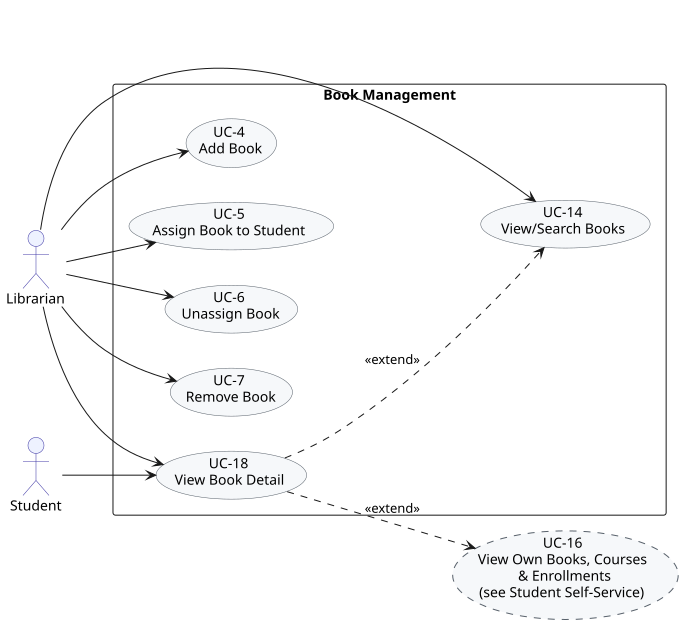
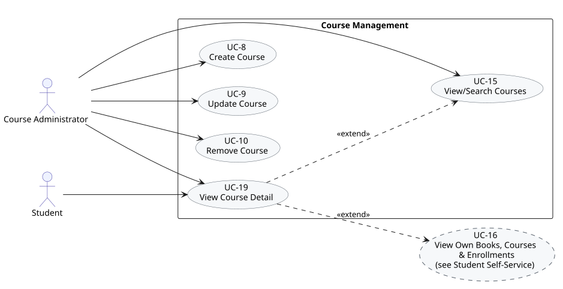
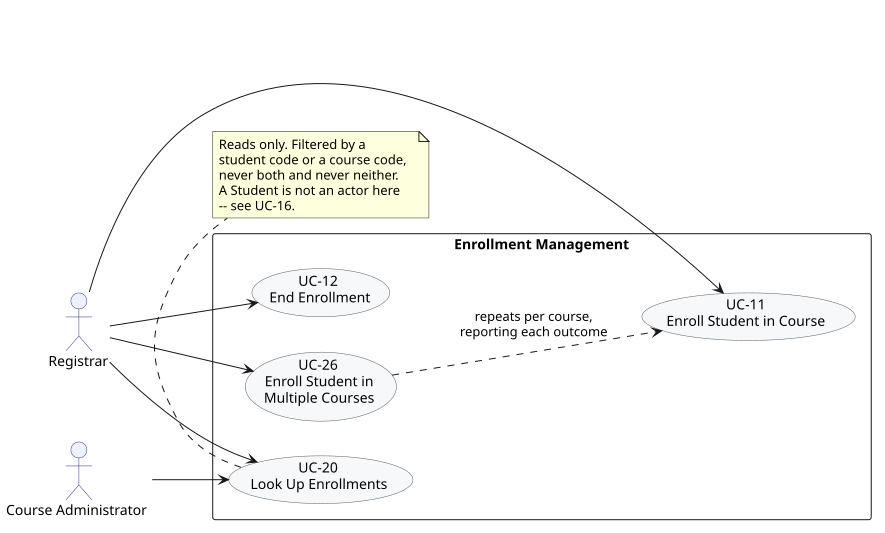
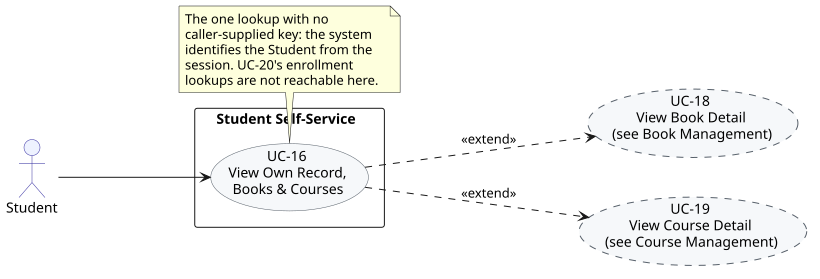
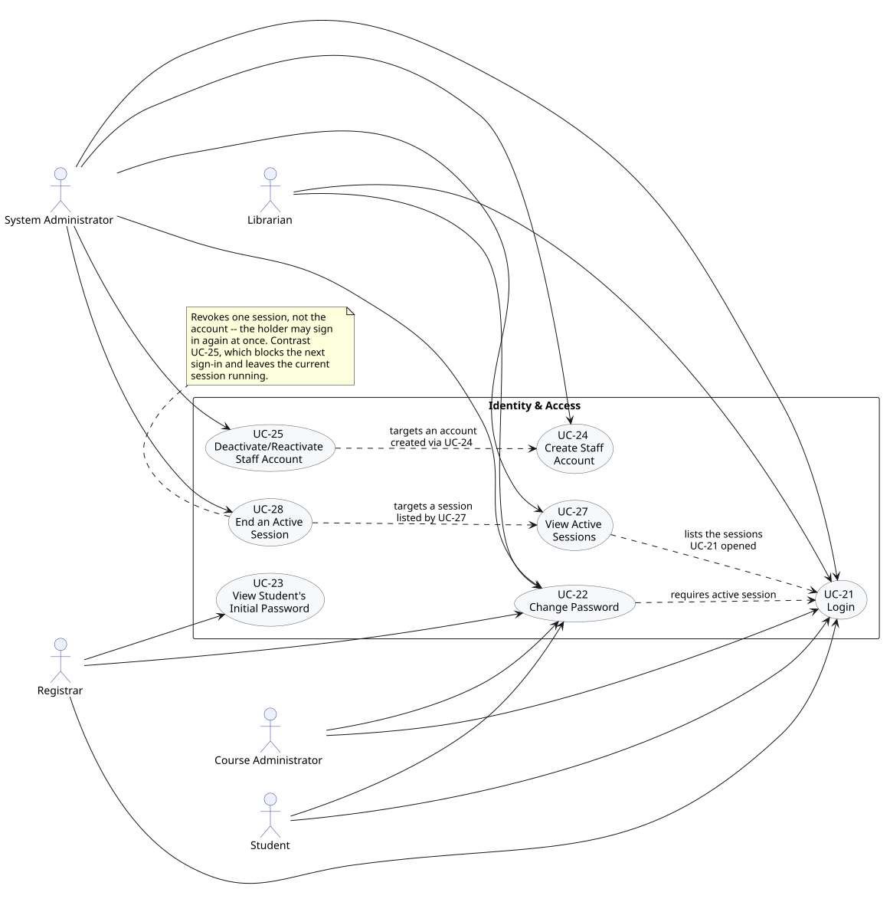

# Student Management System — Use Case Diagrams

Derived from [use-cases.md](./use-cases.md), which remains the authoritative source (actors, flows, business-rule traceability). This document is the visual companion: a system-wide **Overview** diagram followed by one **detail diagram per functional area**, so that no single diagram has to carry all 25 use cases at once. See also [req.md](./req.md) and [user-stories.md](./user-stories.md), and the [Activity Diagrams](./activity-diagram.md) for how each use case's request flow — validations, decisions, branches — actually plays out.

Diagrams are drawn in standard UML use-case notation (stick-figure actors, oval use cases, a system-boundary rectangle) using [PlantUML](https://plantuml.com/use-case-diagram). Each `.svg` below is generated from the matching `.puml` source in [use-case-diagram-assets/](./use-case-diagram-assets/) — edit the `.puml` file and re-render with `plantuml -tsvg *.puml` to update a diagram. Running `make docs` compiles this document to HTML with the same SVGs inlined, click-to-zoom and drag-to-pan, and keyboard access to the same viewer.

---

## Notation

| Symbol | Meaning |
| ------ | ------- |
| Stick figure | Actor |
| Oval, e.g. `UC-1 Register Student` | A use case |
| Solid line, no arrowhead | Association — actor participates in the use case |
| Dashed arrow labeled `«extend»` | One use case optionally extends another (arrow points at the base use case) |
| Dashed-border oval | An "external" reference to a use case drawn in full in a different diagram |
| Dashed arrow, other label | A dependency that isn't a formal extend, e.g. "requires active session" |

The six functional areas group the 25 use cases as follows:

| Area | Use Cases |
| ---- | --------- |
| Student Management | UC-1, UC-2, UC-3, UC-13, UC-17 |
| Book Management | UC-4, UC-5, UC-6, UC-7, UC-14, UC-18 |
| Course Management | UC-8, UC-9, UC-10, UC-15, UC-19 |
| Enrollment Management | UC-11, UC-12, UC-20 |
| Student Self-Service | UC-16 |
| Identity & Access | UC-21, UC-22, UC-23, UC-24, UC-25 |

---

## 1. System Overview

Shows which functional areas each actor touches. Solid lines are an actor's own work; dashed lines are **read-only reach into somebody else's area**, and each is labelled with why it exists — a Registrar reads courses in order to enroll into them, a Librarian reads one student to see who is holding a book, a Course Administrator reads one student by clicking through a roster. Those three are deliberately narrow: no actor has blanket read access across the system. The Student touches only Self-Service (their record, books, and courses all arrive there, identified by their sign-in), and the System Administrator only Identity & Access — it has no reach into any domain data.

---

## 2. Student Management

Registrar-only. UC-17 extends UC-13: selecting one result from a student search continues into the full detail view.

---

## 3. Book Management

Librarian owns write access and search; UC-18 (View Book Detail) is also reachable directly by the Student, and extends both UC-14 (search results) and UC-16 (a student's own book list, detailed in §5).

---

## 4. Course Management

Mirrors Book Management's shape: Course Administrator owns write access and search; UC-19 (View Course Detail) is also reachable by the Student and extends both UC-15 and UC-16.

---

## 5. Enrollment Management

UC-11 (Enroll Student in Course), UC-26 (Enroll Student in Multiple Courses) and UC-12 (End Enrollment) are Registrar-only. Student self-service enrollment and withdrawal are out of scope — a Student's involvement with enrollments is read-only, via UC-16/UC-20 in §6. UC-26 depends on UC-11 rather than extending it: it applies UC-11's validations once per course and answers with each course's outcome, so a rejected course costs only itself.

---

## 6. Student Self-Service

UC-16 (View Own Books, Courses & Enrollments) is Student-only. UC-20 (View Enrollment Detail) is shared by all three actors and extends UC-16, plus UC-17 and UC-19 from the Student Management and Course Management diagrams.

---

## 7. Identity & Access

All five actors share Login and Change Password. UC-23 (View Student's Initial Password) is Registrar-only; UC-24 (Create Staff Account), UC-25 (Deactivate/Reactivate Staff Account), UC-27 (View Active Sessions) and UC-28 (End an Active Session) are System Administrator-only. UC-22 depends on an authenticated session from UC-21 — shown as a dependency rather than `«extend»`, since it's a precondition, not an optional insertion point. UC-25 similarly depends on an account already having been created via UC-24.

UC-27 lists exactly the sessions UC-21 opened, and UC-28 addresses one of them, so both depend on those rather than on any account use case. That is the distinction the note in the diagram draws: UC-25 acts on the *account* and takes effect at the next sign-in, while UC-28 acts on the *session* and takes effect at the holder's next request, leaving the account free to sign in again (req.md §4 Identity.7 vs Identity.8).

---

## Use Case Coverage

| Use Case | Diagram | Primary Actor(s) |
| -------- | ------- | ----------------- |
| UC-1 Register Student | §2 Student Management | Registrar |
| UC-2 Update Student Details | §2 Student Management | Registrar |
| UC-3 Remove Student | §2 Student Management | Registrar |
| UC-4 Add Book | §3 Book Management | Librarian |
| UC-5 Assign Book to Student | §3 Book Management | Librarian |
| UC-6 Unassign Book | §3 Book Management | Librarian |
| UC-7 Remove Book | §3 Book Management | Librarian |
| UC-8 Create Course | §4 Course Management | Course Administrator |
| UC-9 Update Course | §4 Course Management | Course Administrator |
| UC-10 Remove Course | §4 Course Management | Course Administrator |
| UC-11 Enroll Student in Course | §5 Enrollment Management | Registrar |
| UC-12 End Enrollment | §5 Enrollment Management | Registrar |
| UC-13 View/Search Students | §2 Student Management | Registrar |
| UC-14 View/Search Books | §3 Book Management | Librarian |
| UC-15 View/Search Courses | §4 Course Management | Course Administrator |
| UC-16 View Own Books, Courses & Enrollments | §6 Student Self-Service | Student |
| UC-17 View Student Detail | §2 Student Management | Registrar |
| UC-18 View Book Detail | §3 Book Management | Librarian / Student |
| UC-19 View Course Detail | §4 Course Management | Course Administrator / Student |
| UC-20 View Enrollment Detail | §6 Student Self-Service | Registrar / Course Administrator / Student |
| UC-21 Login | §7 Identity & Access | All actors |
| UC-22 Change Password | §7 Identity & Access | All actors |
| UC-23 View Student's Initial Password | §7 Identity & Access | Registrar |
| UC-24 Create Staff Account | §7 Identity & Access | System Administrator |
| UC-25 Deactivate/Reactivate Staff Account | §7 Identity & Access | System Administrator |
| UC-26 Enroll Student in Multiple Courses | §5 Enrollment Management | Registrar |
| UC-27 View Active Sessions | §7 Identity & Access | System Administrator |
| UC-28 End an Active Session | §7 Identity & Access | System Administrator |
