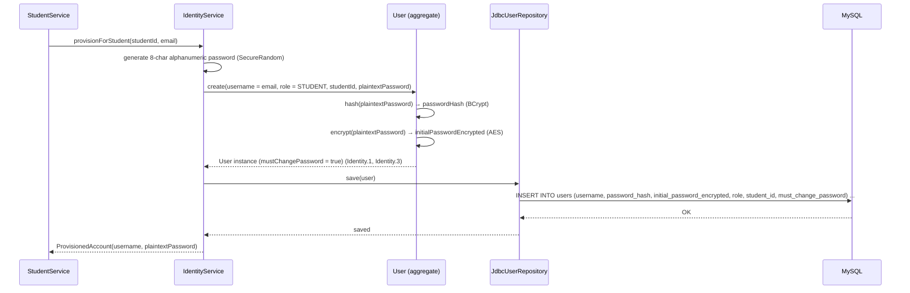
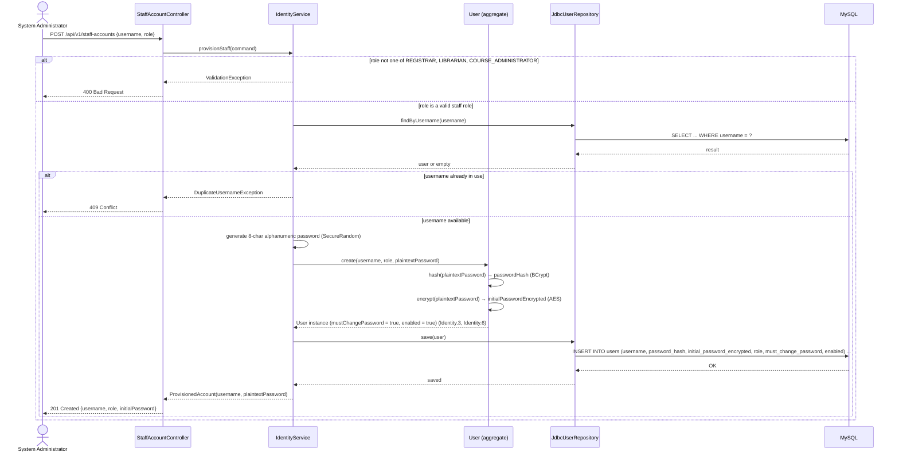
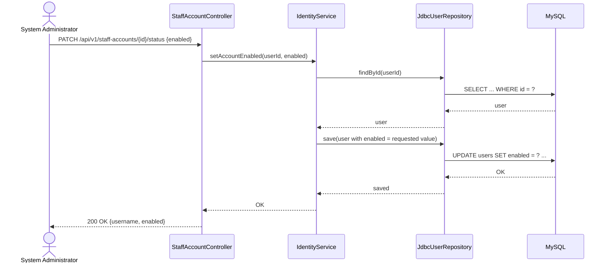
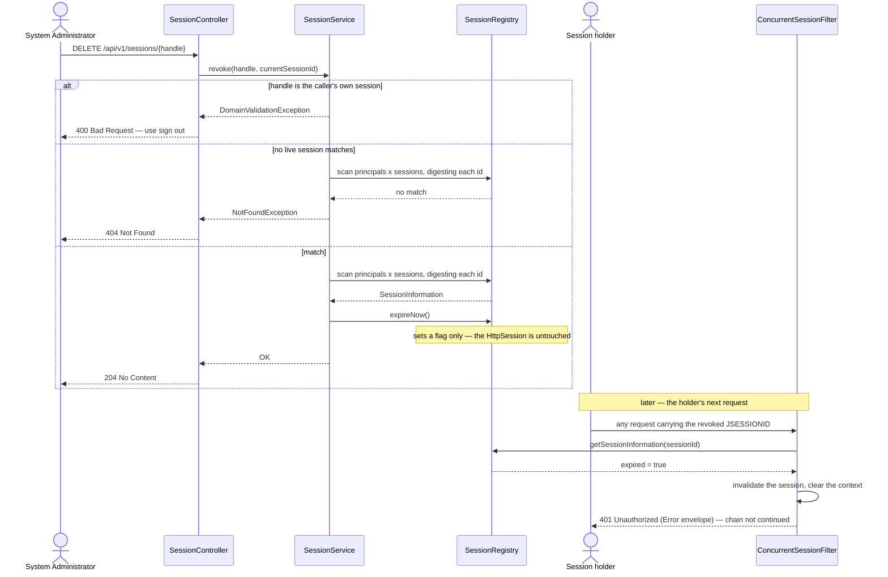
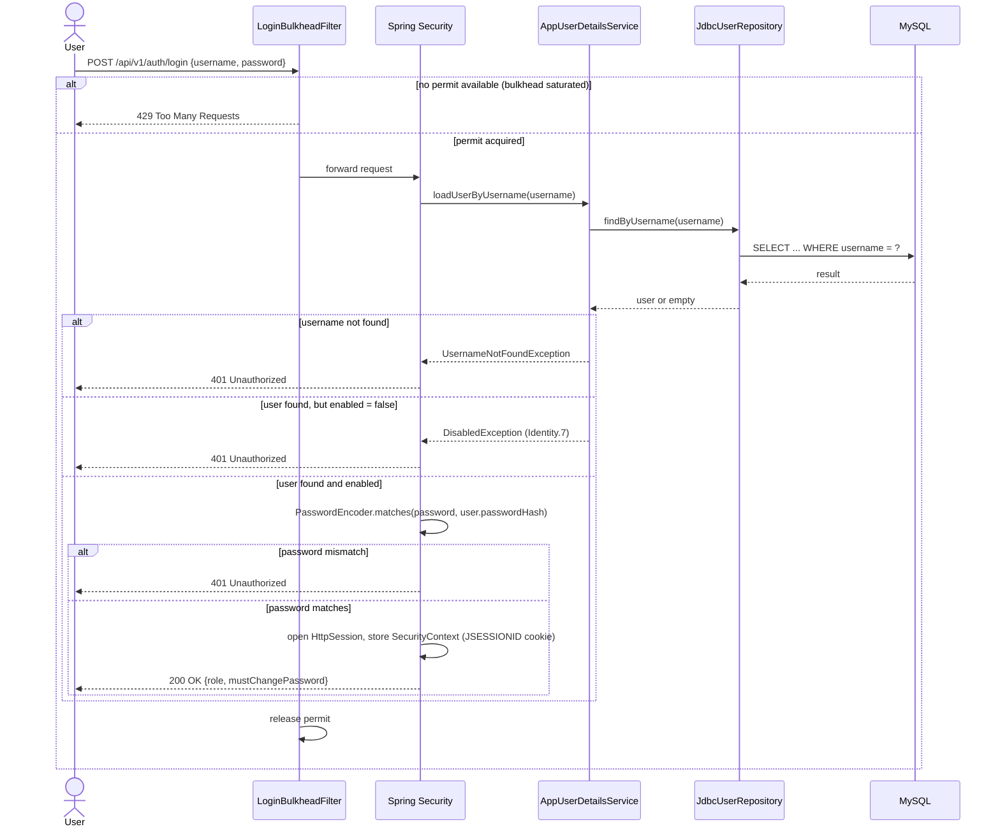
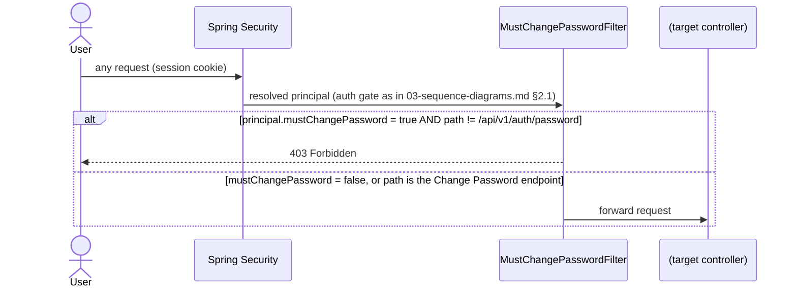
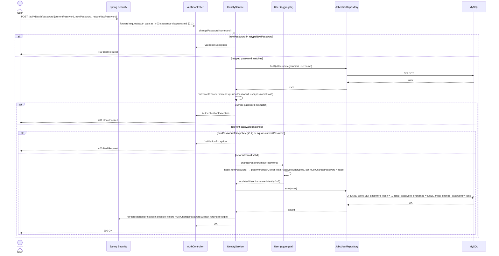
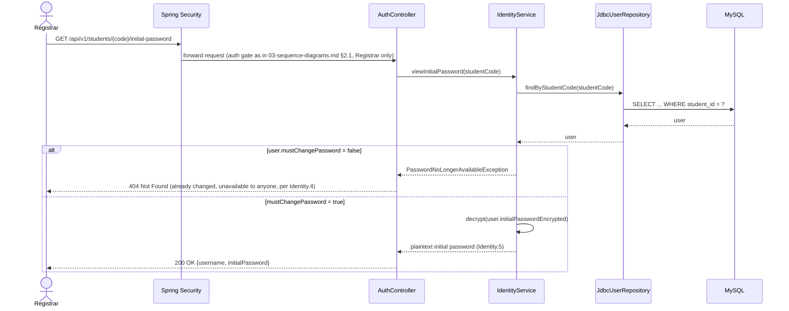

# Authentication & Authorization

Solution Architecture Document — Part 4 of 6 ([System Overview](./01-system-overview.md) → [Component Diagram](./02-component-diagram.md) → [Sequence Diagram](./03-sequence-diagrams.md) → Authentication & Authorization → [Database Schema](./05-database-schema.md) → [Low-Level Design](./06-low-level-design.md)).

Derived from [use-cases.md](../BA-docs/use-cases.md) (UC-1's account-provisioning step, UC-21 Login, UC-22 Change Password, UC-23 View Student's Initial Password, UC-24 Create Staff Account, UC-25 Deactivate/Reactivate Staff Account, UC-27 View Active Sessions, UC-28 End an Active Session) and [req.md](../BA-docs/req.md) (the User Account entity and Identity.1–8 rules). This document settles what `01-system-overview.md` §4.2 and its Deployment Characteristics table originally left as "an implementation decision" — the authentication scheme, the identity/session model, and the `identity` module introduced in `02-component-diagram.md` §2.1/§2.4. It reuses the lifeline, arrow-style, and `alt`/`par` conventions defined once in `03-sequence-diagrams.md` §1 rather than restating them, and does not repeat request/response DTO shapes, which stay in the OpenAPI contract per `02-component-diagram.md` §5.

---

## 1. Decisions

| Concern | Decision | Supersedes |
| --- | --- | --- |
| State management | **Session-based (stateful).** Spring Security's default HTTP session management issues a server-side session (`JSESSIONID` cookie) on successful login. | `01-system-overview.md` Deployment Characteristics "State" row, previously "Stateless"; §4.2, previously "an implementation decision... not fixed at this level." |
| Authorization model | **RBAC**, using 5 roles: the 4 already named throughout the doc set (Registrar, Librarian, Course Administrator, Student) plus a new **System Administrator** role, scoped solely to staff-account provisioning (§3a) and deactivation (§3b) — it has no access to any domain module's data. | `02-component-diagram.md` §4's existing role/access table, which now has a concrete `role` column on `users` backing it instead of an abstract "authenticated principal," plus a new System Administrator row. |
| Identity / SSO | **In-app identity.** A dedicated `users` table owned by a new `identity` module; login and password logic are built into the application itself. No external IdP, no OAuth/OIDC. | — (no prior decision existed; this scope was entirely unaddressed before). |
| Session enumeration & revocation | **Spring Security's in-memory `SessionRegistry`**, populated by a `RegisterSessionAuthenticationStrategy` on the login filter and read by a System Administrator-only `/api/v1/sessions` (§3c). Revocation is `SessionInformation.expireNow()`, enforced by `ConcurrentSessionFilter` on the session's next request. | §9's "Force-terminating an already-open session" bullet, which deferred this entirely; §3b's claim that no session-by-user-id invalidation mechanism exists. Sessions can now be ended — deliberately, by a System Administrator — though still not automatically as a side effect of deactivation. |
| Session fixation | **`ChangeSessionIdAuthenticationStrategy`**, composed ahead of session registration on the login filter (§3c). | — (no prior decision existed). The login filter is installed with `addFilterAt`, so no DSL configurer supplied a session strategy and it silently kept the framework's no-op default; the session id was therefore not rotated on login. |

Single-process deployment (`01-system-overview.md` Deployment Characteristics, "Process topology") makes an in-memory session store sufficient for this scope — no distributed session store is designed here (see §9). The session registry inherits that scope exactly: it lives in the same process as the sessions it describes, so it is emptied by a restart and, were the application ever run as more than one instance, each instance would see only its own sessions.

## 2. The `identity` module and the `users` table

### 2.1 Module placement

A new Spring Modulith module, `identity`, mirroring `student`'s hexagonal shape (`web/` → `application/` → `domain/` → `port/` → `internal/`), not folded into `shared`. `shared` keeps owning the *mechanism* — the `SecurityFilterChain` and `PasswordEncoder` beans, alongside its existing global exception handler (`02-component-diagram.md` §4). `identity` owns the *domain* — a `User` aggregate with real invariants (unique username, hash-vs-encrypted-initial-password split, role/`student_id` co-invariant, must-change-password state), the same kind of thing `Student`/`Course`/`Book`/`Enrollment` already are, and so belongs in a module of its own by the same reasoning `02-component-diagram.md` §2.5 already applies to `StudentLookup`/`CourseLookup`.

Published API (non-`internal`, consumed by other modules — see `02-component-diagram.md` §2.1, §2.2):

- `AccountProvisioning.provisionForStudent(studentId, email)` — called by `student` synchronously, in the same transaction as the student save (`03-sequence-diagrams.md` §2.1).
- `PrincipalStudentResolver.studentIdOf(Authentication)` — used wherever a module needs to resolve "own records only" scoping for a Student principal (`02-component-diagram.md` §4).

This is the one place in the module graph where the dependency direction is inverted from the existing `book`/`enrollment` → `student`/`course` pattern: the *owning* module (`student`) calls out to `identity`, not the reverse.

### 2.2 `users` table schema

Conceptual schema — Flyway DDL is future build-phase work, same status as the rest of the schema (`01-system-overview.md` §4.4 notes Spring Data JDBC generates no DDL of its own).

| Column | Notes |
| --- | --- |
| `id` | Surrogate primary key. |
| `username` | Unique, not null. For a Student account this is always the student's email (already validated unique by Student.2) — if the student's email later changes, the username changes with it (req.md §3, Student ↔ User Account). |
| `password_hash` | BCrypt hash of the **current** password. One-way — used only to verify a login or a Change Password submission; never reversible, never displayed. |
| `initial_password_encrypted` | Nullable. A **reversibly encrypted** (AES) copy of the *original* system-generated password, populated at account creation. **Cleared to `NULL` the instant the account holder completes their first password change.** This is the only recoverable form of any password in this design, and it exists solely to satisfy UC-23. |
| `role` | One of `SYSTEM_ADMINISTRATOR`, `REGISTRAR`, `LIBRARIAN`, `COURSE_ADMINISTRATOR`, `STUDENT`. |
| `student_id` | Nullable FK to the `student` module's aggregate. Required if and only if `role = STUDENT`; must be `NULL` for the 4 non-Student roles — a domain invariant on `User`, enforced the same way Student.3/4 are enforced on `Student`. |
| `must_change_password` | Not null, default `false`. Set `true` at creation for auto-provisioned Student accounts (Identity.3) and for accounts created via UC-24 (Identity.6); flips to `false` on the first successful Change Password (Identity.3–5). |
| `enabled` | Not null, default `true`. Set `false` by UC-25 (Identity.7); a disabled account fails login (§4.1) regardless of password correctness. Only meaningful for staff roles — Student accounts have no deactivation use case and System Administrator accounts are never disabled through the application (there being no use case for a System Administrator to manage another System Administrator's account). |
| `created_at` / `updated_at` | Timestamps. |

**Security note.** Storing any reversible form of a password is a deliberate, narrow deviation from password-storage best practice, made only because Identity.5 requires the Registrar to be able to look up a student's still-active initial password. The deviation is scoped as tightly as the requirement allows: only the *original* system-generated password is ever recoverable (never one the account holder chose), only for as long as `must_change_password = true`, and only via `initial_password_encrypted` — `password_hash` itself is always one-way. The AES key used for this field is application-managed configuration (e.g. environment/secret store); its storage and rotation is a build/ops concern, out of scope here (§9).

**Staff accounts (Registrar, Librarian, Course Administrator) are never auto-provisioned** — only a Student account is, as a side effect of UC-1. A staff account is instead created deliberately, one at a time, by a System Administrator via UC-24 (§3a below). The **System Administrator** account itself is the one identity in this table that stays pre-seeded/out-of-band (§9) — the application has no use case for creating one, precisely to prevent any in-app path to self-granting that role.

## 3. Account provisioning (UC-1 tail)

Extends `03-sequence-diagrams.md` §2.1, immediately after `Svc->>Repo: save(student)` succeeds and before the `201 Created` response. Runs in the same transaction as the student save — if provisioning fails, the whole registration rolls back (`01-system-overview.md` §4.4: one schema, one connection pool).



No `alt` for a username collision is modeled — consistent with this doc set's rule of only modeling branches `use-cases.md` actually lists (`03-sequence-diagrams.md` §1): a collision is unreachable here since the username is always the already-Student.2-validated-unique email. The returned `plaintextPassword` is included once in UC-1's `201 Created` response (`03-sequence-diagrams.md` §2.1); after that response, it is retrievable again only through UC-23 (§5.3), and only until the student changes it.

## 3a. Staff account provisioning (UC-24)

System Administrator-only (`03-sequence-diagrams.md` §2.1 auth gate, `hasRole("SYSTEM_ADMINISTRATOR")`). Manual trigger, not a side effect of another module's save — this is the one place `identity` is called directly by an end user rather than by another module.



Reuses exactly the same password-generate/hash/encrypt steps as §3's Student provisioning — the only differences are who triggers it (a person, not another module), the role being one of the 3 staff values instead of always `STUDENT`, and `student_id` staying `NULL`. As with §3, the plaintext password is returned exactly once, in this response; after that it's gone — there is no UC-23-equivalent "view a staff account's initial password" use case, so a lost initial password for a staff account has no in-app recovery path (§9).

## 3b. Staff account deactivation (UC-25)

System Administrator-only. Symmetric — the same endpoint toggles `enabled` in either direction.



Deactivation does not by itself force-terminate an already-open session for the target account: it changes what happens at the *next* login, not what is happening now, so an account disabled mid-session retains access until that session ends. That is unchanged.

What has changed is that the session can now be ended deliberately. §3c adds a System Administrator-only view of live sessions and the ability to revoke one, so the remedy for "disabled, but still working" is to disable the account (UC-25) and then end its session (UC-28) — two explicit acts rather than one implicit cascade. Keeping them separate is intentional: the two answer different questions (Identity.7 governs the next sign-in, Identity.8 the current session), and an administrator revoking a session usually does *not* want the account disabled as well.

## 3c. Active sessions and revocation (UC-27, UC-28)

System Administrator-only. Backed by Spring Security's `SessionRegistry` rather than by any table of this application's own: sessions live in the servlet container, so the registry is the only thing that knows they exist.

### 3c.1 What makes the registry non-empty

Three beans and one line on the login filter, and the last of these is the load-bearing one:

| Piece | Why it is needed |
| --- | --- |
| `SessionRegistryImpl` as a `@Bean` | It is an `ApplicationListener`. Only a registry that is a bean receives `SessionDestroyedEvent`/`SessionIdChangedEvent` and prunes itself; one created privately by the DSL does not. |
| `HttpSessionEventPublisher` as a `@Bean` | Bridges the container's `HttpSessionEvent`s into the application context. Without it nothing tells the registry that a session was logged out or timed out, and it accumulates dead session ids indefinitely. |
| `sessionConcurrency(...)` with `SessionLimit.UNLIMITED` | Installs `ConcurrentSessionFilter`, which *is* the revocation mechanism (§3c.3). The limit is unlimited because concurrent logins are not being capped — the machinery is being switched on. |
| `loginFilter.setSessionAuthenticationStrategy(...)` | **Required, not optional.** `.sessionManagement()` publishes its `SessionAuthenticationStrategy` as a shared object consumed only by `AbstractAuthenticationFilterConfigurer` — that is, by filters the DSL builds. The JSON login filter is installed with `addFilterAt` (§11.2 of `06-low-level-design.md`), so no configurer runs for it and it keeps the inherited `NullAuthenticatedSessionStrategy`. There is no fallback: `SessionManagementFilter` is not in the chain either. Left alone, the registry would be permanently empty. |

The strategy is a `CompositeSessionAuthenticationStrategy` of `ChangeSessionIdAuthenticationStrategy` then `RegisterSessionAuthenticationStrategy`, in that order — rotation must precede registration or the id recorded is the pre-rotation one. Setting it also closes the session-fixation gap noted in §1, which existed for the same reason and had gone unnoticed because nothing else depended on the strategy being real.

### 3c.2 What the view exposes, and what it does not

Each row carries the account's username, its role, when the session was last seen, and whether it is the caller's own. Two deliberate omissions:

- **The session id is never emitted.** A session id is a bearer credential: anything holding one can present it as a `JSESSIONID` cookie and become that user. The API publishes a SHA-256 digest of it instead — stable, so it addresses a session for revocation, and preimage-resistant, so it cannot be turned back into a cookie by an onlooker, a screenshot, or a log. See `api-specification.md` §5 decision #13.
- **No `mustChangePassword` or `enabled`.** `AuthController` replaces the session principal after a password change (§5.1) without informing the registry, so the registry's copy of those flags can be stale. Account state belongs to `/staff-accounts`; this view is about sessions.

That same staleness constrains the implementation: `AuthenticatedPrincipal` is a record with value-based equality and `SessionRegistryImpl` keys its map on the principal object, so a principal reconstructed in order to look one up may differ from the stored key by a field and match nothing. Every read here iterates `getAllPrincipals()` instead, which is insensitive to it.

### 3c.3 Revocation is deferred, and answers 401

`SessionInformation.expireNow()` sets a flag. It does not invalidate the `HttpSession`, and it has no effect on any request already in flight. `ConcurrentSessionFilter` is what notices the flag on the session's *next* request, invalidates it, and answers without continuing the chain. So the guarantee is "nothing further can be done with this session", not "this session no longer exists" — the difference matters only to how it is described, since no request can use it in the interval either way.

`ConcurrentSessionFilter`'s default `SessionInformationExpiredStrategy` prints one plain-text sentence and never sets a status, which would answer **200 OK** with prose — indistinguishable from success to any client. It is replaced with one that answers **401** in the standard `Error` envelope (`api-specification.md` §3), written directly to the response because this filter runs ahead of `DispatcherServlet` and `GlobalExceptionHandler` can never see it.

Filter ordering already places `ConcurrentSessionFilter` after the login filter and before `AuthorizationFilter`, and therefore before `MustChangePasswordFilter`, so a revoked session is turned away ahead of both authorization and the must-change gate.

### 3c.4 Self-revocation

Ending one's own session from this view is rejected (400), not merely discouraged. It is indistinguishable from the feature malfunctioning, and signing out already does it deliberately.

### 3c.5 Sequence — listing (UC-27)

```mermaid
sequenceDiagram
    actor SysAdmin as System Administrator
    participant Ctrl as SessionController
    participant Svc as SessionService
    participant Reg as SessionRegistry

    SysAdmin->>Ctrl: GET /api/v1/sessions
    Ctrl->>Ctrl: read own session id (never creating one)
    Ctrl->>Svc: listActiveSessions(currentSessionId)
    Svc->>Reg: getAllPrincipals()
    Reg-->>Svc: AuthenticatedPrincipal[]
    loop for each principal
        Svc->>Reg: getAllSessions(principal, false)
        Reg-->>Svc: SessionInformation[]
    end
    Note over Svc: SHA-256 each session id into a handle;<br/>mark the caller's own; sort by lastRequest desc
    Svc-->>Ctrl: ActiveSessionView[]
    Ctrl-->>SysAdmin: 200 OK [{handle, username, role, lastRequest, current}]
```

`false` on `getAllSessions` excludes sessions already marked expired — listing one would invite an administrator to end something already ended. Iterating `getAllPrincipals()` rather than looking a principal up is the constraint from §3c.2.

### 3c.6 Sequence — revocation (UC-28)

The two participants that matter are on different requests. That is the whole shape of it.



The gap between the 204 and the 401 is what "deferred" means in §3c.3. It is also why the account is unaffected: nothing in this flow touches `users`.

## 4. Login & the must-change-password gate

### 4.1 UC-21: Login



A disabled account and a wrong password both return the same `401 Unauthorized` with no distinguishing detail — otherwise the response would leak an account's enabled-state to an unauthenticated caller.

`Bulk` (PM-048, hazard H5, `shared/security/LoginBulkheadFilter.java`) is a fixed-permit semaphore gate ahead of every other step in this diagram: the permit check happens before `AppUserDetailsService`/BCrypt are ever reached, which is the entire point — a saturated bulkhead rejects in constant time, without spending a BCrypt verify (~95ms) or a Tomcat thread on a request that's going to be rejected anyway.

### 4.2 Must-change-password gate

Sits behind the standard auth gate (`03-sequence-diagrams.md` §2.1) — a request must already be authenticated before this check runs.



A newly provisioned Student account (§3) therefore cannot do anything except submit UC-22 until it does so — there is no way to "skip" the change and use the temporary password for ordinary access.

## 5. Change Password & View Initial Password

### 5.1 UC-22: Change Password

Three fields — Current Password, New Password, Re-type New Password — validated in that order (retype-match, then current-password match, then new-password policy), mirroring the cascading-`alt` style of UC-1.



Clearing `initial_password_encrypted` in the same update is what makes the new password permanently unrecoverable — including to the Registrar (Identity.4).

### 5.2 Password policy

Kept minimal — this is a small internal system, not a public-facing one:

1. Minimum length **8 characters** (no regression versus the temp password).
2. **No mandatory composition rules** (no forced upper/lower/digit/symbol mix) — favors length over complexity, per NIST 800-63B guidance for a system this size.
3. New password **must differ** from the current password — otherwise "changing" it could be a no-op that still clears `must_change_password`, defeating the gate in §4.2.
4. New and Re-type must match exactly (already enforced as the first check in §5.1).
5. Maximum length **72 characters** — BCrypt silently truncates beyond 72 bytes; capping input avoids that surprise.
6. No password history, expiry, or rotation policy — out of scope (§9).

### 5.3 UC-23: View Student's Initial Password

Registrar-only. Available only while the target account is still using its system-issued password.



## 6. RBAC summary

Extends `02-component-diagram.md` §4's role/access table with the `identity`-specific permissions that table deliberately excludes (§4's closing note):

| Role | Can log in (UC-21) | Can change own password (UC-22) | Can view a student's initial password (UC-23) | Can create/deactivate staff accounts (UC-24/25) | Can view/end sessions (UC-27/28) |
| --- | --- | --- | --- | --- | --- |
| System Administrator | Yes | Yes | No | Yes | Yes³ |
| Registrar | Yes | Yes | Yes | No | No |
| Librarian | Yes | Yes | No | No | No |
| Course Administrator | Yes | Yes | No | No | No |
| Student | Yes | Yes | No | No | No |

³ Every session, not only staff ones — a Student's session is as endable as a Registrar's. The one
exception is the administrator's own session, refused so that ending it cannot be mistaken for the
feature breaking (§3c.4).

### 6.1 Domain read access, per resource

`02-component-diagram.md` §4 states this in module terms; here it is as the endpoint allow-lists the
filter chain actually carries (06-low-level-design.md §11.1). Each row is an explicit grant — a role
absent from a row receives `403`, not an empty result:

| `GET` | Registrar | Librarian | Course Admin | Student | System Admin |
| --- | :-: | :-: | :-: | :-: | :-: |
| `/api/v1/students/**` | Yes | Yes | Yes¹ | Yes² | No |
| `/api/v1/books/**` | No | Yes | No | Yes² | No |
| `/api/v1/courses/**` | Yes | No | Yes | Yes | No |
| `/api/v1/enrollments/**` | Yes | No | Yes | No | No |
| `/api/v1/me/**` | No | No | No | Yes | No |
| `/api/v1/sessions` | No | No | No | No | Yes |

¹ Course Administrator holds this grant only to open a student's profile from a course roster; the
role has no student-browsing workflow, and its UI offers no Students destination.

² Transparently scoped server-side to the caller's own records (§2 of `api-specification.md`'s
decision list) — a Student searching students gets 0 or 1 rows, and another student's detail is a
`403`. Not blocked, scoped.

A Student's own enrolled courses come from `GET /api/v1/me/courses`, scoped by the session principal
rather than by a student code the caller types — which is why the Student row on
`/api/v1/enrollments/**` is a flat No rather than a scoped Yes. There is nothing on that surface for
a Student to read that `/me` does not answer more safely.

`/api/v1/sessions` is the first row where the System Administrator column is not `No`, and the first
grant it holds outside `identity`'s own resources — but it is not a domain read: it exposes who is
signed in, never any student, book, course, or enrollment. `02-component-diagram.md` §4's "no domain
data" statement about the role therefore still holds.

Like `/staff-accounts`, both matchers are explicit rather than inherited. The per-resource allow-list
above does not cover `/sessions`, so without them a `GET` would fall through to
`.anyRequest().authenticated()` and every signed-in role could enumerate — and end — everyone else's
sessions.

No role may view or change another principal's *changed* password — that is never possible for anyone, by construction (§2.2, §5.1). The System Administrator's own account is never created or deactivated through the application (§3a) — that column has no entry for its own row by construction, not by omission.

## 8. Demo accounts for development/testing

**Purpose:** a developer exercising the frontend needs a one-click way to log in as each actor, without knowing or typing any real credentials. This is a development/QA convenience only — it has no business use case and is not part of `use-cases.md`.

**Endpoint:** `GET /api/v1/auth/demo-accounts` — public (`x-roles: []`, no `Authorization`/session required, since its whole purpose is to be callable *before* login). Returns the 5 fixed demo identities, one per actor:

```json
[
  { "role": "SYSTEM_ADMINISTRATOR", "username": "demo.sysadmin", "password": "Demo#12345" },
  { "role": "REGISTRAR",            "username": "demo.registrar", "password": "Demo#12345" },
  { "role": "LIBRARIAN",             "username": "demo.librarian", "password": "Demo#12345" },
  { "role": "COURSE_ADMINISTRATOR",  "username": "demo.courseadmin", "password": "Demo#12345" },
  { "role": "STUDENT",               "username": "demo.student", "password": "Demo#12345" }
]
```

The frontend calls this once (e.g. on the login screen), renders one button per entry, and on click submits the returned `{username, password}` straight to UC-21 Login (§4.1) — no special-cased "demo login" code path in `identity` itself, it's an ordinary login.

**Production safety (the load-bearing constraint of this design):** the route is registered only when `app.demo-accounts.enabled=true`, a property defaulted to `true` in the `dev`/`test`/`local` Spring profiles and hard-`false` in the `prod` profile, enforced by making the controller bean itself conditional (`@ConditionalOnProperty`) rather than gating it with a security rule. A disabled feature that returns `404` because the route doesn't exist is a stronger guarantee than one that returns `403` because a filter blocked it — the latter still tells an attacker the endpoint exists and still ships the handler code. See `06-low-level-design.md` §11 for the bean wiring and `Testing/01-test-strategy.md` §6 for this being tracked as an explicit P0 risk.

**Seed data:** the 5 accounts are inserted by a dev/test-only data seed (`Testing/04-test-data-preparation.md`), never by the production Flyway migration path — they exist in a `prod` database not at all, which is the second, independent layer of the same guarantee (even if the route were somehow reachable, the accounts wouldn't exist to log into).

## 9. Out of Scope (this document)

- SSO, OAuth/OIDC, or any external identity provider — identity is entirely in-app, per §1.
- A "true" forgot-password flow for a user with no active session and no known current password (email/SMS/token-based reset) — not designed; an account holder who cannot authenticate at all must be handled operationally. This applies equally to a staff account created via UC-24 that loses its initial password — there is no UC-23-equivalent lookup for staff accounts (§3a).
- Further System Administrator accounts — always pre-seeded/out-of-band, never created through the application (§2.2, §3a).
- Self-service staff registration — a staff account can only come from UC-24; there is no "sign up" flow.
- Force-terminating an already-open session *automatically*, as a side effect of deactivating its account (§3b). A System Administrator can now end a session deliberately (§3c, UC-28), which supersedes the previous blanket deferral; making deactivation cascade into it remains undesigned, and §3b explains why the two are kept separate.
- Surviving a restart, or working across more than one application instance, for the session view (§3c) — the registry is in-process by the same single-process assumption as the session store itself (§1). A restart empties the list without signing anyone out, and a second instance would see only its own sessions.
- The demo-accounts endpoint (§8) being reachable, or its seed accounts existing, in a production environment — treated as a P0 risk, not merely "out of scope," per `01-test-strategy.md` §6.
- Horizontal scaling of the session store (Spring Session JDBC/Redis, sticky sessions) — the single-process deployment in `01-system-overview.md` makes this unnecessary for current scope. This is the change that §3c would require first if the deployment ever became multi-instance.
- Multi-factor authentication, password expiry/rotation, and password history beyond the single "must differ from current" check (§5.2).
- AES key management/rotation for `initial_password_encrypted` — application configuration, a build/ops concern.
- Flyway migration DDL and Java class implementation for the `identity` module — future build-phase work, same status as the rest of the schema (`01-system-overview.md` §4.4).
