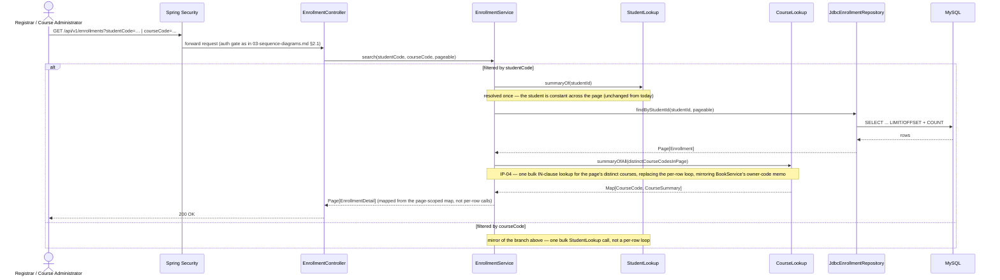

# Benchmark Remediation — Architecture Impact

Software Architecture — v0.1 addendum. One section per `docs-v00/SA-docs/` document that `docs-v01/Benchmark/07-improvement-roadmap.md` and `08-hazard-fix-specs.md`'s `IP-01`…`IP-11` fixes touch, change, or contradict. Nothing here is a code change or a redrawn diagram — every item below is either a documented fact about the system as it exists today, a forward note about an edit due once a fix lands, or an open decision presented for someone to make. None of the eleven fixes has been implemented as of this document (`IP-09` is the one exception — already delivered, see §1).

---

## 1. `01-system-overview.md` §5 — deployment characteristics

Two things this section is currently silent on, one of which is already true regardless of whether this document says so:

- **Connection pooling has no documented size.** §5 says "one schema, one connection pool, shared by all modules" but states no number. Today that number is HikariCP's framework default of 10 — the confound `06-conclusions-and-recommendations.md` §2 identifies as the single largest lever in the whole benchmark set. Once `IP-01` lands, §5 should state the chosen size explicitly, the same way it already states other deployment facts as numbers rather than leaving them implicit.
- **Observability is real, permanent, and undocumented.** §5 says nothing about actuator, Micrometer, or metrics anywhere. As of this document, that's inaccurate by omission: `management/pom.xml` carries `spring-boot-starter-actuator` and `micrometer-registry-prometheus` as permanent dependencies (not benchmark-session scaffolding); `application-benchmark.properties` exposes `/actuator/health`, `/actuator/metrics`, and `/actuator/prometheus` only under the `benchmark` Spring profile, on a dedicated `:8081` management port; `SecurityConfig.java:161-170` gates `/actuator/**` on the main port behind `SYSTEM_ADMINISTRATOR` and permits only `/actuator/health` unauthenticated. On top of that, `docs-v00/Benchmark/benchmark-strategy/06-dashboard-building.md` specifies a full six-dashboard Grafana/Prometheus stack (Benchmark Overview, HTTP & Load Testing, JVM Runtime, Spring Boot Runtime, MySQL Performance, Performance Correlation) built against exactly this metrics surface. **This is `06-conclusions-and-recommendations.md` §6 recommendation #9 (`IP-09`) already done, and exceeded** — `08-hazard-fix-specs.md`'s `IP-09` entry is being corrected to reflect this (see that document). §5 should gain an observability row describing this capability; it currently reads as if the system has none.

  Worth flagging alongside this: `06-dashboard-building.md` is a sixth document in a folder (`benchmark-strategy/`) whose own `README.md`, `01-benchmark-strategy.md` §6, and the top-level `Benchmark/README.md` all still describe a "five-part design." That's a `docs-v00` cross-reference gap, not an SA-docs one — noted here only because it's what surfaced this section's own gap, not something this document fixes.

## 2. `api-specification.md`

Two open decisions this document doesn't make, both already load-bearing on the API contract:

- **Decision #8 (pagination defaults/cap) is what `IP-05` would supersede.** §3 documents the current envelope verbatim: `{content: [...], page, size, totalElements, totalPages}`, and decision #8 fixes the default/cap/invalid-page behavior around it. `IP-05`'s move to keyset (cursor) pagination is not a repository-internal change — it changes this envelope, for every list endpoint `api-specification.md` §3 names (`GET /students`, `/books`, `/courses`, `/enrollments`, `/me/books`, `/me/courses`). Whichever way the still-open page-number-vs-cursor UX decision goes (`08-hazard-fix-specs.md`'s `IP-05` entry), decision #8 will need a successor decision recorded here — not a quiet edit to its own text, since decision #8 is itself part of a numbered log that future readers rely on.
- **§6's "no rate limiting" is an explicit, named decision — and `IP-08` has one option that reverses it and one that doesn't.** `IP-08` proposes either a bulkhead (a dedicated, bounded thread pool for the auth endpoint) or rate-limiting/`429` once a login queue passes a threshold. A bulkhead is invisible at the API layer — no client-observable change, no contract edit, §6 stays correct as written. Rate-limiting is not: it introduces a new response the API can return that §6 currently rules out by name. If that path is chosen, it is the same shape of move `01-benchmark-strategy.md` §2.1 already made once, reversing `Testing/01-test-strategy.md`'s load-testing exclusion "deliberately, and with a reason" — §6 would need the same treatment: the decision restated with the reason for reversing it, not silently dropped. This document does not choose between the two options; see `docs-v01/BA-docs/non-functional-requirements.md` §3.2 for the same open choice at the business-requirements layer.

## 3. `05-database-schema.md`

**Line 189 already names the exact condition `IP-02` now satisfies.** The document rules out additional indexes "without a known query pattern to justify them" — a deliberate, stated bar, not an oversight. `IP-02`'s `FULLTEXT` (or equivalent) index on the student/book/course search columns is the first index addition in this system made *because* that bar is met: the leading-wildcard `LIKE` scan is not a hypothetical query pattern, it is the single worst measured latency in the entire benchmark set (`BM-BK-001`, p95 up to 8.57 s at S3). Once `IP-02` lands, this section gains its first indexing entry — framed as the bar being met, not as an exception carved into it.

## 4. `tactical-ddd-design.md` §9 — a guarantee the system does not currently keep

This is the sharpest finding in this document. §9 (lines 120-131) states the `StudentDeleted`/`CourseDeleted` cascade has "an at-least-once delivery guarantee even across a process restart," attributing it to Spring Modulith's Event Publication Registry. **That claim is not true today.** `06-conclusions-and-recommendations.md` §3.5 measured 568 of 801 `EVENT_PUBLICATION` rows still incomplete more than 30 minutes after a 200-student burst delete — not delayed, permanently dropped, because `AsyncConfig`'s executor (core=2, max=4, queue=50, unchanged as of this document) rejects tasks under that load and `ThreadPoolTaskExecutor` does not retry a rejection.

This is not a case of the architecture document being silent on something (like §5's pool size) or ruling something out deliberately (like `api-specification.md` §6). It's a stated guarantee that the current configuration does not honor under a realistic burst. `IP-06` is what restores the claim — whichever of its three approaches is chosen (wider pool/queue, retry/backoff, or a bounded input size), the fix's job is specifically to make §9's sentence true again, not to add a new capability. Until `IP-06` lands, a reader relying on §9's guarantee for anything — a future listener, an audit report — would be relying on something currently false under load. Worth stating plainly rather than leaving implicit.

## 5. `06-low-level-design.md` — `EnrollmentService.search`, due for a follow-up edit

Line 557 accurately describes what `EnrollmentService.search` does today: "the **constant** side of a page is resolved once, outside the per-row mapping, so a page of 20 costs one lookup for that side rather than 20 identical ones." That's correct and complete for the constant side — but it says nothing about the *varying* side, which is exactly where `06-conclusions-and-recommendations.md` §3.2 found the N+1 (`courseLookup.summaryOf(...)` called once per row). `IP-04` fixes the varying side by porting `BookService`'s per-page memo pattern to it. Once that lands, line 557's description will be accurate-but-incomplete in the other direction — it will describe a bottleneck that no longer exists without describing the fix that removed it. Flagged here as a known follow-up edit; not made now, since `IP-04` hasn't landed and there's no new behavior yet to describe accurately.

## 6. `02-component-diagram.md` — no component for what doesn't exist yet

§2.1's diagram shows one Spring Security box in front of every controller and one MySQL box underneath — no session-store component, and no bulkhead/rate-limiter component, because neither exists in the running system. Two of the still-open `IP-*` items would each add one:

- **If `IP-08` chooses a bulkhead**, the diagram needs a new box between Spring Security and the controllers (or a sub-box inside the existing Tomcat boundary) representing the dedicated auth thread pool.
- **If `IP-10` is ever promoted out of "tracked, not scheduled"** (`07-improvement-roadmap.md` Phase 5), the MySQL box gains a sibling — a Redis (or equivalent) session store — replacing the implicit in-process session state the diagram currently doesn't draw at all.

Neither is drawn now. Both are deferred until the corresponding fix actually lands, consistent with this whole document's rule: describe what's true today and what a fix would change, not what a fix might eventually look like.

## 7. `03-sequence-diagrams.md` — one diagram draws the hazard being fixed

Unlike every section above, this one diagram doesn't just relate to the improvement plan abstractly — it draws H2's N+1 as the current, correct-as-documented design. The rest of this section's findings are text flags, matching the rest of this document; this one gets an actual redrawn diagram, because its fix has no open decision left to presuppose.

### 7.1 §5.4 (`UC-11`/`UC-20` list view) — drawn now, not deferred

Lines 779-852 show the constant side of a page resolved once (`Svc->>SLookup: summaryOf(studentId)`, noted "resolved once — the student is constant across the page," line 817) immediately followed by `loop per row: Svc->>CLookup: summaryOf(courseCode)` for the varying side (lines 823-826) — and the mirrored course-filtered branch loops per-row on `SLookup.summaryOf(studentId)` (lines 844-847). This is exactly what `06-conclusions-and-recommendations.md` §3.2 measured and `IP-04` fixes by porting `BookService`'s per-page memo pattern. Every other item in this document was left as a flag because some part of its "after" state is still undecided (a UX choice, a pool-sizing choice); `IP-04`'s is not — the memo pattern already exists and works in this same codebase, so drawing the target shape doesn't presuppose anything:

The only change from today's diagram is the `loop per row` block replaced by one `summaryOfAll` call and a map-based mapping step — everything else (the constant-side resolution, the `alt`/validation structure, the response shape) is unchanged, because `IP-04` doesn't touch any of that.

### 7.2 Four search/list diagrams — flagged, not drawn

`UC-13` (§2.4), `UC-14` (§3.5), `UC-15` (§4.4), and `UC-16`'s `/me/courses`/`/me/books` (§7.1) each show `Repo->>DB: SELECT ... WHERE ... LIMIT/OFFSET (+ COUNT for totalElements)` and a response carrying `page, size, totalElements, totalPages`. That one line encodes three separate things, and the three `IP-*` items affect it differently:

- **`IP-02`** (the `FULLTEXT`/index-friendly search) changes nothing about these diagrams — it's an internal query-plan change behind the same `WHERE` clause, not a call-sequence change.
- **`IP-03`** (drop the double `COUNT(*)`) changes the "(+ COUNT for totalElements)" annotation — once landed, the count is computed once per query and reused, not issued as a second scan every page.
- **`IP-05`** (keyset pagination) changes `LIMIT/OFFSET` to a cursor predicate, and would change the response shape shown at every `200 OK` in these four diagrams.

**Not drawn as an "after" diagram**, unlike §7.1: `IP-05`'s page-number-vs-cursor decision is still open (`docs-v01/Benchmark/08-hazard-fix-specs.md`'s `IP-05` entry, and `docs-v01/BA-docs/non-functional-requirements.md` §3.1's data point toward it). Drawing a specific cursor-shaped response here would quietly answer a question this document set has deliberately left for someone else. Once that decision is made, these four diagrams' `LIMIT/OFFSET (+ COUNT...)` line and response-shape annotations are what needs editing — this paragraph is the pointer back to them.

### 7.3 Confirmed non-findings

`IP-01`/`IP-07` (pool/buffer-pool sizing) touch nothing in this document's notation — no lifeline or call represents a connection pool or a buffer pool at this level of abstraction. `IP-06` (async retry/pool sizing) was already out of scope before this task existed: §8's own closing note excludes "transaction isolation levels, retry policy, and timing/performance characteristics of the async event listeners in §6" as "an implementation concern, not an architectural one at this level" (line 1028) — the cascade diagrams in §6.1/§6.2 stay exactly as they are. `IP-08` (login) isn't diagrammed here at all; §8 points to `04-authentication-authorization.md` instead, which this document does not open — whether that file needs a similar note is unresolved, not ruled out.
