# Student Management System — Activity Diagrams

Derived from [use-cases.md](./use-cases.md), which remains the authoritative source (actors, flows, business-rule traceability). Where the [use-case diagrams](./use-case-diagram.md) show *what* actors can do and how use cases relate, this document shows *how* each request actually flows: the actor/system steps, the validation decisions drawn from each use case's alternate/exception flows, and where each path terminates. One activity diagram is drawn per use case (23 total), grouped into the same six functional areas as the use-case diagrams, so the two document sets read side by side.

Diagrams are drawn in standard UML activity notation (swimlanes, decision diamonds, start/stop nodes) using [PlantUML](https://plantuml.com/activity-diagram-beta). Each `.svg` below is generated from the matching `.puml` source in [activity-diagram-assets/](./activity-diagram-assets/); edit the `.puml` file and re-render with `plantuml -tsvg *.puml` to update a diagram. The [HTML version](./activity-diagram.html) of this document embeds the same SVGs with click-to-zoom and drag-to-pan.

---

## Notation

| Symbol | Meaning |
| ------ | ------- |
| `\|Lane\|` heading | Swimlane — the actor or "System" performing the steps beneath it |
| Rounded box, e.g. `Create student record` | An activity (a single step) |
| Diamond with `yes`/`no` (or similar) branches | A decision point — usually a validation drawn from the use case's alternate/exception flows |
| Filled circle (●) | Start node |
| Circle with ring (◉) | Stop node — either a successful completion or a terminal rejection |
| Dashed reference, e.g. `Continue at UC-17` | Hand-off to another use case's activity diagram, rather than inlining it |

The six functional areas group the 23 use cases as follows (same grouping as [use-case-diagram.md](./use-case-diagram.md)):

| Area | Use Cases |
| ---- | --------- |
| Student Management | UC-1, UC-2, UC-3, UC-13, UC-17 |
| Book Management | UC-4, UC-5, UC-6, UC-7, UC-14, UC-18 |
| Course Management | UC-8, UC-9, UC-10, UC-15, UC-19 |
| Enrollment Management | UC-11, UC-12 |
| Student Self-Service | UC-16, UC-20 |
| Identity & Access | UC-21, UC-22, UC-23 |

---

## 1. Student Management

### UC-1 Register Student

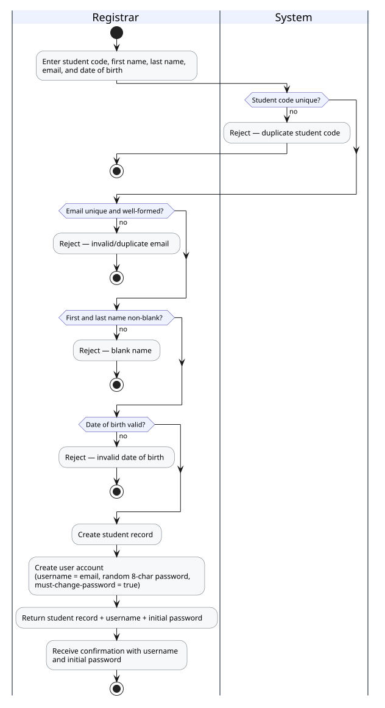

Four sequential validations (code, email, name, date of birth) each terminate the flow on failure; success cascades into an automatic user-account creation.

### UC-2 Update Student Details

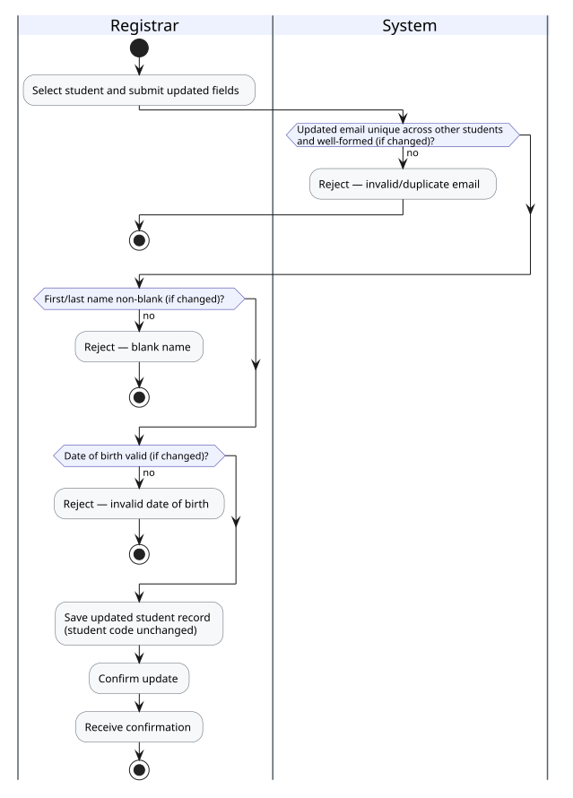

Same validation shape as UC-1, applied only to fields that changed; student code is immutable.

### UC-3 Remove Student

No validation branches — removal unconditionally cascades: books are unassigned (not deleted), enrollments are removed (courses untouched), and the student's user account is deleted along with the student record.

### UC-13 View/Search Students

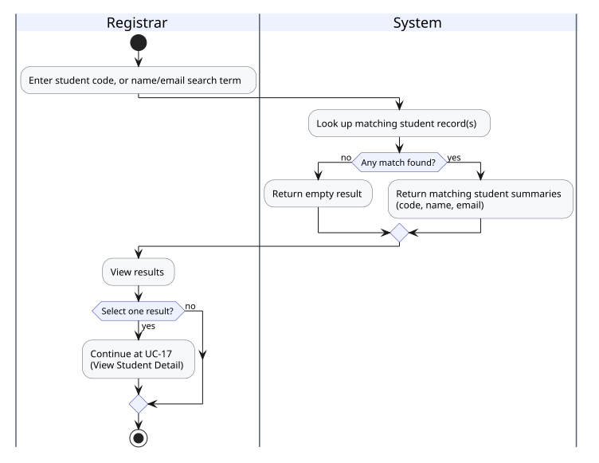

Read-only lookup; selecting a result hands off to UC-17.

### UC-17 View Student Detail

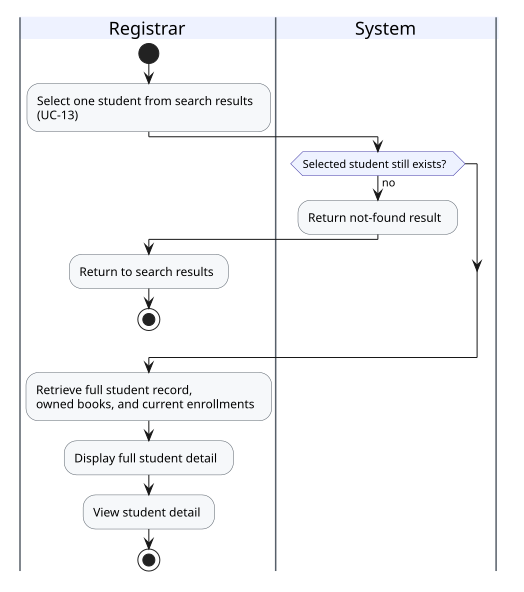

Extends UC-13. Guards against the selected student having been removed since the search ran.

---

## 2. Book Management

### UC-4 Add Book

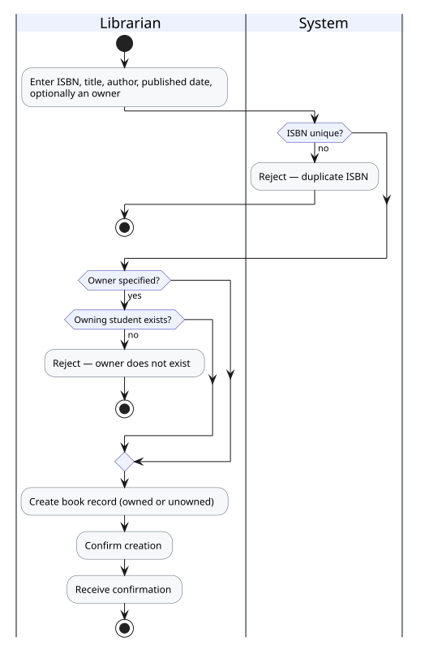

ISBN uniqueness is always checked; the owner-existence check only applies if an owner was specified.

### UC-5 Assign Book to Student

Reassignment silently replaces any prior owner — a book has at most one owner at a time.

### UC-6 Unassign Book

No decision branches — the book always remains in the catalog after its ownership link is cleared.

### UC-7 Remove Book

No decision branches — the previous owner, if any, is unaffected by the removal.

### UC-14 View/Search Books

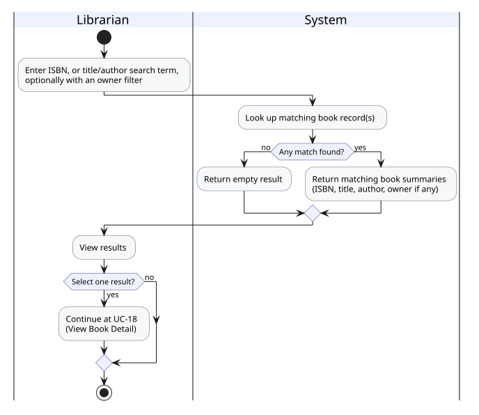

Read-only lookup; selecting a result hands off to UC-18.

### UC-18 View Book Detail

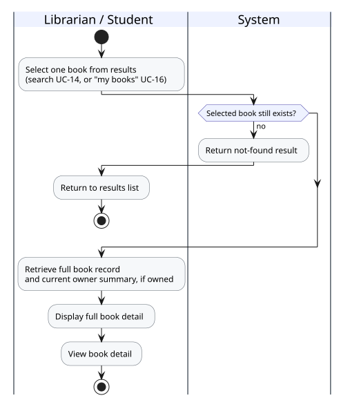

Extends both UC-14 (search results) and UC-16 (a student's own book list) — reachable by either a Librarian or a Student.

---

## 3. Course Management

### UC-8 Create Course

Mirrors UC-1's shape: sequential validations (code, name, credits) each terminate on failure.

### UC-9 Update Course

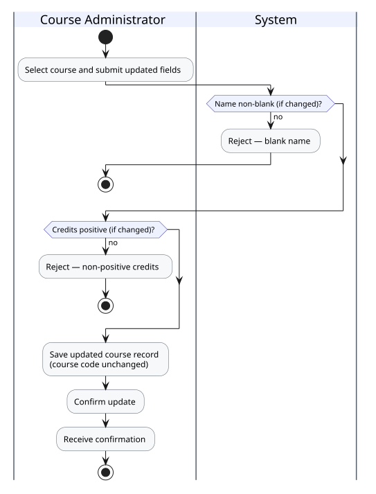

Validations apply only to changed fields; course code is immutable.

### UC-10 Remove Course

No validation branches — removal unconditionally cascades every tied enrollment; enrolled students are unaffected.

### UC-15 View/Search Courses

Read-only lookup; selecting a result hands off to UC-19.

### UC-19 View Course Detail

Extends both UC-15 (search results) and UC-16 (a student's own course list) — reachable by either a Course Administrator or a Student.

---

## 4. Enrollment Management

### UC-11 Enroll Student in Course

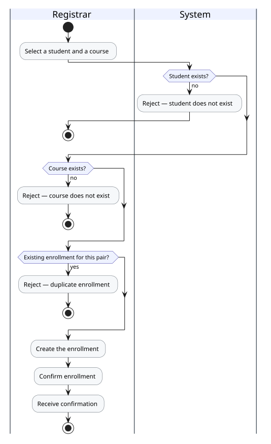

Three validations: student exists, course exists, and no duplicate enrollment already exists for the pair. Registrar-only — student self-service enrollment is out of scope.

### UC-12 End Enrollment

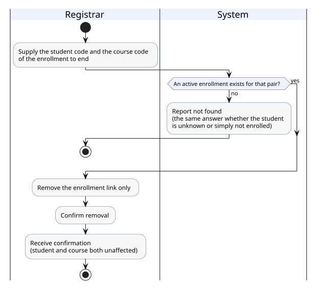

No decision branches — only the enrollment link is removed; the student and course records are both unaffected.

---

## 5. Student Self-Service

### UC-16 View Own Books, Courses & Enrollments

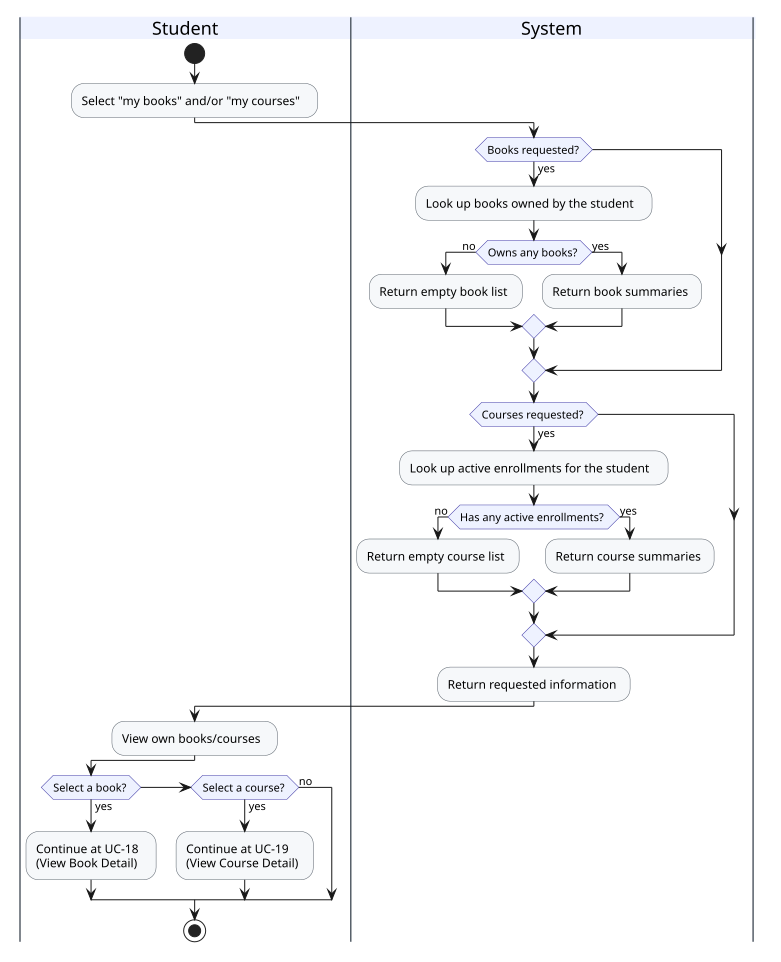

Two independent lookups (books, courses), each with its own empty-result branch; selecting an item hands off to UC-18 or UC-19.

### UC-20 View Enrollment Detail

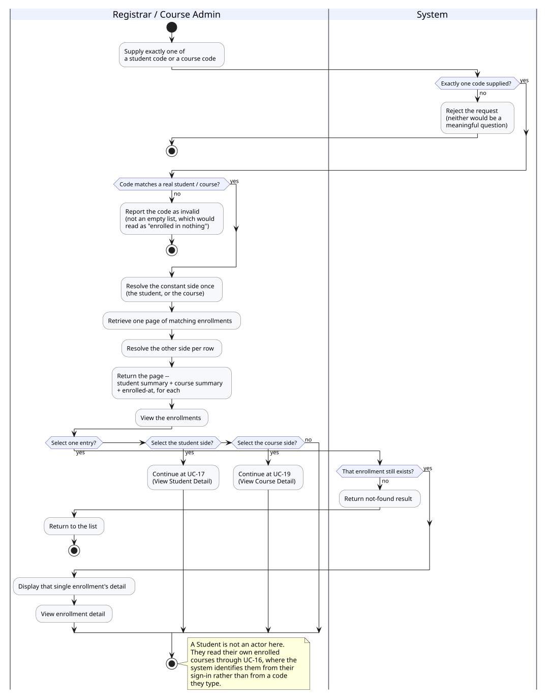

Shared by Registrar, Course Administrator, and Student — extends UC-17's enrollment list and UC-19's roster (as well as UC-16's own-enrollments view). Guards against the enrollment having been ended since the list was shown.

---

## 6. Identity & Access

### UC-21 Login

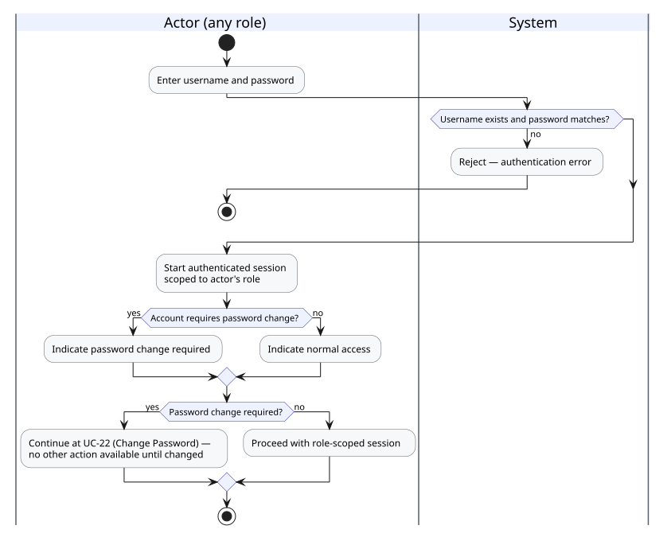

On success, an account still on its system-issued initial password is routed straight into UC-22 — no other action is available until the password is changed.

### UC-22 Change Password

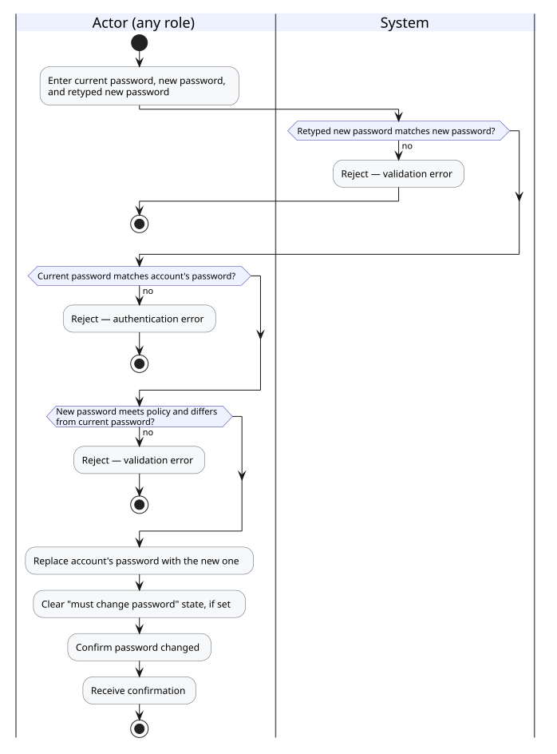

Three validations in sequence: retyped password matches, current password is correct, new password meets policy and differs from the current one.

### UC-23 View Student's Initial Password

Registrar-only. The single branch reflects that this access is permanently revoked the moment the student replaces their initial password.

---

## Use Case Coverage

| Use Case | Diagram File | Primary Actor(s) |
| -------- | ------------ | ----------------- |
| UC-1 Register Student | `uc01-register-student.svg` | Registrar |
| UC-2 Update Student Details | `uc02-update-student.svg` | Registrar |
| UC-3 Remove Student | `uc03-remove-student.svg` | Registrar |
| UC-4 Add Book | `uc04-add-book.svg` | Librarian |
| UC-5 Assign Book to Student | `uc05-assign-book.svg` | Librarian |
| UC-6 Unassign Book | `uc06-unassign-book.svg` | Librarian |
| UC-7 Remove Book | `uc07-remove-book.svg` | Librarian |
| UC-8 Create Course | `uc08-create-course.svg` | Course Administrator |
| UC-9 Update Course | `uc09-update-course.svg` | Course Administrator |
| UC-10 Remove Course | `uc10-remove-course.svg` | Course Administrator |
| UC-11 Enroll Student in Course | `uc11-enroll-student.svg` | Registrar |
| UC-12 End Enrollment | `uc12-end-enrollment.svg` | Registrar |
| UC-13 View/Search Students | `uc13-search-students.svg` | Registrar |
| UC-14 View/Search Books | `uc14-search-books.svg` | Librarian |
| UC-15 View/Search Courses | `uc15-search-courses.svg` | Course Administrator |
| UC-16 View Own Books, Courses & Enrollments | `uc16-view-own.svg` | Student |
| UC-17 View Student Detail | `uc17-view-student-detail.svg` | Registrar |
| UC-18 View Book Detail | `uc18-view-book-detail.svg` | Librarian / Student |
| UC-19 View Course Detail | `uc19-view-course-detail.svg` | Course Administrator / Student |
| UC-20 View Enrollment Detail | `uc20-view-enrollment-detail.svg` | Registrar / Course Administrator / Student |
| UC-21 Login | `uc21-login.svg` | All actors |
| UC-22 Change Password | `uc22-change-password.svg` | All actors |
| UC-23 View Student's Initial Password | `uc23-view-initial-password.svg` | Registrar |
