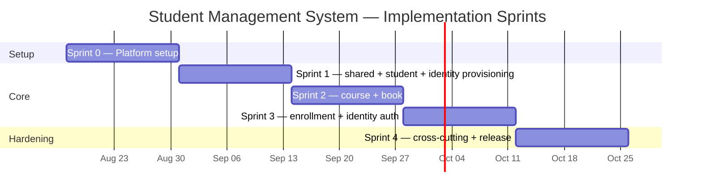

# Sprint Plan

Project Management Documentation — Part 2 of 4 ([Product Backlog](./01-product-backlog.md) → Sprint Plan → [Scrum Artifacts](./03-scrum-artifacts.md) → [Sprint Backlog](./04-sprint-backlog.md)).

Five 2-week sprints (Sprint 0 + Sprints 1–4), starting **Monday 2026-08-17**. The sequence is fixed by [Testing/02-test-plan.md](../Testing/02-test-plan.md) §2's build order — `shared` → `student`+`identity` provisioning → `course` → `book` → `enrollment` → `identity` auth → cross-cutting — since that ordering is already load-bearing for how the 141 test cases in [Testing/03-test-cases/](../Testing/03-test-cases/) get authored and automated. Delivery model: solo developer playing PO/SM/Dev (see [03-scrum-artifacts.md](./03-scrum-artifacts.md) §1); estimates below are ideal-hours, not team velocity.

**Capacity assumption:** ~20 ideal-hours/week (part-time pace alongside other commitments) → **40 ideal-hours per 2-week sprint**. This is a planning input, not a guarantee — adjust if actual pace differs after Sprint 0.

---

## Timeline

| Sprint | Dates | Theme |
| --- | --- | --- |
| Sprint 0 | 2026-08-17 → 2026-08-30 | Platform setup (no UC) |
| Sprint 1 | 2026-08-31 → 2026-09-13 | `shared` + `student` + `identity` provisioning |
| Sprint 2 | 2026-09-14 → 2026-09-27 | `course` + `book` |
| Sprint 3 | 2026-09-28 → 2026-10-11 | `enrollment` + `identity` auth |
| Sprint 4 | 2026-10-12 → 2026-10-25 | Cross-cutting, hardening, v1.0 |

---

## Sprint 0 — Platform setup

**Dates:** 2026-08-17 → 2026-08-30
**Goal:** Nothing in later sprints should be blocked by missing infrastructure — a Flyway-managed schema exists, CI runs on every PR, and the environment inconsistencies flagged in the Testing docs are resolved before any module code is written.

**Scope:** PM-000, PM-001, PM-002, PM-003, PM-004 — **19h / 40h capacity (48%)**. Deliberately light: first-sprint tooling friction (Docker, Maven, CI provider setup) reliably runs over estimate, and there is no partial-credit backlog item to fall back on if it does.

**Sprint Definition of Done:**
- `docker-compose.yml` and `Makefile` agree on MySQL; `make up` works as documented.
- A `V1__*.sql` Flyway migration applies cleanly against a fresh MySQL 8 container and matches the DDL in `06-low-level-design.md` §9.
- `application.properties` no longer sets a hardcoded Spring Security username/password.
- A CI workflow runs `mvn verify` on pull requests against `main` and is green on the (still skeleton-only) codebase.
- `architecture/` test package exists with ArchUnit rules that pass against the current skeleton (per `Testing/02-test-plan.md` §5, this level needs no database and can be green from day one).

---

## Sprint 1 — `shared` + `student` + `identity` provisioning

**Dates:** 2026-08-31 → 2026-09-13
**Goal:** A registrar can register, update, remove, and look up a student, and every new student automatically gets a working (initial-password-gated) login — the first vertical slice through every architectural layer (`web` → `application` → `domain` → `internal`), proving the pattern the remaining modules will repeat.

**Scope:** PM-005, PM-006, US-1.1, US-1.2, US-1.3, US-5.1 — **36h / 40h capacity (90%)**. This is the heaviest sprint by design: it's the reference module (`06-low-level-design.md` §4 calls `student` out explicitly as the reference implementation) plus the two `shared`-layer pieces every later module depends on.

**Sprint Definition of Done** (builds on the module-level DoD in [03-scrum-artifacts.md](./03-scrum-artifacts.md) §3):
- `student` module test suite matches the structure in `Testing/02-test-plan.md` §4 (`domain/`, `application/`, `web/`, `internal/`) and all of `Testing/03-test-cases/student.md`'s TC-STU-001–031 are automated and green.
- `AccountProvisioning.provisionForStudent` is exercised by `Testing/03-test-cases/identity-auth.md`'s provisioning-relevant cases.
- Global exception handler + error envelope shape match `06-low-level-design.md` §3 and are exercised by at least one negative test per validation rule (Student.1–4).
- `ApplicationModules.verify()` passes with `student` (and `shared`) present.

---

## Sprint 2 — `course` + `book`

**Dates:** 2026-09-14 → 2026-09-27
**Goal:** Course offerings and the book catalog both exist as independent, fully CRUD-able aggregates, with `book` correctly reading through `student`'s public `StudentLookup` API for optional ownership — the first inter-module dependency exercised end-to-end.

**Scope:** US-3.1, US-3.2, US-3.3, US-5.3, US-2.1, US-2.2, US-2.3, US-2.4, US-5.2 — **34h / 40h capacity (85%)**. `course` has no dependency on `student` or `book` and can be built first within the sprint for early feedback; `book` should follow once `course` is stable, since it depends on `student` (already done in Sprint 1) but not on `course`.

**Sprint Definition of Done:**
- `Testing/03-test-cases/course.md` (TC-CRS-001–022) and `book.md` (TC-BOOK-001–020) fully automated and green.
- `book`'s dependency on `student` goes only through `StudentLookup` (public API), never `internal/` — verified by `ApplicationModules.verify()`.
- Course removal cascades enrollments correctly even though `enrollment` doesn't exist as a module yet — implemented as a no-op-safe cascade hook, revisited in Sprint 3 once `enrollment` ships (flag any rework needed here in the Sprint 3 retro).

---

## Sprint 3 — `enrollment` + `identity` auth

**Dates:** 2026-09-28 → 2026-10-11
**Goal:** Students can be enrolled and unenrolled, every actor can log in and change their password, a student can view their own books/courses/enrollments, and a System Administrator can provision and deactivate staff accounts — closing out all 25 UCs' functional scope.

**Scope:** US-4.1, US-4.2, US-5.5, US-6.1, US-6.2, US-6.3, US-5.4, PM-016, US-7.1, US-7.2, PM-017 — **40h / 40h capacity (100%)**.

> **Sudden mid-sprint-plan addition — capacity note.** This sprint was originally scoped at 27h/40h (68%), deliberately left under capacity to absorb spillover from Sprint 2's cascade-hook rework (see Sprint 2's DoD). The staff-account-provisioning + demo-accounts requirement (PM-016, US-7.1, US-7.2, PM-017 — 13h, added after the original plan was written) exactly consumes that headroom. **Sprint 3 now has no slack**: if Sprint 2's cascade rework spills over as anticipated, it has nowhere to land within Sprint 3 and will need to either slip into Sprint 4 or bump PM-017 (demo accounts, the lowest-priority item of the four — it's a developer convenience, not a functional requirement) out to Sprint 4 instead. Revisit this trade-off at the Sprint 2 retro, before Sprint 3 starts.

**Sprint Definition of Done:**
- `Testing/03-test-cases/enrollment.md` (TC-ENR-001–012) and `identity-auth.md` (TC-IDN-001–032) fully automated and green.
- Course removal (US-3.3) and student removal (US-1.3) are re-verified end-to-end now that `enrollment` exists — this closes the gap flagged in Sprint 2.
- Login (UC-21) correctly indicates must-change-password state; Change Password (UC-22) clears it and makes the initial password permanently unrecoverable (US-6.2's last acceptance criterion).
- A System Administrator can create a Registrar/Librarian/Course Administrator account (UC-24) and deactivate/reactivate one (UC-25); a disabled account cannot log in (`Testing/03-test-cases/identity-auth.md` TC-IDN-024–030; `cross-cutting.md` TC-XC-039–041).
- `GET /api/v1/auth/demo-accounts` returns the 5 fixed demo identities when `app.demo-accounts.enabled=true`, and the route does not exist (`404`, not `403`) when built with the `prod` profile (TC-IDN-031–032, TC-XC-042).

---

## Sprint 4 — Cross-cutting, hardening, v1.0

**Dates:** 2026-10-12 → 2026-10-25
**Goal:** Everything the individual modules couldn't prove on their own — role × endpoint authorization, optimistic locking, cross-module cascades under load, and the 7 explicit ambiguity resolutions — is implemented and tested, closing the release.

**Scope:** PM-010, PM-011, PM-012, PM-018, PM-013, PM-014, PM-015 — **34h / 40h capacity (85%)**.

> **Second sudden mid-plan addition — capacity note.** `06-low-level-design.md` §13 always specified three `StudentDeleted` listeners (`book`, `enrollment`, `identity`), but the original backlog decomposition only turned `enrollment`'s into a task (US-4.2, Sprint 3). PM-018 (3h) closes that gap — implementing `book`'s exactly as specified, but correcting `identity`'s: an `@ApplicationModuleListener` on `student.StudentDeleted` inside `identity` would cycle back against `identity`'s existing dependency direction (`student` already depends on `identity` via `AccountProvisioning`), which `ApplicationModules.verify()` confirmed by failing the build. `identity` is deprovisioned synchronously instead, via a new `AccountProvisioning.deprovisionForStudent` method called from `StudentService.remove`, mirroring how `provisionForStudent` already works one-directionally. It's placed immediately before PM-013 because PM-013's cascade tests ("books unassigned... account removed") assume both mechanisms already exist. Sprint 4 still has 6h of slack (85% of capacity) to absorb it.

**Sprint Definition of Done (= Release Definition of Done):**
- All of `Testing/03-test-cases/cross-cutting.md` (TC-XC-001–035) automated and green — RBAC matrix, must-change-password gate, optimistic locking, cascade/lifecycle scenarios, error envelope, all 7 `api-specification.md` §5 ambiguity resolutions, architecture conformance.
- JaCoCo coverage report generated; living traceability matrix (`Testing/README.md` UC → File Index) has every UC-1–25 marked implemented and tested.
- `mvn verify` green in CI on `main`.
- **v1.0 release condition met:** all 25 UCs implemented and tested; see [03-scrum-artifacts.md](./03-scrum-artifacts.md) §5 for what stays explicitly out of scope.

---

## Backlog coverage check

Every item in [01-product-backlog.md](./01-product-backlog.md) §9's ranked list appears in exactly one sprint above; no item is dropped or duplicated. Total scoped: 163h across 5 sprints (10 weeks) against a 200h capacity budget (5 × 40h), leaving ~18.5% aggregate slack for the estimation risk inherent in sizing 38 items against a spec that has never been implemented before — down from the original plan's ~26%, first because Sprint 3 absorbed the 13h staff-account/demo-account addition with no other sprint's scope changing, then because Sprint 4 absorbed PM-018's 3h the same way.
