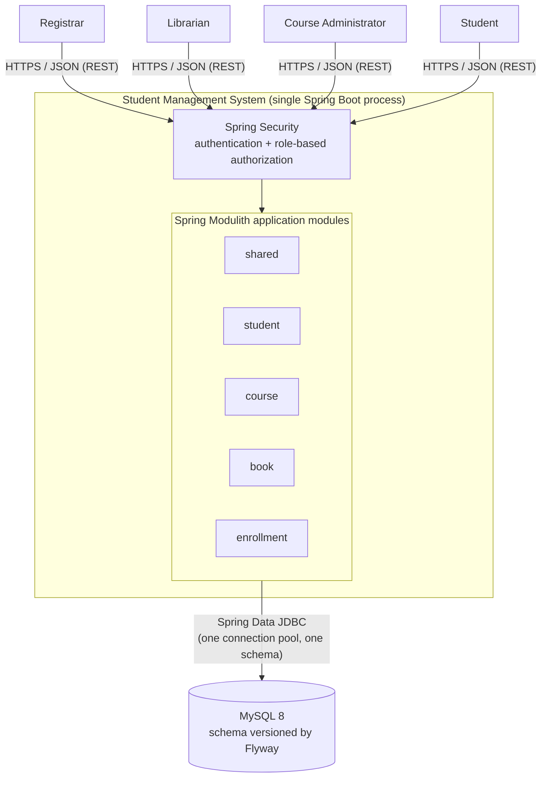

# System Overview

Solution Architecture Document — Part 1 of 3 (System Overview → [Component Diagram](./02-component-diagram.md) → [Sequence Diagram](./03-sequence-diagrams.md)).

Derived from [use-cases.md](../BA-docs/use-cases.md) and [req.md](../BA-docs/req.md). This document answers _what the system is, who talks to it, and what it depends on_ — not how a request is handled internally (Component Diagram) or in what order (Sequence Diagram).

---

## 1. Scope

The Student Management System is a **single-deployable, backend-only REST API**. There is no bundled frontend; any HTTP client (Swagger UI, a future SPA, `curl`) reaches it the same way. There are **no external system integrations** in the current scope — no email/notification service, no payment gateway, no third-party identity provider. The only runtime dependency outside the application process is its own database.

## 2. Actors

| Actor                    | Description                                                                   | Source                             |
| ------------------------ | ----------------------------------------------------------------------------- | ---------------------------------- |
| **Registrar**            | Manages student records and enrollments.                                      | use-cases.md UC-1–3, 11–13, 17, 20 |
| **Librarian**            | Manages the book catalog and book ownership assignments.                      | use-cases.md UC-4–7, 14, 18        |
| **Course Administrator** | Manages course offerings.                                                     | use-cases.md UC-8–10, 15, 19       |
| **Student**              | Looks up their own books/courses; may self-enroll if self-service is enabled. | use-cases.md UC-16, 18–20          |

All four are **human actors interacting over HTTPS**; none is a system-to-system integration. They are distinguished by **authorization scope**, not by transport or protocol — every actor hits the same API through the same security gateway, and Spring Security narrows what each role/principal may do or see (e.g., a Student principal can only read their own records).

## 3. System Context Diagram

## 4. Elements

### 4.1 Actors → System

Every actor talks to the same single entry point (`/api/v1/**`) over HTTPS. There is no per-actor endpoint or gateway split — role information (Registrar / Librarian / Course Administrator / Student) is carried on the authenticated principal and enforced by Spring Security at the module boundary, not by routing to different systems.

### 4.2 Spring Security gateway

Every inbound request is authenticated and authorized before it reaches a module's controller. This is the one cross-cutting concern that sits _outside_ the five application modules (alongside error handling, which lives in `shared`). The concrete authentication scheme (session vs. token) is an implementation decision for the Component Diagram / build phase, not fixed at this level — what's architecturally fixed is that **authorization is role-based and enforced centrally**, once, not re-implemented per module.

### 4.3 The system: one Spring Boot process, five Spring Modulith modules

The system is a **modular monolith** — one deployable JAR, one running process, one database schema — not a set of independently deployable services. `shared`, `student`, `course`, `book`, and `enrollment` are Spring Modulith _application modules_: they are enforced at build time (`ApplicationModules.verify()`), but they communicate **in-process**, not over a network. This matters at the overview level because it rules out the failure modes a distributed system would have (partial network failure, eventual consistency between modules) — cross-module effects (e.g., deleting a student clearing their books) happen synchronously, inside one database transaction. Module-to-module dependencies and the internal hexagonal layering of each module are detailed in the [Component Diagram](./02-component-diagram.md).

### 4.4 MySQL database

A single MySQL 8 schema, owned entirely by this application — no other system reads or writes it directly. The schema is version-controlled via Flyway migrations (`src/main/resources/db/migration`), since Spring Data JDBC does not generate DDL. All five modules share one schema and one connection pool; module boundaries are a code/build-time concept, not a database-per-module split.

## 5. Deployment Characteristics

| Property                | Value                                                           |
| ----------------------- | --------------------------------------------------------------- |
| Deployable unit         | Single Spring Boot fat JAR (or container image built from it)   |
| Process topology        | One process, no clustering/sharding for this scope              |
| State                   | Stateless application tier; all persistent state lives in MySQL |
| Data store topology     | One schema, one connection pool, shared by all modules          |
| External integrations   | None                                                            |
| Local/dev orchestration | `docker-compose.yml` — application container + MySQL container  |

## 6. Out of Scope (this document)

- Internal request flow through a module's layers (controller → service → domain → repository) — see [Component Diagram](./02-component-diagram.md).
- Ordering of calls and cross-module event handling for a specific use case — see [Sequence Diagram](./03-sequence-diagrams.md).
- API request/response shapes — tracked separately in an OpenAPI contract, not in this document.
