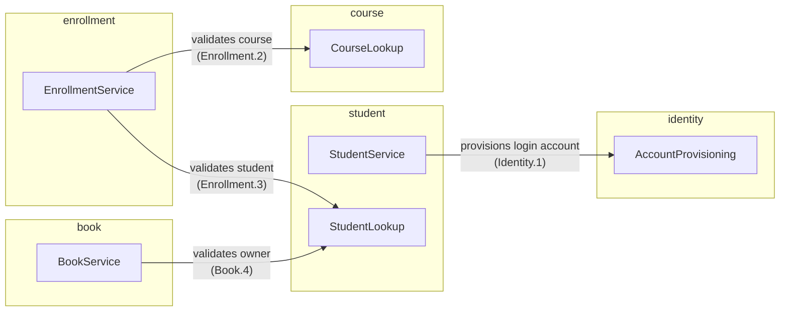
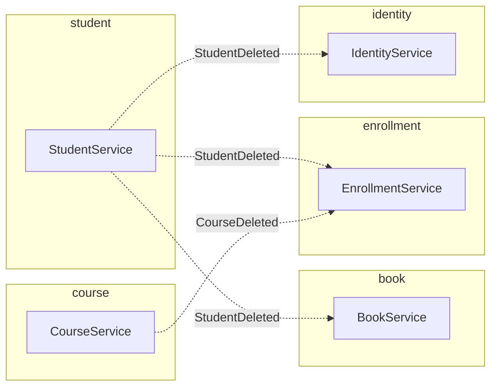
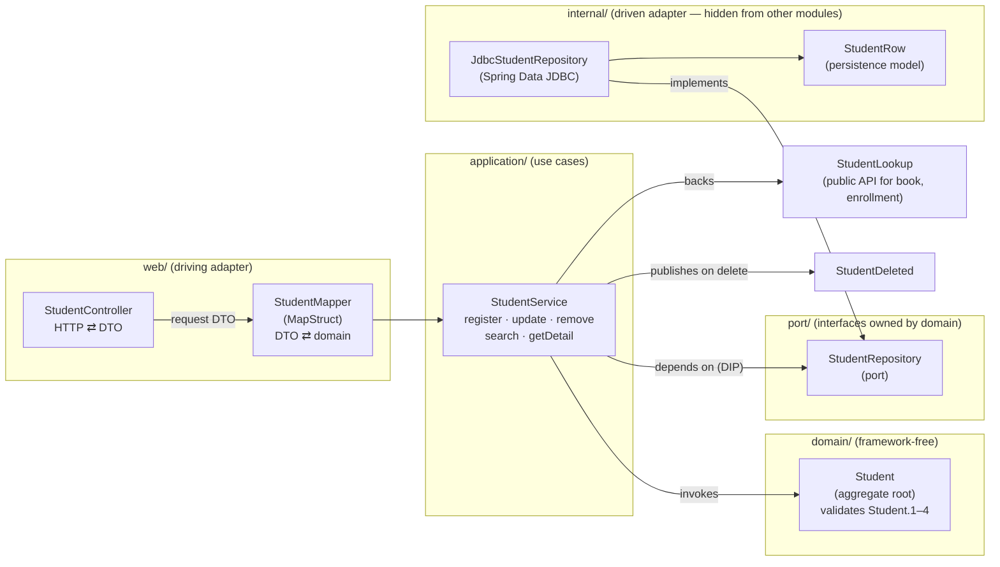

# Component Diagram

Solution Architecture Document — Part 2 of 6 ([System Overview](./01-system-overview.md) → Component Diagram → [Sequence Diagram](./03-sequence-diagrams.md) → [Authentication & Authorization](./04-authentication-authorization.md) → [Database Schema](./05-database-schema.md) → [Low-Level Design](./06-low-level-design.md)).

This document zooms into the single process shown in the System Overview and answers two questions the Context diagram deliberately left out: **how do the five Spring Modulith modules depend on each other**, and **what does the inside of one module look like** (the Clean/Hexagonal layering referenced in the README). Traceability back to [use-cases.md](../BA-docs/use-cases.md) is kept explicit throughout, since every component here exists to serve a specific UC.

---

## 1. Two kinds of boundary, two kinds of arrow

This architecture enforces boundaries at two different levels, and the diagrams below use two different arrow styles to keep them visually distinct:

- **Inter-module** (between the 5 Spring Modulith modules) — a module may only depend on another module's small, explicitly exposed **public API** (a plain Spring bean, e.g. `StudentLookup`). It can never reach into another module's `internal/` package (repository, persistence entity). This is enforced at build time by `ApplicationModules.verify()`.
- **Intra-module** (inside one module) — the classic **hexagonal port/adapter** split: the domain layer defines a port interface it needs (e.g. `StudentRepository`), and `internal/` provides the Spring Data JDBC adapter that implements it. This is enforced by package structure and code review, not a test.

Solid arrows below are synchronous in-process calls (a direct method call on a Spring bean — never HTTP, since everything lives in one process). Dashed arrows are **domain events**, used specifically for the cross-module cleanup rules from req.md §5.

## 2. Module-Level Component Diagram

The previous version of this diagram packed three different concerns — what's inside each module, which modules call each other's public API, and which modules exchange domain events — into a single flowchart. Overlaying all three at once produced long, crossing arrows that were hard to trace. It's split below into three narrower views that each answer one question.

### 2.1 Composition — what's inside each module

Each module's own layers (`web/` → `application/` → `domain/`, plus its `internal/` adapter and, where relevant, its exposed public API), and how they connect to the shared cross-cutting concerns (Security in front, `shared` behind, MySQL underneath). No cross-module edges here — that's diagram 2.2.

```mermaid
flowchart TB
    Sec["Spring Security\n(filter chain — authN + role check)"]

    subgraph Student["student module"]
        direction TB
        StudentWeb["StudentController"]
        StudentApp["StudentService\n(use cases)"]
        StudentDomain["Student\n(aggregate)"]
        StudentApi["StudentLookup\n(public API — exists(id), summary(id))"]
        StudentInternal["internal:\nJdbcStudentRepository"]
    end

    subgraph Course["course module"]
        direction TB
        CourseWeb["CourseController"]
        CourseApp["CourseService"]
        CourseDomain["Course\n(aggregate)"]
        CourseApi["CourseLookup\n(public API)"]
        CourseInternal["internal:\nJdbcCourseRepository"]
    end

    subgraph Book["book module"]
        direction TB
        BookWeb["BookController"]
        BookApp["BookService"]
        BookDomain["Book\n(aggregate, ownerId: StudentId)"]
        BookInternal["internal:\nJdbcBookRepository"]
    end

    subgraph Enrollment["enrollment module"]
        direction TB
        EnrollWeb["EnrollmentController"]
        EnrollApp["EnrollmentService"]
        EnrollDomain["Enrollment\n(aggregate, PK: studentId+courseCode)"]
        EnrollInternal["internal:\nJdbcEnrollmentRepository"]
    end

    subgraph Identity["identity module"]
        direction TB
        IdentityWeb["AuthController"]
        IdentityApp["IdentityService\nlogin · changePassword\nviewInitialPassword"]
        IdentityDomain["User\n(aggregate)"]
        IdentityApi["AccountProvisioning ·\nPrincipalStudentResolver\n(public API — for student)"]
        IdentityInternal["internal:\nJdbcUserRepository"]
    end

    Shared["shared module\nexceptions · error envelope · global handler"]
    DB[("MySQL 8")]

    Sec --> StudentWeb & CourseWeb & BookWeb & EnrollWeb & IdentityWeb

    StudentWeb --> StudentApp --> StudentDomain
    StudentApp --> StudentInternal
    StudentApp -. "exposes" .-> StudentApi

    CourseWeb --> CourseApp --> CourseDomain
    CourseApp --> CourseInternal
    CourseApp -. "exposes" .-> CourseApi

    BookWeb --> BookApp --> BookDomain
    BookApp --> BookInternal

    EnrollWeb --> EnrollApp --> EnrollDomain
    EnrollApp --> EnrollInternal

    IdentityWeb --> IdentityApp --> IdentityDomain
    IdentityApp --> IdentityInternal
    IdentityApp -. "exposes" .-> IdentityApi

    Student & Course & Book & Enrollment & Identity --> Shared
    StudentInternal & CourseInternal & BookInternal & EnrollInternal & IdentityInternal -- "Spring Data JDBC" --> DB
```

### 2.2 Inter-module dependencies — public API calls

Three modules call into another module: `book` and `enrollment`, each reading through a narrow public API bean (never through `internal/`) — plus `student`, which now calls out to `identity` to provision a new student's login account as part of registration (UC-1). This last edge runs the opposite direction from the other two: the *owning* module (`student`) is the caller, not the dependent one. Solid arrows only — synchronous in-process calls.

### 2.3 Cross-module domain events

The cleanup rules from req.md §5: when a `student` or `course` aggregate is deleted, dependent modules react asynchronously via a Spring Modulith event listener rather than a direct call. This now includes `identity`: removing a student also removes their user account (Identity — "when a student is removed"), so `identity` listens for `StudentDeleted` alongside `book` and `enrollment`. Dashed arrows only.

### 2.4 Module → use case ownership

| Module | Owns (UC) | Depends on (public API) | Publishes / listens |
| --- | --- | --- | --- |
| `student` | UC-1, 2, 3, 13, 17 | `identity.AccountProvisioning` (Identity.1) | publishes `StudentDeleted` |
| `course` | UC-8, 9, 10, 15, 19 | — | publishes `CourseDeleted` |
| `book` | UC-4, 5, 6, 7, 14, 18 | `student.StudentLookup` (Book.4) | listens for `StudentDeleted` |
| `enrollment` | UC-11, 12, 20 | `student.StudentLookup` (Enrollment.3), `course.CourseLookup` (Enrollment.2) | listens for `StudentDeleted`, `CourseDeleted` |
| `identity` | UC-21, 22, 23 (+ provisioning tail of UC-1) | — | listens for `StudentDeleted` |
| `shared` | — (cross-cutting) | — | — |

**UC-16** (Student's "my books / my courses / my enrollments") is a **read-side composition**, not a module of its own: the request lands on a thin composing endpoint (or the client makes three scoped calls) that reads from `book`, `enrollment`, and `student` independently — no new write dependency is introduced, and no module gains a new inbound edge beyond what the table above already shows.

### 2.5 Why `book`/`enrollment` depend on a public API, not a port

A hexagonal *port* is owned and defined by the module that needs it, for infrastructure it plugs in itself (e.g., `student`'s own `StudentRepository` port, implemented by its own JDBC adapter). A cross-module dependency is different: `book` doesn't want to own persistence for students, it wants to ask a question of the `student` module. Spring Modulith's answer is a **published interface** — `student` exposes `StudentLookup` from its top-level (non-`internal`) package as a small, deliberately narrow read API (`idOf`, `summaryOf`, `profileOf`). `book` and `enrollment` inject it like any other Spring bean. This keeps `Book.ownerId` a plain `StudentId` value (never a `Student` reference or `@ManyToOne`), while still letting `book` enforce Book.4 ("cannot be assigned to a student who does not exist") — `idOf` answers that question and yields the FK value in the same call, which is why `book` and `enrollment` accept a `StudentCode` from callers and never a raw id. The same principle holds for `student`'s own outbound call into `identity.AccountProvisioning` (§2.2) even though the direction is inverted — `student` is asking `identity` to do something on its behalf, not the other way around, but it's still a narrow published interface, never a reach into `identity/internal/`.

## 3. Inside a Module: Hexagonal Layering (`student`, the reference module)

`student` is the module every other module structurally mirrors (`course` is its twin; `book` and `enrollment` add one/two outbound API calls on top of the same shape).

- **`web/`** never sees the domain aggregate directly — `StudentMapper` (MapStruct) converts `RegisterStudentRequest` ⇄ `Student` ⇄ `StudentResponse`. MapStruct is used here specifically because this mapping is field-renaming/reshaping, not a 1:1 constructor call.
- **`application/`** (`StudentService`) is where UC-1/2/3/13/17's *orchestration* lives: call validation, ask the port for uniqueness, invoke the aggregate, save, publish events. It depends only on the `port/` interface, never on `internal/` directly — this is the dependency-inversion boundary that makes the domain layer testable without a database.
- **`domain/`** (`Student` aggregate) enforces the *invariants* (Student.1–4: unique code/email format checked in collaboration with the port, non-blank names, valid DOB) — this class has no Spring, no JDBC, no HTTP imports.
- **`port/`** is one interface, `StudentRepository`, with the methods the application layer actually needs (`findByCode`, `existsByEmail`, `save`, `deleteById`, …) — not a generic `CrudRepository` leaked outward.
- **`internal/`** is the only place Spring Data JDBC appears: `JdbcStudentRepository` implements the port, `StudentRow` is the `@Table`-mapped persistence record. Nothing outside `student/` can import from here — enforced by `ApplicationModules.verify()`.
- **`StudentLookup`** sits beside (not inside) `application/`: a thin façade over `StudentService`'s read path, exposed deliberately so `book` and `enrollment` have exactly one narrow, stable thing to depend on.

`course`, `book`, `enrollment`, and `identity` follow the identical five-folder shape; `book` and `enrollment` additionally hold a constructor-injected reference to `StudentLookup`/`CourseLookup` inside their `application/` service, and `student` holds one to `identity`'s `AccountProvisioning`, per §2.

## 4. Security Component Placement

Spring Security's filter chain sits in front of every controller, not inside any one module — it is configured once in `shared` (alongside the global exception handler) and applies uniformly.

| Role (principal) | Write access | Read access |
| --- | --- | --- |
| System Administrator | `identity` (staff accounts only, via UC-24/25) | none — no `student`/`book`/`course`/`enrollment` access |
| Registrar | `student`, `enrollment` | `student`, `course`, `enrollment` |
| Librarian | `book` | `student`, `book` |
| Course Administrator | `course` | `student`, `course`, `enrollment` |
| Student | none | own records only — `student` and `book` scoped to `principal.studentId`, plus the course catalogue; no `enrollment` access |

**Read access is granted per module, not as one undifferentiated "domain read".** Each role reads
what its own work needs and nothing more, which is a narrowing of an earlier version of this table
that granted all four domain roles read access to everything. What each grant is *for*:

- **Registrar** reads `enrollment` to answer "what is this student taking" and `course` to enroll
  them; it has no reason to read `book`, so it no longer can.
- **Librarian** reads `student` to attach a loan to a person and to show that person's books; it has
  no reason to read `course` or `enrollment`.
- **Course Administrator** reads `enrollment` for a course's roster and `student` to open a profile
  from that roster — the *only* way it reaches a student record, since browsing students is not part
  of its job. It has no reason to read `book`.
- **Student** reads their own `student` record and their own `book` loans (both scoped
  server-side), and the course catalogue. It has no `enrollment` access at all: a Student's enrolled
  courses come from `identity`-scoped self-service (`GET /api/v1/me/courses`), keyed off the session
  principal rather than off a student code the caller supplies — so there is nothing on
  `enrollment`'s surface for a Student to read that self-service does not already answer.

Every grant above is an **explicit allow-list** in the filter chain, not merely an absent denial: a
role that fell through to `.anyRequest().authenticated()` would read everything
(06-low-level-design.md §11.1).

The exact scoping check ("own records only") is implemented as a method-level authorization check in each module's `application/` service — it needs the authenticated principal's student identity compared against the aggregate being read, which is domain-specific logic, not something the filter chain alone can express. `identity`'s *own-credential* surface (login, change password) doesn't fit this table's per-domain-module shape and isn't added as a row: every role may write to `identity`, but only ever their own credentials (UC-22) — no role may change another principal's password. The one asymmetric exception is UC-23: the Registrar additionally gets read access to a student's *initial* password, and only for as long as that student hasn't changed it yet. `identity`'s *staff-account-management* surface (UC-24/25) is asymmetric the other way — it's the System Administrator row above, and no other role may reach it. See [Authentication & Authorization](./04-authentication-authorization.md) §5–§6 for both.

## 5. Out of Scope (this document)

- The order of calls and transaction boundaries for a specific request (e.g., what exactly happens, in what order, when a student is deleted) — see [Sequence Diagram](./03-sequence-diagrams.md).
- Database schema / column-level design — tracked separately, not duplicated here.
- Request/response DTO field lists — tracked in the OpenAPI contract.
