# Sequence Diagrams

Solution Architecture Document — Part 3 of 6 ([System Overview](./01-system-overview.md) → [Component Diagram](./02-component-diagram.md) → Sequence Diagram → [Authentication & Authorization](./04-authentication-authorization.md) → [Database Schema](./05-database-schema.md) → [Low-Level Design](./06-low-level-design.md)).

This document shows, for every use case in [use-cases.md](../BA-docs/use-cases.md), the order of calls a request makes through the layers and modules described in the [Component Diagram](./02-component-diagram.md): Spring Security → Controller → Service → domain aggregate → repository → MySQL, plus the two synchronous cross-module lookups (`StudentLookup`, `CourseLookup`) and the two asynchronous cascade-delete events (`StudentDeleted`, `CourseDeleted`). Sections are grouped by owning module, matching the ownership table in `02-component-diagram.md` §2.4.

---

## 1. Conventions

Every diagram below reuses the same notation, defined once here so individual sections stay focused on what's different about that use case.

**Arrow styles**

| Arrow | Meaning |
| --- | --- |
| `->>` (solid) | Synchronous call — the caller blocks waiting for a result |
| `-->>` (dashed) | Return / response to a synchronous call |
| `-)` (solid, open head) | Asynchronous, fire-and-forget — used only for the two Spring Modulith domain events (`StudentDeleted`, `CourseDeleted`); the publisher does not wait |
| `alt` / `else` | A validation gate — modeled directly from the "Alt/Exception Flows" enumerated for that UC in `use-cases.md`. A UC gets an `alt` block only where `use-cases.md` actually lists an exception flow for it — nothing is invented beyond what the BA doc specifies |
| `par` / `and` | Two or more calls that are independent of each other (e.g., reading owned books and active enrollments) and don't need to happen in a fixed order |

**Standard lifeline set**

Actor → `Spring Security` → `<Module>Controller` → `<Module>Service` → `<Module>` (aggregate, shown only where a diagram needs to make a domain invariant explicit) → `Jdbc<Module>Repository` (the port and its JDBC adapter are folded into one lifeline here for readability — see `02-component-diagram.md` §3 for the port/adapter split) → `MySQL`.

**Security gate**

Every request passes through the same Spring Security filter chain before reaching a controller. The full authentication/authorization gate (`alt` block, 401/403 branch) is spelled out once, on UC-1's diagram (§2.1). Every other diagram keeps a single `Security` step with a note — *"auth gate as in §2.1"* — rather than repeating the same two branches twenty times.

A second, narrower gate sits behind it: if the authenticated principal's account has `mustChangePassword = true`, every endpoint except Change Password (UC-22) is blocked with 403. This gate is spelled out once in [04-authentication-authorization.md](./04-authentication-authorization.md) §4 rather than repeated here.

**Cross-module reads for detail/composition views (UC-16–UC-20)**

`02-component-diagram.md` §2.2 graphs only the two *write-path* validation dependencies (`book`→`StudentLookup`, `enrollment`→`StudentLookup`/`CourseLookup`). The detail and composition use cases (UC-16 "my books/courses", UC-17 student detail, UC-18 book detail, UC-19 course detail, UC-20 enrollment detail) all need additional *read-path* calls across module boundaries — e.g., `StudentService` reading a student's owned books from `book`, or `CourseService` reading a course's roster from `enrollment`. These are modeled the same way as `StudentLookup`/`CourseLookup`: a narrow, read-only call into the owning module's service. `02-component-diagram.md` §2.4 flags UC-16 explicitly as this kind of "read-side composition, not a new write dependency"; the diagrams below extend that same reasoning to UC-17–UC-20 rather than inventing a different mechanism per use case.

---

## 2. Student module

Owns UC-1, UC-2, UC-3, UC-13, UC-17.

### 2.1 UC-1: Register Student

Registrar submits a new student's code, name, email, and date of birth; the system enforces Student.1–4 before creating the record. This diagram also shows the full security gate referenced by every later diagram.

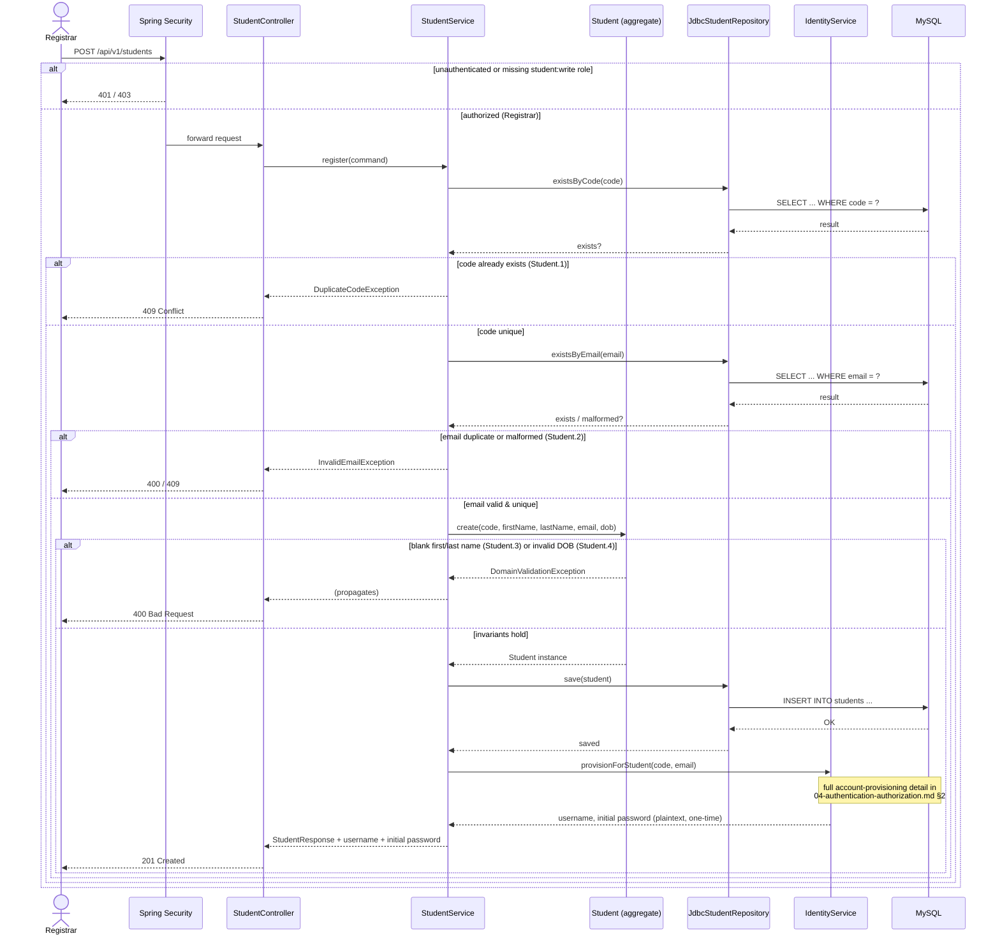

### 2.2 UC-2: Update Student Details

Registrar updates an existing student's name, email, and/or date of birth. The student code itself never changes.

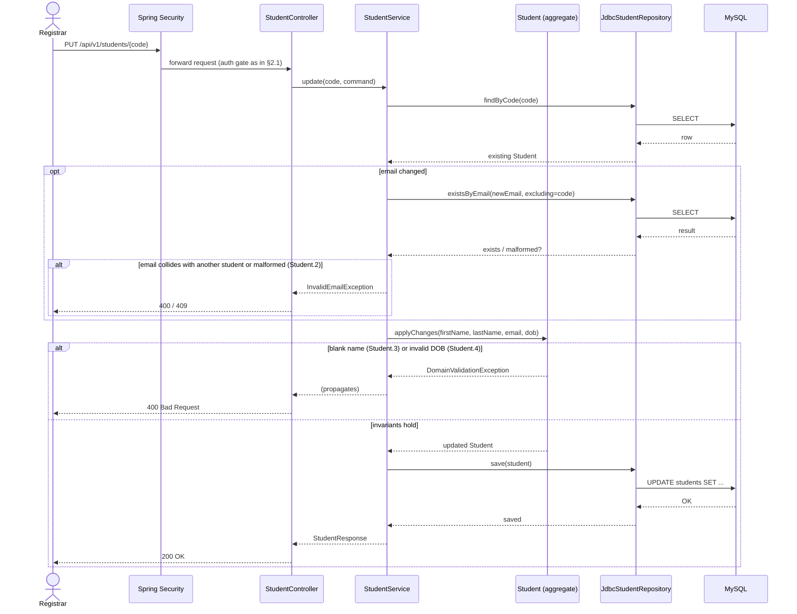

### 2.3 UC-3: Remove Student

Registrar deletes a student. Removing the student itself is synchronous; unassigning their books and ending their enrollments happens through the async cascade detailed in §6.1 — this diagram shows only `student`'s own write path plus the event publish.

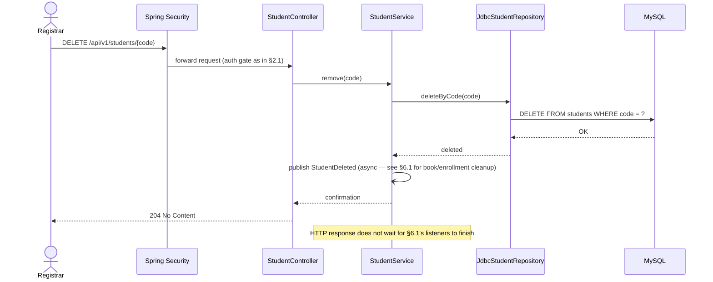

### 2.4 UC-13: View/Search Students

Registrar looks up a student by code, or searches by name/email.

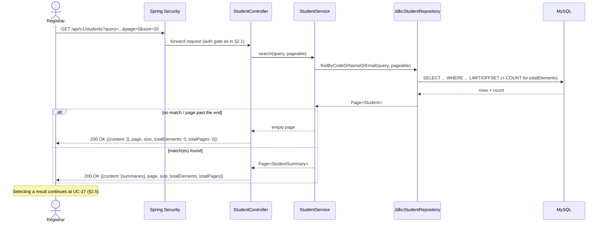

### 2.5 UC-17: View Student Detail

An actor with student read access selects one student to see their record. **Which *related* data they then see depends on their role**, and each side is fetched separately rather than embedded in this response:

| Viewer | Related data | Endpoint |
| --- | --- | --- |
| Librarian | the books that student is holding | `GET /api/v1/books?ownerStudentCode={code}` (§3.5) |
| Registrar, Course Administrator | the courses that student is enrolled in | `GET /api/v1/enrollments?studentCode={code}` (§5.4) |

This is the change from an earlier version of this diagram, which showed `StudentService.getDetail` composing both collections in a `par` block. Embedding them made every reader of a student record a reader of *both* sides of it — a Librarian would receive a course list, a Course Administrator a book list — which `02-component-diagram.md` §4's per-resource read grants explicitly deny. Each collection is also independently paged, which an embedded list cannot be. `student` consequently makes **no** outbound cross-module calls at all (`06-low-level-design.md` §4), which is what its "reference module, no outbound dependencies" description always claimed.

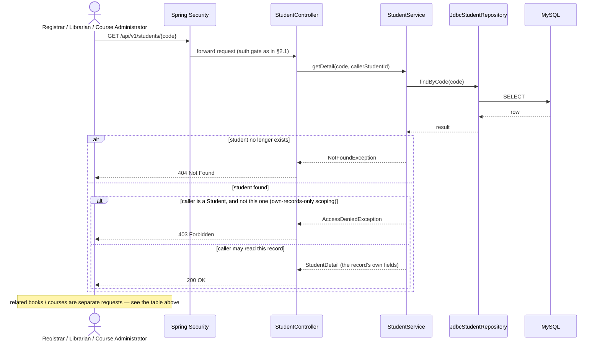

---

## 3. Book module

Owns UC-4, UC-5, UC-6, UC-7, UC-14, UC-18.

### 3.1 UC-4: Add Book

Librarian adds a book, optionally assigning it to a student on creation.

```mermaid
sequenceDiagram
    actor Librarian
    participant Sec as Spring Security
    participant Ctrl as BookController
    participant Svc as BookService
    participant Lookup as StudentLookup
    participant Agg as Book (aggregate)
    participant Repo as JdbcBookRepository
    participant DB as MySQL

    Librarian->>Sec: POST /api/v1/books
    Sec->>Ctrl: forward request (auth gate as in §2.1)
    Ctrl->>Svc: addBook(command)
    Svc->>Repo: existsByIsbn(isbn)
    Repo->>DB: SELECT
    DB-->>Repo: result
    Repo-->>Svc: exists?
    alt ISBN already exists (Book.1)
        Svc-->>Ctrl: DuplicateIsbnException
        Ctrl-->>Librarian: 409 Conflict
    else ISBN unique
        opt ownerStudentCode specified
            Svc->>Lookup: idOf(ownerStudentCode)
            Lookup-->>Svc: Optional&lt;StudentId&gt;
            alt owner does not exist (Book.4)
                Svc-->>Ctrl: UnknownStudentException
                Ctrl-->>Librarian: 400 Bad Request
            end
        end
        Svc->>Agg: create(isbn, title, author, publishedDate, ownerId?)
        Agg-->>Svc: Book instance
        Svc->>Repo: save(book)
        Repo->>DB: INSERT INTO books ...
        DB-->>Repo: OK
        Repo-->>Svc: saved
        Svc-->>Ctrl: BookResponse
        Ctrl-->>Librarian: 201 Created
    end
```

### 3.2 UC-5: Assign Book to Student

Librarian assigns (or reassigns) a book to a student. A book has at most one owner, so any prior owner is implicitly replaced.

```mermaid
sequenceDiagram
    actor Librarian
    participant Sec as Spring Security
    participant Ctrl as BookController
    participant Svc as BookService
    participant Lookup as StudentLookup
    participant Agg as Book (aggregate)
    participant Repo as JdbcBookRepository
    participant DB as MySQL

    Librarian->>Sec: PATCH /api/v1/books/{isbn}/owner {studentCode}
    Sec->>Ctrl: forward request (auth gate as in §2.1)
    Ctrl->>Svc: assignOwner(isbn, studentCode)
    Svc->>Lookup: idOf(studentCode)
    Lookup-->>Svc: Optional&lt;StudentId&gt;
    alt target student does not exist (Book.4)
        Svc-->>Ctrl: UnknownStudentException
        Ctrl-->>Librarian: 400 Bad Request
    else student exists
        Svc->>Repo: findByIsbn(isbn)
        Repo->>DB: SELECT
        DB-->>Repo: row
        Repo-->>Svc: Book
        Svc->>Agg: changeOwner(studentId)
        Note over Agg: replaces any prior owner (Book.2 — at most one owner)
        Agg-->>Svc: updated Book
        Svc->>Repo: save(book)
        Repo->>DB: UPDATE books SET owner_id = ?
        DB-->>Repo: OK
        Repo-->>Svc: saved
        Svc-->>Ctrl: BookResponse
        Ctrl-->>Librarian: 200 OK
    end
```

### 3.3 UC-6: Unassign Book (End Ownership)

Librarian clears a book's ownership; the book stays in the catalog, unassigned.

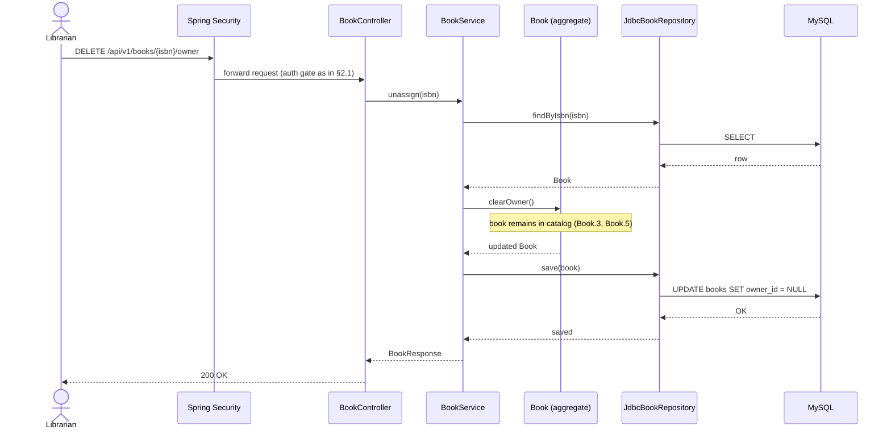

### 3.4 UC-7: Remove Book

Librarian deletes a book outright. No other module is affected — removing a book never cascades.

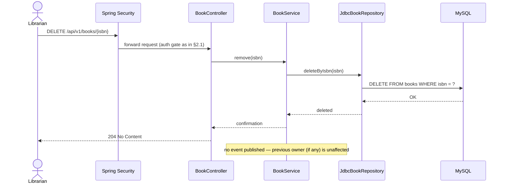

### 3.5 UC-14: View/Search Books

Librarian looks up a book by ISBN, or searches by title/author with an optional owner filter.

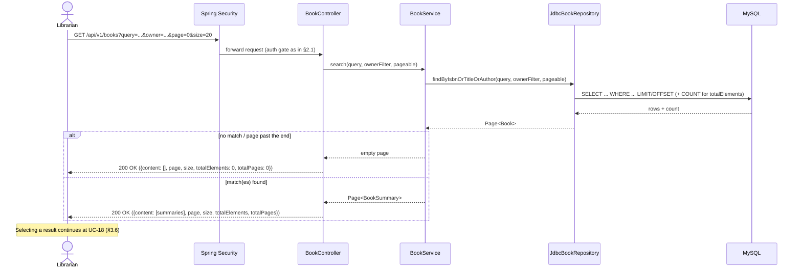

### 3.6 UC-18: View Book Detail

Actor (Librarian, or a Student via UC-16) selects one book to see its full record, including the current owner's summary if assigned.

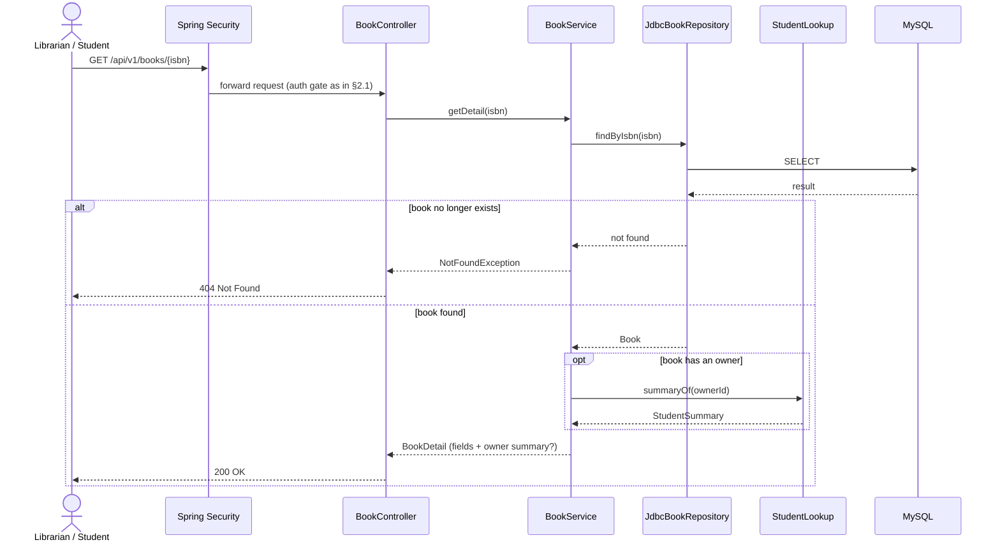

---

## 4. Course module

Owns UC-8, UC-9, UC-10, UC-15, UC-19.

### 4.1 UC-8: Create Course

Course Administrator creates a new course offering.

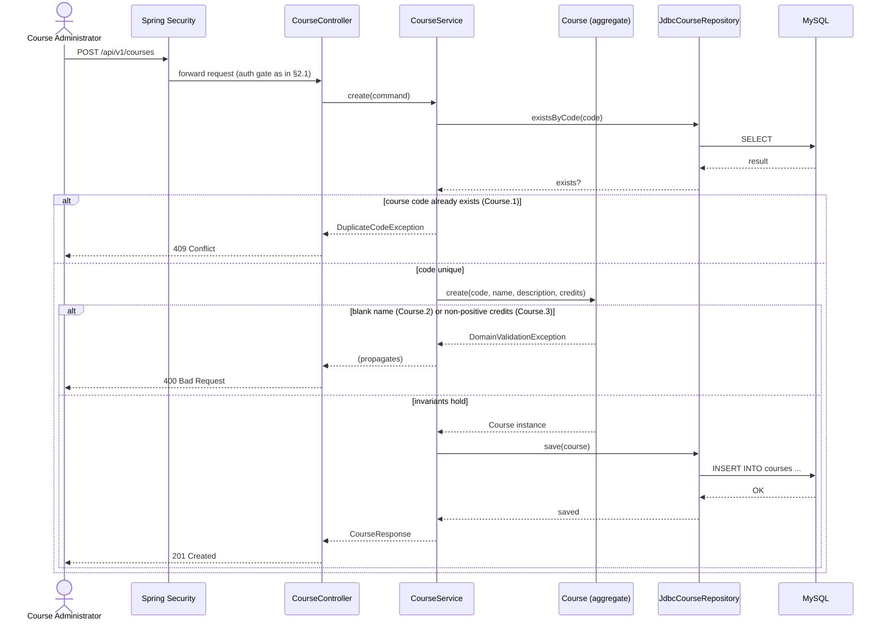

### 4.2 UC-9: Update Course

Course Administrator updates a course's name, description, and/or credits. The course code never changes.

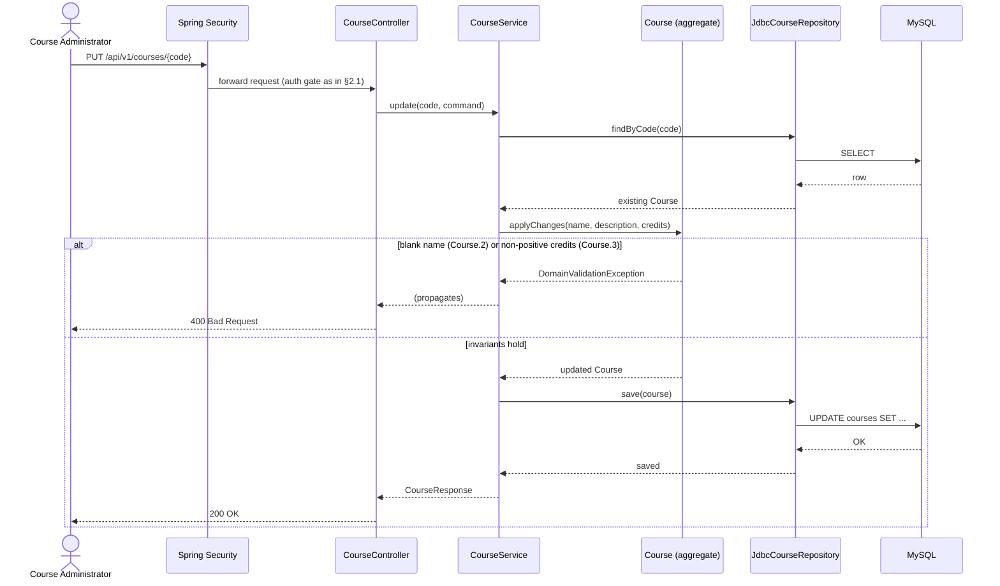

### 4.3 UC-10: Remove Course

Course Administrator deletes a course. Removing the course itself is synchronous; removing every enrollment tied to it happens through the async cascade detailed in §6.2.

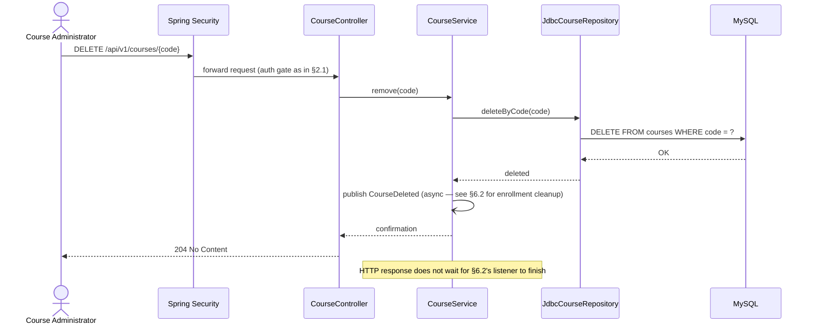

### 4.4 UC-15: View/Search Courses

Course Administrator looks up a course by code or searches by name.

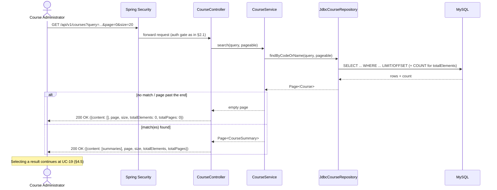

### 4.5 UC-19: View Course Detail

Registrar, Course Administrator, or a Student (via UC-16) selects one course to see its record.

**The roster is not part of this response.** It is its own read — `GET /api/v1/enrollments?courseCode={code}` (§5.4) — granted to the Registrar and Course Administrator but not to a Student browsing the catalogue. Embedding it, as an earlier version of this diagram did, would have handed a Student the names and email addresses of everyone else taking a course as a side effect of opening it. Removing the composition also removes `course`'s only outbound module dependency: `course` now calls nothing.

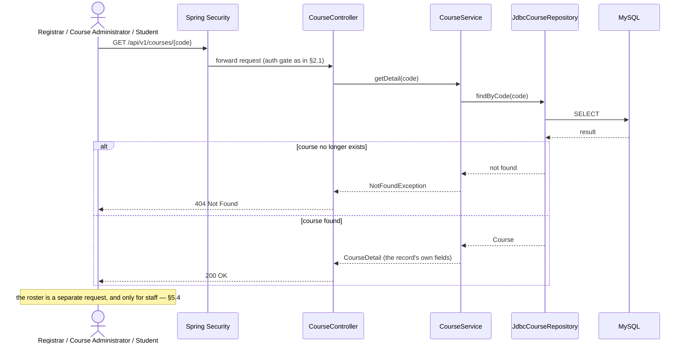

---

## 5. Enrollment module

Owns UC-11, UC-12, UC-20.

### 5.1 UC-11: Enroll Student in Course

Registrar enrolls a student in a course, naming them by **student code** — the surrogate `students.id` is never supplied by a caller (`api-specification.md` §5 decision #9). `StudentLookup.idOf` does double duty here: resolving the code to the id the `enrollments.student_id` FK needs *is* the Enrollment.3 existence check, so the ordering below is unchanged from when this step was a bare existence test. Student self-service enrollment is out of scope. Both cross-module existence checks run before the duplicate-enrollment check.

```mermaid
sequenceDiagram
    actor Caller as Registrar
    participant Sec as Spring Security
    participant Ctrl as EnrollmentController
    participant Svc as EnrollmentService
    participant SLookup as StudentLookup
    participant CLookup as CourseLookup
    participant Agg as Enrollment (aggregate)
    participant Repo as JdbcEnrollmentRepository
    participant DB as MySQL

    Caller->>Sec: POST /api/v1/enrollments
    Sec->>Ctrl: forward request (auth gate as in §2.1)
    Ctrl->>Svc: enroll(studentCode, courseCode)
    Svc->>SLookup: idOf(studentCode)
    SLookup-->>Svc: Optional&lt;StudentId&gt;
    alt student does not exist (Enrollment.3)
        Svc-->>Ctrl: UnknownStudentException
        Ctrl-->>Caller: 400 Bad Request
    else student exists
        Svc->>CLookup: existsByCode(courseCode)
        CLookup-->>Svc: exists?
        alt course does not exist (Enrollment.2)
            Svc-->>Ctrl: UnknownCourseException
            Ctrl-->>Caller: 400 Bad Request
        else course exists
            Svc->>Repo: existsByStudentAndCourse(studentId, courseCode)
            Repo->>DB: SELECT
            DB-->>Repo: result
            Repo-->>Svc: exists?
            alt already enrolled (Enrollment.1)
                Svc-->>Ctrl: DuplicateEnrollmentException
                Ctrl-->>Caller: 409 Conflict
            else no existing enrollment
                Svc->>Agg: create(studentId, courseCode)
                Agg-->>Svc: Enrollment instance
                Svc->>Repo: save(enrollment)
                Repo->>DB: INSERT INTO enrollments ...
                DB-->>Repo: OK
                Repo-->>Svc: saved
                Svc-->>Ctrl: EnrollmentResponse
                Ctrl-->>Caller: 201 Created
            end
        end
    end
```

### 5.2 UC-12: End Enrollment

Registrar withdraws a student from a course, again by student code. Student self-service withdrawal is out of scope. Only the enrollment link is removed — both the student and course records are unaffected.

Note the status choice: an unresolvable `studentCode` is a **404** here, not the 400 §5.1 raises. The caller is addressing one specific enrollment, and an enrollment whose student does not exist cannot exist either — the same answer a real student with no such enrollment gets, so no student-existence signal leaks through a differently-shaped error.

```mermaid
sequenceDiagram
    actor Caller as Registrar
    participant Sec as Spring Security
    participant Ctrl as EnrollmentController
    participant Svc as EnrollmentService
    participant SLookup as StudentLookup
    participant Repo as JdbcEnrollmentRepository
    participant DB as MySQL

    Caller->>Sec: DELETE /api/v1/enrollments/{studentCode}/{courseCode}
    Sec->>Ctrl: forward request (auth gate as in §2.1)
    Ctrl->>Svc: end(studentCode, courseCode)
    Svc->>SLookup: idOf(studentCode)
    SLookup-->>Svc: Optional&lt;StudentId&gt;
    alt no such student, or no such enrollment
        Svc-->>Ctrl: NotFoundException
        Ctrl-->>Caller: 404 Not Found
    else enrollment exists
        Svc->>Repo: deleteByStudentAndCourse(studentId, courseCode)
        Repo->>DB: DELETE FROM enrollments WHERE ...
        DB-->>Repo: OK
        Repo-->>Svc: deleted
        Svc-->>Ctrl: confirmation
        Ctrl-->>Caller: 204 No Content
    end
    Note over Svc: Enrollment.4 — only the link is removed
```

### 5.3 UC-20: View Enrollment Detail

Registrar or Course Administrator selects one enrollment from a student's list or a course roster to see both sides' summary info. **A Student is not an actor here**: `SecurityConfig` grants no role-STUDENT access to `/api/v1/enrollments/**` at all (`04-authentication-authorization.md` §6.1), because a Student's enrolled courses come from `GET /api/v1/me/courses`, scoped by the session principal rather than by a code the caller types.

```mermaid
sequenceDiagram
    actor Caller as Registrar / Course Administrator
    participant Sec as Spring Security
    participant Ctrl as EnrollmentController
    participant Svc as EnrollmentService
    participant Repo as JdbcEnrollmentRepository
    participant SLookup as StudentLookup
    participant CLookup as CourseLookup
    participant DB as MySQL

    Caller->>Sec: GET /api/v1/enrollments/{studentCode}/{courseCode}
    Sec->>Ctrl: forward request (auth gate as in §2.1)
    Ctrl->>Svc: getDetail(studentCode, courseCode)
    Svc->>SLookup: idOf(studentCode)
    SLookup-->>Svc: Optional&lt;StudentId&gt; (empty → the same 404 below)
    Svc->>Repo: findByStudentAndCourse(studentId, courseCode)
    Repo->>DB: SELECT
    DB-->>Repo: result
    alt enrollment no longer exists (ended after list was shown — Enrollment.4)
        Repo-->>Svc: not found
        Svc-->>Ctrl: NotFoundException
        Ctrl-->>Caller: 404 Not Found
    else enrollment found
        Repo-->>Svc: Enrollment
        par student summary
            Svc->>SLookup: summaryOf(studentId)
            SLookup-->>Svc: StudentSummary
        and course summary
            Svc->>CLookup: summaryOf(courseCode)
            CLookup-->>Svc: CourseSummary
        end
        Svc-->>Ctrl: EnrollmentDetail (student summary + course summary)
        Ctrl-->>Caller: 200 OK
    end
```

### 5.4 UC-11 / UC-20 list view: enrollments by student, or by course

The list both of the above are *reached from*. One endpoint, filtered from either end:

| Filter | Answers | Used by |
| --- | --- | --- |
| `?studentCode={code}` | the courses that student is enrolled in | Registrar's Enrollments tab; the enrolled-courses section of UC-17 |
| `?courseCode={code}` | the students enrolled in that course | the roster section of UC-19; Course Administrator's Enrollments tab |

**Exactly one filter is required.** With neither, this would enumerate every enrollment in the system, which no use case asks for; with both, the answer is a single enrollment that §5.3 already addresses directly. Either mistake is a `400` with both field names reported, not a silently broad result.

Both directions return the **same row shape** (`EnrollmentDetail`: student summary + course summary + `enrolledAt`), because they are the same rows viewed from different ends. That is what lets one client render "this student's courses" and another "this course's roster" against one schema. The redundant side is constant across a page, so it is resolved **once**, outside the per-row mapping — a page of 20 costs one lookup for that side, not 20 identical ones.

```mermaid
sequenceDiagram
    actor Caller as Registrar / Course Administrator
    participant Sec as Spring Security
    participant Ctrl as EnrollmentController
    participant Svc as EnrollmentService
    participant SLookup as StudentLookup
    participant CLookup as CourseLookup
    participant Repo as JdbcEnrollmentRepository
    participant DB as MySQL

    Caller->>Sec: GET /api/v1/enrollments?studentCode=… | courseCode=…
    Sec->>Ctrl: forward request (auth gate as in §2.1)
    Ctrl->>Svc: search(studentCode, courseCode, pageable)
    alt neither filter, or both
        Svc-->>Ctrl: DomainValidationException
        Ctrl-->>Caller: 400 Bad Request
    else filtered by studentCode
        Svc->>SLookup: idOf(studentCode)
        SLookup-->>Svc: Optional&lt;StudentId&gt;
        alt no such student
            Svc-->>Ctrl: UnknownStudentException
            Ctrl-->>Caller: 400 Bad Request
        else student exists
            Svc->>SLookup: summaryOf(studentId)
            Note over Svc,SLookup: resolved once — the student is constant across the page
            SLookup-->>Svc: StudentSummary
            Svc->>Repo: findByStudentId(studentId, pageable)
            Repo->>DB: SELECT ... LIMIT/OFFSET + COUNT
            DB-->>Repo: rows
            Repo-->>Svc: Page&lt;Enrollment&gt;
            loop per row
                Svc->>CLookup: summaryOf(courseCode)
                CLookup-->>Svc: CourseSummary
            end
            Svc-->>Ctrl: Page&lt;EnrollmentDetail&gt;
            Ctrl-->>Caller: 200 OK
        end
    else filtered by courseCode
        Svc->>CLookup: existsByCode(courseCode)
        CLookup-->>Svc: exists?
        alt no such course
            Svc-->>Ctrl: UnknownCourseException
            Ctrl-->>Caller: 400 Bad Request
        else course exists
            Svc->>CLookup: summaryOf(courseCode)
            Note over Svc,CLookup: resolved once — the course is constant across the page
            CLookup-->>Svc: CourseSummary
            Svc->>Repo: findByCourseCode(courseCode, pageable)
            Repo->>DB: SELECT ... JOIN courses ... LIMIT/OFFSET + COUNT
            DB-->>Repo: rows
            Repo-->>Svc: Page&lt;Enrollment&gt;
            loop per row
                Svc->>SLookup: summaryOf(studentId)
                SLookup-->>Svc: StudentSummary
            end
            Svc-->>Ctrl: Page&lt;EnrollmentDetail&gt;
            Ctrl-->>Caller: 200 OK
        end
    end
```

---

## 6. Cross-module cascades (async domain events)

Realizes the cleanup rules in `req.md` §5. Both are Spring Modulith event listeners — asynchronous, decoupled from the publisher's transaction (`02-component-diagram.md` §2.3).

### 6.1 StudentDeleted → book, enrollment cleanup

Fired by UC-3 (§2.3) after a student is deleted. `book` clears ownership on any books the student held; `enrollment` removes any enrollments the student held. Neither books nor courses are deleted — only the links to the removed student.

```mermaid
sequenceDiagram
    participant StudentSvc as StudentService
    participant BookSvc as BookService
    participant BookRepo as JdbcBookRepository
    participant EnrollSvc as EnrollmentService
    participant EnrollRepo as JdbcEnrollmentRepository
    participant DB as MySQL

    par book module listener
        StudentSvc-)BookSvc: StudentDeleted(studentId)
        BookSvc->>BookRepo: clearOwnerByStudentId(studentId)
        BookRepo->>DB: UPDATE books SET owner_id = NULL WHERE owner_id = ?
        DB-->>BookRepo: OK
    and enrollment module listener
        StudentSvc-)EnrollSvc: StudentDeleted(studentId)
        EnrollSvc->>EnrollRepo: deleteByStudentId(studentId)
        EnrollRepo->>DB: DELETE FROM enrollments WHERE student_id = ?
        DB-->>EnrollRepo: OK
    end
```

### 6.2 CourseDeleted → enrollment cleanup

Fired by UC-10 (§4.3) after a course is deleted. `enrollment` removes every enrollment tied to that course; previously enrolled students are otherwise unaffected.

```mermaid
sequenceDiagram
    participant CourseSvc as CourseService
    participant EnrollSvc as EnrollmentService
    participant EnrollRepo as JdbcEnrollmentRepository
    participant DB as MySQL

    CourseSvc-)EnrollSvc: CourseDeleted(courseCode)
    EnrollSvc->>EnrollRepo: deleteByCourseCode(courseCode)
    EnrollRepo->>DB: DELETE FROM enrollments WHERE course_code = ?
    DB-->>EnrollRepo: OK
```

---

## 7. Read-side composition

Owned by no single module (`02-component-diagram.md` §2.4).

### 7.1 UC-16: View Own Record, Books & Courses

A Student's whole self-service surface, and the only place a Student learns their own `studentCode` — the login response carries just `{role, mustChangePassword}`, and this API has no session-probe endpoint.

**Three endpoints, not one composed response.** The single `GET /me/books-and-courses` this replaces had to hand-roll `booksPage`/`coursesPage`-prefixed paging parameters, because Spring Data's `PageableHandlerMethodArgumentResolver` resolves only one `page`/`size` pair per request. Splitting the collections apart lets each take an ordinary `Pageable` like every other list endpoint, and lets a Student paging their book list stop refetching their course list to do it. Each is still scoped to `principal.studentId`, never to anything the caller supplies.

| Endpoint | Answers | Backed by |
| --- | --- | --- |
| `GET /api/v1/me/profile` | the caller's own record | `StudentLookup.profileOf` |
| `GET /api/v1/me/courses` | the courses they are enrolled in | `EnrollmentLookup.findByStudent` |
| `GET /api/v1/me/books` | the books they are holding | `BookLookup.findByOwner` |

```mermaid
sequenceDiagram
    actor Student
    participant Sec as Spring Security
    participant Ctrl as MeController
    participant SLookup as StudentLookup
    participant BookSvc as BookService
    participant EnrollSvc as EnrollmentService
    participant DB as MySQL

    Note over Sec: /api/v1/me/** is hasRole("STUDENT"), so studentId is guaranteed non-null

    Student->>Sec: GET /api/v1/me/profile
    Sec->>Ctrl: forward (scoped to principal.studentId)
    Ctrl->>SLookup: profileOf(studentId)
    SLookup->>DB: SELECT
    DB-->>SLookup: row
    alt the record was removed mid-session
        SLookup-->>Ctrl: empty
        Ctrl-->>Student: 404 Not Found
    else record exists
        SLookup-->>Ctrl: StudentProfile
        Ctrl-->>Student: 200 OK
    end

    Student->>Sec: GET /api/v1/me/courses?page=0&size=20
    Sec->>Ctrl: forward (scoped to principal.studentId)
    Ctrl->>EnrollSvc: findByStudent(studentId, pageable)
    EnrollSvc->>DB: SELECT ... LIMIT/OFFSET (+ COUNT)
    DB-->>EnrollSvc: rows + count
    EnrollSvc-->>Ctrl: Page&lt;CourseSummary&gt; (empty page if none, never an error)
    Ctrl-->>Student: 200 OK

    Student->>Sec: GET /api/v1/me/books?page=0&size=20
    Sec->>Ctrl: forward (scoped to principal.studentId)
    Ctrl->>BookSvc: findByOwner(studentId, pageable)
    BookSvc->>DB: SELECT ... LIMIT/OFFSET (+ COUNT)
    DB-->>BookSvc: rows + count
    BookSvc-->>Ctrl: Page&lt;BookSummary&gt; (empty page if none, never an error)
    Ctrl-->>Student: 200 OK

    Note over Student: Selecting a book → UC-18 (§3.6), selecting a course → UC-19 (§4.5)
```

**Why a Student has no enrollment endpoint of their own.** `/me/courses` answers "what am I taking" from the session principal. `/api/v1/enrollments/**` answers the same question from a caller-supplied student code — which is a code a Student could substitute. Rather than scope that surface, the grant is withdrawn: `SecurityConfig` gives role STUDENT no access to it at all (`04-authentication-authorization.md` §6.1). There is no id to probe with and no ownership comparison left to get wrong.

---

## 8. Out of Scope (this document)

- Request/response DTO field lists and error envelope shape — tracked in the OpenAPI contract, per `02-component-diagram.md` §5.
- Database schema / column-level design — tracked separately.
- Login, the must-change-password gate, and the Change/Forgot Password and View Initial Password flows (UC-21, UC-22, UC-23) — see [04-authentication-authorization.md](./04-authentication-authorization.md).
- Transaction isolation levels, retry policy, and timing/performance characteristics of the async event listeners in §6 — an implementation concern, not an architectural one at this level.
