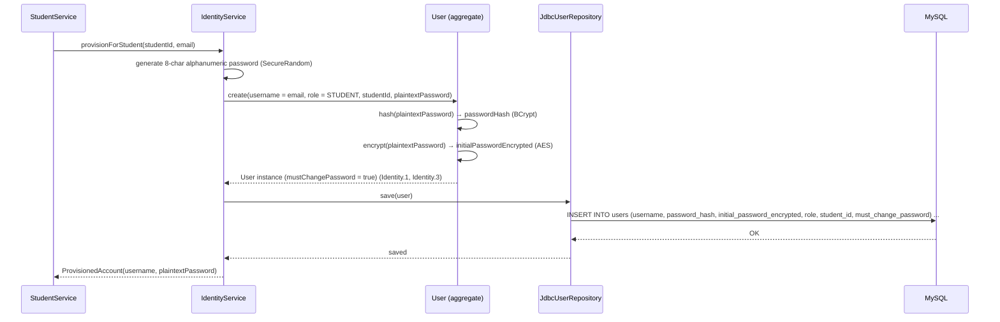
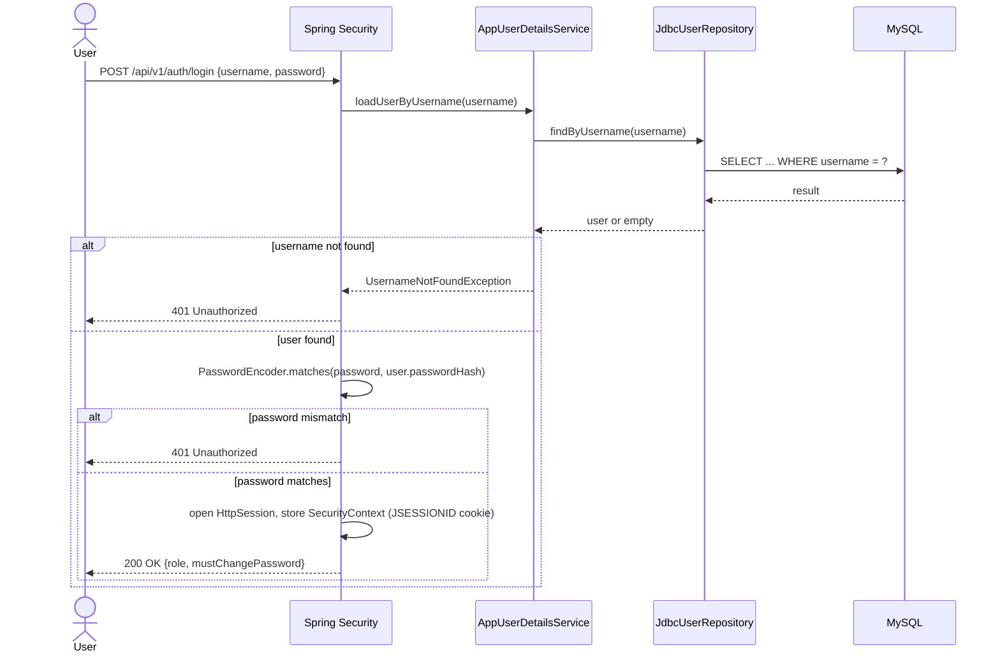
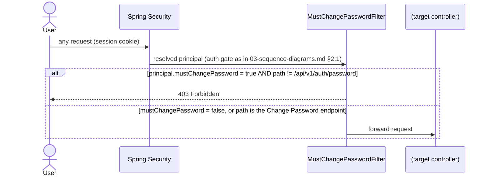
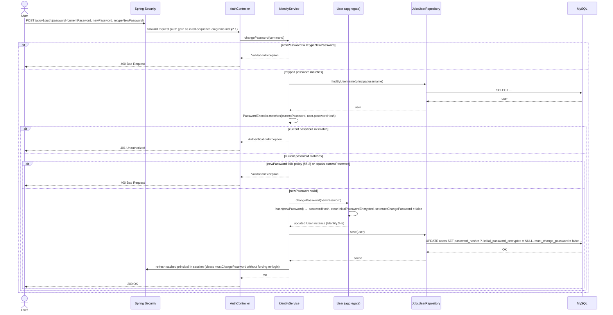
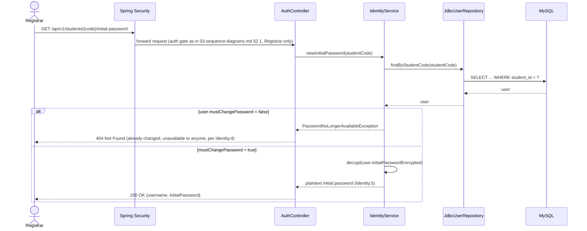

# Authentication & Authorization

Solution Architecture Document — Part 4 of 6 ([System Overview](./01-system-overview.md) → [Component Diagram](./02-component-diagram.md) → [Sequence Diagram](./03-sequence-diagrams.md) → Authentication & Authorization → [Database Schema](./05-database-schema.md) → [Low-Level Design](./06-low-level-design.md)).

Derived from [use-cases.md](../BA-docs/use-cases.md) (UC-1's account-provisioning step, UC-21 Login, UC-22 Change Password, UC-23 View Student's Initial Password) and [req.md](../BA-docs/req.md) (the User Account entity and Identity.1–5 rules). This document settles what `01-system-overview.md` §4.2 and its Deployment Characteristics table originally left as "an implementation decision" — the authentication scheme, the identity/session model, and the `identity` module introduced in `02-component-diagram.md` §2.1/§2.4. It reuses the lifeline, arrow-style, and `alt`/`par` conventions defined once in `03-sequence-diagrams.md` §1 rather than restating them, and does not repeat request/response DTO shapes, which stay in the OpenAPI contract per `02-component-diagram.md` §5.

---

## 1. Decisions

| Concern | Decision | Supersedes |
| --- | --- | --- |
| State management | **Session-based (stateful).** Spring Security's default HTTP session management issues a server-side session (`JSESSIONID` cookie) on successful login. | `01-system-overview.md` Deployment Characteristics "State" row, previously "Stateless"; §4.2, previously "an implementation decision... not fixed at this level." |
| Authorization model | **RBAC**, using the same 4 roles already named throughout the doc set (Registrar, Librarian, Course Administrator, Student) — no new role is introduced. | `02-component-diagram.md` §4's existing role/access table, which now has a concrete `role` column on `users` backing it instead of an abstract "authenticated principal." |
| Identity / SSO | **In-app identity.** A dedicated `users` table owned by a new `identity` module; login and password logic are built into the application itself. No external IdP, no OAuth/OIDC. | — (no prior decision existed; this scope was entirely unaddressed before). |

Single-process deployment (`01-system-overview.md` Deployment Characteristics, "Process topology") makes an in-memory session store sufficient for this scope — no distributed session store is designed here (see §7).

## 2. The `identity` module and the `users` table

### 2.1 Module placement

A new Spring Modulith module, `identity`, mirroring `student`'s hexagonal shape (`web/` → `application/` → `domain/` → `port/` → `internal/`), not folded into `shared`. `shared` keeps owning the *mechanism* — the `SecurityFilterChain` and `PasswordEncoder` beans, alongside its existing global exception handler (`02-component-diagram.md` §4). `identity` owns the *domain* — a `User` aggregate with real invariants (unique username, hash-vs-encrypted-initial-password split, role/`student_id` co-invariant, must-change-password state), the same kind of thing `Student`/`Course`/`Book`/`Enrollment` already are, and so belongs in a module of its own by the same reasoning `02-component-diagram.md` §2.5 already applies to `StudentLookup`/`CourseLookup`.

Published API (non-`internal`, consumed by other modules — see `02-component-diagram.md` §2.1, §2.2):

- `AccountProvisioning.provisionForStudent(studentId, email)` — called by `student` synchronously, in the same transaction as the student save (`03-sequence-diagrams.md` §2.1).
- `PrincipalStudentResolver.studentIdOf(Authentication)` — used wherever a module needs to resolve "own records only" scoping for a Student principal (`02-component-diagram.md` §4).

This is the one place in the module graph where the dependency direction is inverted from the existing `book`/`enrollment` → `student`/`course` pattern: the *owning* module (`student`) calls out to `identity`, not the reverse.

### 2.2 `users` table schema

Conceptual schema — Flyway DDL is future build-phase work, same status as the rest of the schema (`01-system-overview.md` §4.4 notes Spring Data JDBC generates no DDL of its own).

| Column | Notes |
| --- | --- |
| `id` | Surrogate primary key. |
| `username` | Unique, not null. For a Student account this is always the student's email (already validated unique by Student.2) — if the student's email later changes, the username changes with it (req.md §3, Student ↔ User Account). |
| `password_hash` | BCrypt hash of the **current** password. One-way — used only to verify a login or a Change Password submission; never reversible, never displayed. |
| `initial_password_encrypted` | Nullable. A **reversibly encrypted** (AES) copy of the *original* system-generated password, populated at account creation. **Cleared to `NULL` the instant the account holder completes their first password change.** This is the only recoverable form of any password in this design, and it exists solely to satisfy UC-23. |
| `role` | One of `REGISTRAR`, `LIBRARIAN`, `COURSE_ADMINISTRATOR`, `STUDENT`. |
| `student_id` | Nullable FK to the `student` module's aggregate. Required if and only if `role = STUDENT`; must be `NULL` for the 3 staff roles — a domain invariant on `User`, enforced the same way Student.3/4 are enforced on `Student`. |
| `must_change_password` | Not null, default `false`. Set `true` at creation for auto-provisioned Student accounts (Identity.3); flips to `false` on the first successful Change Password (Identity.3–5). |
| `created_at` / `updated_at` | Timestamps. |

**Security note.** Storing any reversible form of a password is a deliberate, narrow deviation from password-storage best practice, made only because Identity.5 requires the Registrar to be able to look up a student's still-active initial password. The deviation is scoped as tightly as the requirement allows: only the *original* system-generated password is ever recoverable (never one the account holder chose), only for as long as `must_change_password = true`, and only via `initial_password_encrypted` — `password_hash` itself is always one-way. The AES key used for this field is application-managed configuration (e.g. environment/secret store); its storage and rotation is a build/ops concern, out of scope here (§7).

**Staff accounts (Registrar, Librarian, Course Administrator) are out of scope for auto-provisioning.** No use case in `use-cases.md` defines who creates a staff account or through what flow — only UC-1 (Student registration) triggers auto-provisioning. Staff accounts are assumed pre-seeded by some out-of-band process (§7).

## 3. Account provisioning (UC-1 tail)

Extends `03-sequence-diagrams.md` §2.1, immediately after `Svc->>Repo: save(student)` succeeds and before the `201 Created` response. Runs in the same transaction as the student save — if provisioning fails, the whole registration rolls back (`01-system-overview.md` §4.4: one schema, one connection pool).

No `alt` for a username collision is modeled — consistent with this doc set's rule of only modeling branches `use-cases.md` actually lists (`03-sequence-diagrams.md` §1): a collision is unreachable here since the username is always the already-Student.2-validated-unique email. The returned `plaintextPassword` is included once in UC-1's `201 Created` response (`03-sequence-diagrams.md` §2.1); after that response, it is retrievable again only through UC-23 (§5.3), and only until the student changes it.

## 4. Login & the must-change-password gate

### 4.1 UC-21: Login

### 4.2 Must-change-password gate

Sits behind the standard auth gate (`03-sequence-diagrams.md` §2.1) — a request must already be authenticated before this check runs.

A newly provisioned Student account (§3) therefore cannot do anything except submit UC-22 until it does so — there is no way to "skip" the change and use the temporary password for ordinary access.

## 5. Change Password & View Initial Password

### 5.1 UC-22: Change Password

Three fields — Current Password, New Password, Re-type New Password — validated in that order (retype-match, then current-password match, then new-password policy), mirroring the cascading-`alt` style of UC-1.

Clearing `initial_password_encrypted` in the same update is what makes the new password permanently unrecoverable — including to the Registrar (Identity.4).

### 5.2 Password policy

Kept minimal — this is a small internal system, not a public-facing one:

1. Minimum length **8 characters** (no regression versus the temp password).
2. **No mandatory composition rules** (no forced upper/lower/digit/symbol mix) — favors length over complexity, per NIST 800-63B guidance for a system this size.
3. New password **must differ** from the current password — otherwise "changing" it could be a no-op that still clears `must_change_password`, defeating the gate in §4.2.
4. New and Re-type must match exactly (already enforced as the first check in §5.1).
5. Maximum length **72 characters** — BCrypt silently truncates beyond 72 bytes; capping input avoids that surprise.
6. No password history, expiry, or rotation policy — out of scope (§7).

### 5.3 UC-23: View Student's Initial Password

Registrar-only. Available only while the target account is still using its system-issued password.

## 6. RBAC summary

Extends `02-component-diagram.md` §4's role/access table with the `identity`-specific permissions that table deliberately excludes (§4's closing note):

| Role | Can log in (UC-21) | Can change own password (UC-22) | Can view a student's initial password (UC-23) |
| --- | --- | --- | --- |
| Registrar | Yes | Yes | Yes |
| Librarian | Yes | Yes | No |
| Course Administrator | Yes | Yes | No |
| Student | Yes | Yes | No |

No role may view or change another principal's *changed* password — that is never possible for anyone, by construction (§2.2, §5.1).

## 7. Out of Scope (this document)

- SSO, OAuth/OIDC, or any external identity provider — identity is entirely in-app, per §1.
- A "true" forgot-password flow for a user with no active session and no known current password (email/SMS/token-based reset) — not designed; an account holder who cannot authenticate at all must be handled operationally.
- How staff (Registrar/Librarian/Course Administrator) accounts are created — assumed pre-seeded; no use case defines this flow (§2.2).
- Horizontal scaling of the session store (Spring Session JDBC/Redis, sticky sessions) — the single-process deployment in `01-system-overview.md` makes this unnecessary for current scope.
- Multi-factor authentication, password expiry/rotation, and password history beyond the single "must differ from current" check (§5.2).
- AES key management/rotation for `initial_password_encrypted` — application configuration, a build/ops concern.
- Flyway migration DDL and Java class implementation for the `identity` module — future build-phase work, same status as the rest of the schema (`01-system-overview.md` §4.4).
