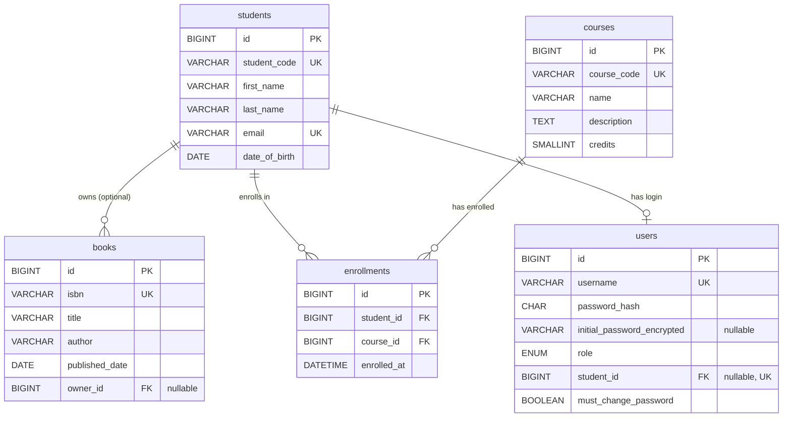

# Database Schema

Solution Architecture Document — Part 5 of 5 ([System Overview](./01-system-overview.md) → [Component Diagram](./02-component-diagram.md) → [Sequence Diagram](./03-sequence-diagrams.md) → [Authentication & Authorization](./04-authentication-authorization.md) → Database Schema).

Derived from [req.md](../BA-docs/req.md) (business entities, invariants, and lifecycle rules) and [04-authentication-authorization.md](./04-authentication-authorization.md) §2.2 (the `users` table). Both of those documents deliberately left column-level design out of scope (`02-component-diagram.md` §5: "Database schema / column-level design — tracked separately, not duplicated here"; `04-authentication-authorization.md` §7: "Flyway migration DDL... future build-phase work"). This document is that separate design: a concrete MySQL 8 table-by-table schema, still **conceptual** — no Flyway migration file is written here, since no entity/repository code exists yet in `management/` to run against it (see §7).

---

## 1. Scope

Five tables, one per aggregate named across the doc set: `students`, `courses`, `books`, `enrollments`, `users`. One schema, owned entirely by the application (`01-system-overview.md` §4.4) — no cross-schema or cross-database references. All five modules (`student`, `course`, `book`, `enrollment`, `identity`) read/write through this one MySQL 8 schema via Spring Data JDBC.

**Primary key strategy.** Every table uses a surrogate `BIGINT AUTO_INCREMENT` primary key (`id`), not a business key. Business keys (`student_code`, `course_code`, `isbn`, `username`) are enforced instead via `UNIQUE NOT NULL` constraints. This matches Spring Data JDBC's preferred aggregate-id pattern and keeps foreign keys and their indexes numeric rather than string-based.

## 2. Entity-Relationship Diagram

Every relationship shown is a plain FK column, never an ORM-level `@ManyToOne`/relationship mapping — Spring Data JDBC aggregates reference each other by id only (`02-component-diagram.md` §2.5: `Book.ownerId` is "a plain `StudentId` value, never a `Student` reference").

## 3. Table Definitions

### 3.1 `students`

| Column | Type | Constraints | Notes |
| --- | --- | --- | --- |
| `id` | `BIGINT` | PK, `AUTO_INCREMENT` | Surrogate key. |
| `student_code` | `VARCHAR(20)` | `UNIQUE NOT NULL` | Business key, Registrar-supplied at registration (Student.1). |
| `first_name` | `VARCHAR(100)` | `NOT NULL` | Student.3. |
| `last_name` | `VARCHAR(100)` | `NOT NULL` | Student.3. |
| `email` | `VARCHAR(255)` | `UNIQUE NOT NULL` | Student.2; also the `users.username` source for this student's account. |
| `date_of_birth` | `DATE` | `NOT NULL` | Student.4. |
| `created_at` | `DATETIME` | `NOT NULL DEFAULT CURRENT_TIMESTAMP` | Audit. |
| `updated_at` | `DATETIME` | `NOT NULL DEFAULT CURRENT_TIMESTAMP ON UPDATE CURRENT_TIMESTAMP` | Audit. |

### 3.2 `courses`

| Column | Type | Constraints | Notes |
| --- | --- | --- | --- |
| `id` | `BIGINT` | PK, `AUTO_INCREMENT` | Surrogate key. |
| `course_code` | `VARCHAR(20)` | `UNIQUE NOT NULL` | Course.1. |
| `name` | `VARCHAR(150)` | `NOT NULL` | Course.2. |
| `description` | `TEXT` | `NULL` | Free text, no business invariant on it. |
| `credits` | `SMALLINT` | `NOT NULL`, `CHECK (credits > 0)` | Course.3. |
| `created_at` | `DATETIME` | `NOT NULL DEFAULT CURRENT_TIMESTAMP` | Audit. |
| `updated_at` | `DATETIME` | `NOT NULL DEFAULT CURRENT_TIMESTAMP ON UPDATE CURRENT_TIMESTAMP` | Audit. |

### 3.3 `books`

| Column | Type | Constraints | Notes |
| --- | --- | --- | --- |
| `id` | `BIGINT` | PK, `AUTO_INCREMENT` | Surrogate key. |
| `isbn` | `VARCHAR(20)` | `UNIQUE NOT NULL` | Book.1. Sized for ISBN-13 with hyphens. |
| `title` | `VARCHAR(255)` | `NOT NULL` | — |
| `author` | `VARCHAR(255)` | `NOT NULL` | — |
| `published_date` | `DATE` | `NULL` | — |
| `owner_id` | `BIGINT` | `NULL`, FK → `students.id`, `ON DELETE SET NULL` | Book.2/3/4: at most one owner, ownership optional. `ON DELETE SET NULL` is the DB-level mirror of req.md §5 "book becomes unassigned" — see §5. |
| `created_at` | `DATETIME` | `NOT NULL DEFAULT CURRENT_TIMESTAMP` | Audit. |
| `updated_at` | `DATETIME` | `NOT NULL DEFAULT CURRENT_TIMESTAMP ON UPDATE CURRENT_TIMESTAMP` | Audit. |

### 3.4 `enrollments`

| Column | Type | Constraints | Notes |
| --- | --- | --- | --- |
| `id` | `BIGINT` | PK, `AUTO_INCREMENT` | Surrogate key. Component diagram (`02-component-diagram.md` §2.1) describes the aggregate's conceptual key as `studentId+courseCode`; here both sides are represented by their surrogate FKs (`student_id`, `course_id`) with a `UNIQUE` constraint standing in for that composite business key, consistent with the surrogate-PK strategy applied uniformly across this schema. |
| `student_id` | `BIGINT` | `NOT NULL`, FK → `students.id`, `ON DELETE CASCADE` | Enrollment.3. |
| `course_id` | `BIGINT` | `NOT NULL`, FK → `courses.id`, `ON DELETE CASCADE` | Enrollment.2. |
| `enrolled_at` | `DATETIME` | `NOT NULL DEFAULT CURRENT_TIMESTAMP` | — |
| — | — | `UNIQUE (student_id, course_id)` | Enrollment.1: no duplicate enrollment for the same (student, course) pair. |

### 3.5 `users`

Translates `04-authentication-authorization.md` §2.2's conceptual column list into concrete DDL.

| Column | Type | Constraints | Notes |
| --- | --- | --- | --- |
| `id` | `BIGINT` | PK, `AUTO_INCREMENT` | Surrogate key. |
| `username` | `VARCHAR(255)` | `UNIQUE NOT NULL` | Identity.2. For a Student account, equals `students.email` at provisioning time; not itself FK-linked to `students.email` (see §6). |
| `password_hash` | `CHAR(60)` | `NOT NULL` | Fixed-length BCrypt hash. |
| `initial_password_encrypted` | `VARCHAR(255)` | `NULL` | AES ciphertext (base64), cleared to `NULL` on first password change (Identity.4). |
| `role` | `ENUM('REGISTRAR','LIBRARIAN','COURSE_ADMINISTRATOR','STUDENT')` | `NOT NULL` | Fixed set of 4 roles per `01-system-overview.md` §2 — no dynamic role management is in scope, so `ENUM` is used instead of a lookup table. |
| `student_id` | `BIGINT` | `NULL`, `UNIQUE`, FK → `students.id`, `ON DELETE CASCADE` | Nullable for the 3 staff roles, required for `STUDENT` (see the `CHECK` below). `UNIQUE` enforces the 1:1 Student↔User relationship (req.md §3). |
| `must_change_password` | `BOOLEAN` | `NOT NULL DEFAULT FALSE` | Identity.3. |
| `created_at` | `DATETIME` | `NOT NULL DEFAULT CURRENT_TIMESTAMP` | Audit. |
| `updated_at` | `DATETIME` | `NOT NULL DEFAULT CURRENT_TIMESTAMP ON UPDATE CURRENT_TIMESTAMP` | Audit. |
| — | — | `CHECK ((role = 'STUDENT' AND student_id IS NOT NULL) OR (role <> 'STUDENT' AND student_id IS NULL))` | The role/`student_id` co-invariant described in `04-authentication-authorization.md` §2.2. |

## 4. Constraints & Invariants Traceability

Every `req.md` §4 rule that constrains stored data maps to a schema-level constraint:

| req.md rule | Schema enforcement |
| --- | --- |
| Student.1 (unique student code) | `students.student_code UNIQUE` |
| Student.2 (unique, valid email) | `students.email UNIQUE`; format validation is application-level (not a DB concern) |
| Student.3 (mandatory names) | `students.first_name`, `students.last_name` `NOT NULL` |
| Student.4 (valid DOB) | `students.date_of_birth DATE NOT NULL`; "real date" validity is guaranteed by the `DATE` type itself |
| Book.1 (unique ISBN) | `books.isbn UNIQUE` |
| Book.2/3 (at most one owner, ownership optional) | `books.owner_id` nullable single FK column — a book row can only ever point at one or zero students |
| Book.4 (owner must exist) | `books.owner_id` FK → `students.id` |
| Course.1 (unique course code) | `courses.course_code UNIQUE` |
| Course.2 (mandatory name) | `courses.name NOT NULL` |
| Course.3 (positive credits) | `courses.credits CHECK (credits > 0)` |
| Enrollment.1 (no duplicate enrollment) | `enrollments UNIQUE (student_id, course_id)` |
| Enrollment.2 (course must exist) | `enrollments.course_id` FK → `courses.id` |
| Enrollment.3 (student must exist) | `enrollments.student_id` FK → `students.id` |
| Identity.2 (unique username) | `users.username UNIQUE` |
| Identity.3 (must-change-password state) | `users.must_change_password NOT NULL DEFAULT FALSE`, set `TRUE` at provisioning |
| Student↔User 1:1 (req.md §3) | `users.student_id UNIQUE` |
| role/`student_id` co-invariant (auth doc §2.2) | `users` `CHECK` constraint |

## 5. Cascade / Delete Behavior

`req.md` §5's lifecycle rules are implemented primarily as **application-level** logic — Spring Modulith domain events (`StudentDeleted`, `CourseDeleted`) consumed synchronously-in-process by dependent modules' services (`02-component-diagram.md` §2.3). The `ON DELETE` clauses below are a **database-level safety net** underneath those handlers, not a replacement for them: they guarantee referential integrity even if an event handler is ever skipped or fails, but the actual deletion still goes through each module's own service/repository so that module boundaries (`ApplicationModules.verify()`) are respected at the code level.

| Trigger | DB mechanism | req.md §5 rule |
| --- | --- | --- |
| Student deleted | `books.owner_id` → `ON DELETE SET NULL` | Book survives, ownership cleared |
| Student deleted | `enrollments.student_id` → `ON DELETE CASCADE` | Enrollment removed, course unaffected |
| Student deleted | `users.student_id` → `ON DELETE CASCADE` | User account removed |
| Course deleted | `enrollments.course_id` → `ON DELETE CASCADE` | Enrollment removed, student unaffected |
| Book deleted | — (no dependents) | Plain row delete; owning student, if any, is unaffected |

## 6. Naming & Type Conventions

- **Tables**: plural, `snake_case` (`students`, `books`, `courses`, `enrollments`, `users`) — `users` matches the exact name already fixed by `04-authentication-authorization.md` §2.2.
- **Columns**: `snake_case`, matching the Spring Data JDBC default property-to-column mapping (camelCase Java fields map automatically).
- **Surrogate keys**: always `id BIGINT AUTO_INCREMENT PRIMARY KEY`.
- **Foreign keys**: named `<referenced_singular>_id` (`owner_id` is the one exception, named for its role rather than its target, since `books` has no other student reference to disambiguate from).
- **Timestamps**: `DATETIME`, `created_at`/`updated_at` pair on every table, matching the pattern `04-authentication-authorization.md` §2.2 already specifies for `users`, applied consistently to the other four tables for the same audit purpose.
- **Character set**: `utf8mb4` throughout, matching the MySQL container's configured charset/collation (`docker-compose.yml`).
- **Engine**: InnoDB (MySQL 8 default), required for FK and `CHECK` constraint enforcement.

## 7. Out of Scope

- **Flyway migration SQL** (`V1__*.sql` or similar) — this document is the design; the runnable migration is future build-phase work, tracked the same way `04-authentication-authorization.md` §7 already tracks the `identity` module's DDL.
- **JDBC entity/`@Table` class definitions** (`StudentRow`, `UserRow`, etc.) — Java implementation detail, not a schema concern (`02-component-diagram.md` §3).
- **Indexing beyond what `UNIQUE`/`FOREIGN KEY` constraints already create** — InnoDB auto-indexes PKs, unique constraints, and FK columns; no additional composite/covering indexes are specified without a known query pattern to justify them.
- **Read replicas, partitioning, sharding** — ruled out by the single-schema, single-process deployment already fixed in `01-system-overview.md` §5.
- **Soft-delete columns** — `req.md` §5 describes hard deletes throughout (rows are removed, not flagged); no soft-delete requirement exists.
