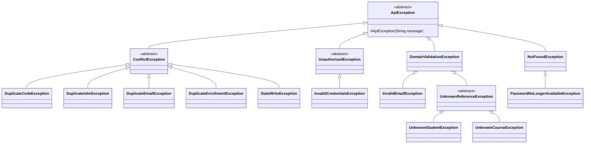
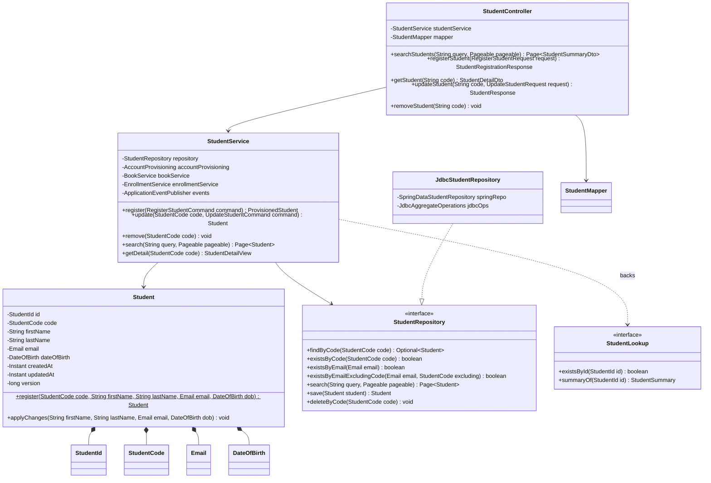
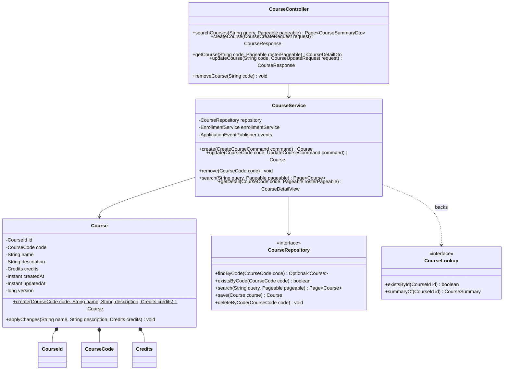
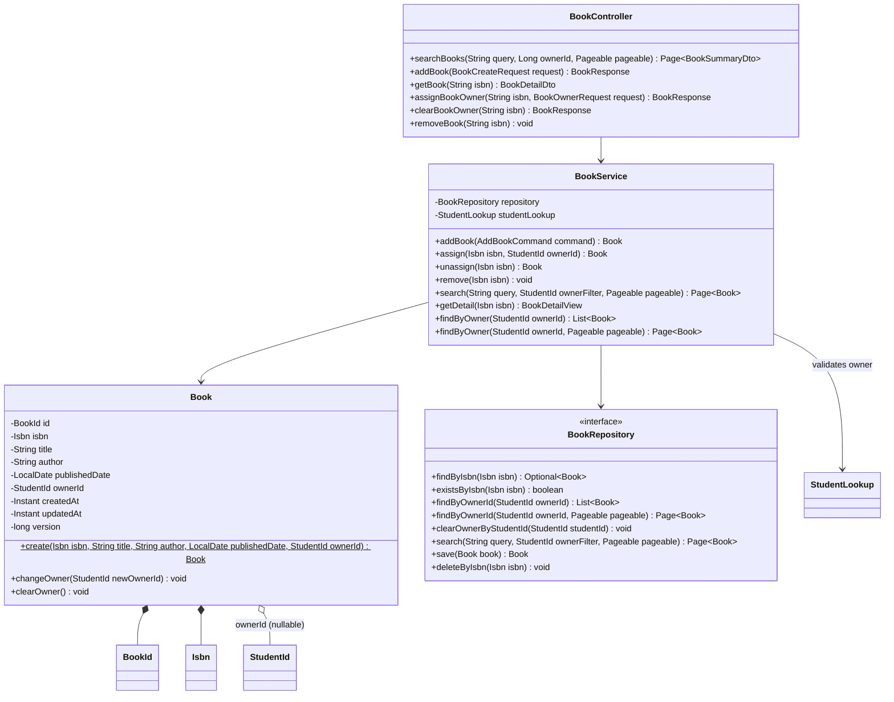
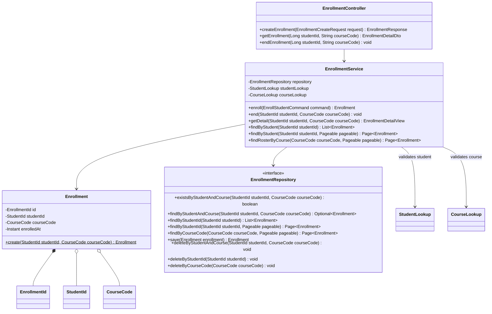

# Low-Level Design

Solution Architecture Document — Part 6 of 6 ([System Overview](./01-system-overview.md) → [Component Diagram](./02-component-diagram.md) → [Sequence Diagram](./03-sequence-diagrams.md) → [Authentication & Authorization](./04-authentication-authorization.md) → [Database Schema](./05-database-schema.md) → Low-Level Design).

This document extends [tactical-ddd-design.md](./tactical-ddd-design.md), which names the tactical DDD building blocks (Aggregates, Value Objects, Repositories, Application Services, Domain Events) and maps each to a class name already introduced in [02-component-diagram.md](./02-component-diagram.md) §3, but explicitly stops there: its own §13 Out of Scope reads *"Class-level Java signatures, package layout beyond what 02-component-diagram.md §3 already shows, or unit-test design — this document names patterns and maps them to existing class names; it does not write the code."* This document is that next layer down: concrete package layout, class/interface definitions, and method signatures (parameters, return types, thrown exceptions) for all five bounded-context modules, precise enough to type directly into `management/src/main/java`.

Nothing here is a new architectural or tactical decision — every class, method, and exception name is already implied by `02-component-diagram.md`, `03-sequence-diagrams.md`, `04-authentication-authorization.md`, `05-database-schema.md`, `tactical-ddd-design.md`, or `openapi/`. Where this document has to choose a concrete shape those documents leave implicit (e.g. an exception's exact superclass, a repository method not listed as "representative" in `tactical-ddd-design.md` §7), that choice is called out explicitly rather than presented as if it were already fixed.

---

## 1. Purpose & Scope

**In scope:**
- Package layout per module, following the `web/ → application/ → domain/ → port/ → internal/` shape `02-component-diagram.md` §3 fixes for `student` and extends to all five modules.
- Class and interface definitions: fields/attributes, constructors/factory methods, method signatures (parameter types, return types, checked/unchecked exceptions thrown).
- The shared exception hierarchy implied by the exception names already used throughout `03-sequence-diagrams.md` and `04-authentication-authorization.md`.
- Mermaid `classDiagram` views, one per module, showing how these classes connect.
- Persistence annotations on every `*Row` record and the runnable Flyway migration DDL (§9).
- Optimistic-locking strategy — which aggregates carry a `@Version`, and how a lost update surfaces as an HTTP response (§10).
- Spring Security bean wiring and `SecurityFilterChain` configuration, including the JSON login filter and the `MustChangePasswordFilter` registration (§11).
- MapStruct mapper method bodies for the domain-to-DTO conversions the annotation processor cannot infer on its own (§12).

**Out of scope** (see §15 for the full list): DTO field lists (owned by the OpenAPI contract) and unit-test design. Both are implementation-phase concerns that don't change the shape fixed here.

## 2. Conventions

### 2.1 Package root and per-module layout

Root package (from `management/pom.xml`): `org.phuchoang.management`. Each of the five modules is a direct child package, matching Spring Modulith's default module-detection (one top-level package per module):

```
org.phuchoang.management
├── shared        (cross-cutting: exceptions, global handler, security config)
├── student
├── course
├── book
├── enrollment
└── identity
```

Inside a module (`02-component-diagram.md` §3), the same five folders recur, plus a public API façade sitting beside `application/`:

```
org.phuchoang.management.<module>
├── web/            driving adapter — Controller, MapStruct Mapper, DTOs
├── application/    use-case orchestration — the Application Service, Commands
├── domain/         framework-free — Aggregate root, Value Objects
├── port/           interfaces owned by domain/application — Repository, and (identity only) PasswordHasher/PasswordCipher
├── <PublicApi>.java, <events>.java   published interfaces & domain events — module root, NOT internal/
└── internal/       driven adapter, invisible outside the module — Jdbc*Repository, *Row persistence records
```

`ApplicationModules.verify()` (Spring Modulith, run as a test) enforces that nothing outside a module imports from that module's `internal/` package — this is the mechanical backstop for the "public API, not a port" rule `02-component-diagram.md` §2.5 already argues from first principles.

### 2.2 Class-shape conventions

| Element | Java shape | Why |
| --- | --- | --- |
| Value Object | `record` (e.g. `record Email(String value)`), validating invariants in a compact constructor | Immutable, equality-by-value for free — exactly what §4 of `tactical-ddd-design.md` calls for |
| Aggregate root | Plain class, private mutable fields, package-visible/`@Getter` accessors, a static factory method, behavior methods that mutate `this` | Spring Data JDBC aggregates are conventionally mutable POJOs; `Lombok` (already a `pom.xml` dependency) supplies `@Getter`/`@RequiredArgsConstructor` boilerplate without adding a runtime framework dependency to `domain/` |
| Repository port | Interface in `port/`, only the methods the Application Service actually calls (never a bare `CrudRepository<T, ID>` leaked outward, per `02-component-diagram.md` §3) | Dependency-inversion boundary |
| Repository adapter | Class in `internal/`, implements the port, delegates to an injected Spring Data JDBC `CrudRepository` for CRUD and `@Query`/`JdbcAggregateOperations` for the rest | Keeps Spring Data JDBC entirely inside `internal/` |
| Application Service | Concrete class (no `Impl` suffix, no interface) in `application/` | Single implementation, thin orchestrator — an interface would add indirection with no second implementation to justify it |
| Command | `record` in `application/`, one per write use case, primitive/`String`-typed fields (VO construction happens inside the service/aggregate, not the command) | Matches the `command` parameter already named generically in every `03-sequence-diagrams.md` diagram (`Svc->>Svc: register(command)`) |
| Domain Event | `record`, placed at the *publishing* module's root (not `internal/`) since consuming modules need the type on their classpath | Same published-language reasoning `tactical-ddd-design.md` §10 applies to `StudentLookup` et al. |
| Exception | Unchecked (`extends RuntimeException`), under `shared.exception` | Spring's `@ControllerAdvice` idiom — see §3 |

### 2.3 Method-signature table format

Every method table below uses this column order: **Method**, **Parameters**, **Returns**, **Throws**. `Throws` lists only checked-equivalent *domain* exceptions callers must expect (unchecked, but load-bearing) — `RuntimeException`s a caller can't reasonably anticipate (e.g. a bug) are omitted.

## 3. Shared Exceptions & Kernel Types (`shared`)

`shared` owns the mechanism (`SecurityFilterChain`, `PasswordEncoder` bean, global exception handler — `04-authentication-authorization.md` §2.1) but no domain vocabulary of its own (`tactical-ddd-design.md` §2). Its one piece of shared *type* vocabulary is the exception hierarchy every module's `application/` throws, consolidating every exception name already used across `03-sequence-diagrams.md` and `04-authentication-authorization.md`:



| Exception | HTTP status | Raised where | Traces to |
| --- | --- | --- | --- |
| `DomainValidationException` | 400 | VO constructors (`StudentCode`, `DateOfBirth`, `Credits`, …), aggregate factory methods | Student.3/4, Course.2/3 |
| `InvalidEmailException` | 400 | `Email` VO constructor — malformed format only (duplicate is `DuplicateEmailException`, per `api-specification.md` §5's malformed-vs-duplicate split) | Student.2 |
| `NotFoundException` | 404 | `*Service.getDetail(...)` when the requested aggregate no longer exists | UC-17/18/19/20 "no longer exists" branches |
| `DuplicateCodeException` | 409 | `StudentService.register`, `CourseService.create` | Student.1, Course.1 |
| `DuplicateIsbnException` | 409 | `BookService.addBook` | Book.1 |
| `DuplicateEmailException` | 409 | `StudentService.register`/`update` | Student.2 |
| `DuplicateEnrollmentException` | 409 | `EnrollmentService.enroll` | Enrollment.1 |
| `StaleWriteException` | 409 | Any `*Service` write method (`update`, `assign`/`unassign`, `changePassword`) that calls `repository.save(...)` on a `Student`/`Course`/`Book`/`User` loaded with a `version` that no longer matches the row — see §10 | New in this document — closes the optimistic-locking gap `tactical-ddd-design.md` §13 left open |
| `UnknownStudentException` | 400 | `BookService` (owner ref), `EnrollmentService` (student ref) via `StudentLookup.existsById` | Book.4, Enrollment.3 |
| `UnknownCourseException` | 400 | `EnrollmentService` (course ref) via `CourseLookup.existsById` | Enrollment.2 |
| `InvalidCredentialsException` | 401 | Login (Spring Security `AuthenticationFailureHandler`), `IdentityService.changePassword` (current-password mismatch) | UC-21, UC-22 |
| `PasswordNoLongerAvailableException` | 404 | `IdentityService.viewInitialPassword` when `mustChangePassword = false` | Identity.4/5, UC-23 |
| `DuplicateUsernameException` | 409 | `IdentityService.provisionStaff` | Identity.2, Identity.6, UC-24 |
| `UserNotFoundException` | 404 | `IdentityService.setAccountEnabled` | UC-25 |
| Spring Security `DisabledException` (not an `ApiException` subtype — handled entirely inside the auth filter chain, same as `InvalidCredentialsException` at login) | 401 | `AppUserDetailsService.loadUserByUsername` when `!user.enabled()` | Identity.7, UC-21, UC-25 |

`shared.web.GlobalExceptionHandler` (`@RestControllerAdvice`) maps each branch of this hierarchy to the `Error`/`ValidationError` envelope already fixed in `api-specification.md` §3 (`timestamp`, `status`, `error`, `message`, `path`) — one `@ExceptionHandler(ApiException.class)` reading `getStatus()` off the exception, no per-exception-type handler methods needed.

## 4. Reference module: `student`

`student` is elaborated in full below; `course`, `book`, `enrollment`, and `identity` (§§5–8) reuse this exact shape and are described only where they differ, per `02-component-diagram.md` §3's own framing ("`course` is its twin; `book` and `enrollment` add one/two outbound API calls on top of the same shape").

### 4.1 Package layout

```
org.phuchoang.management.student
├── web
│   ├── StudentController.java
│   ├── StudentMapper.java              (MapStruct: DTO ⇄ domain)
│   └── dto/
│       ├── RegisterStudentRequest.java, UpdateStudentRequest.java
│       └── StudentResponse.java, StudentRegistrationResponse.java, StudentSummaryDto.java, StudentDetailDto.java
├── application/
│   ├── StudentService.java
│   └── command/
│       ├── RegisterStudentCommand.java
│       └── UpdateStudentCommand.java
├── domain/
│   ├── Student.java
│   ├── StudentId.java, StudentCode.java, Email.java, DateOfBirth.java
├── port/
│   └── StudentRepository.java
├── StudentLookup.java                  (public API)
├── StudentSummary.java                 (public API read model, also reused by web/ mapping)
├── StudentDeleted.java                 (domain event)
└── internal/
    ├── JdbcStudentRepository.java
    ├── SpringDataStudentRepository.java   (Spring Data JDBC CrudRepository<StudentRow, Long>)
    └── StudentRow.java                    (@Table("students") persistence record)
```

`StudentSummaryDto` (web) and `StudentSummary` (public API) hold the same fields by design — the web layer's `StudentMapper` maps the domain `Student` straight into both, and `book`/`enrollment` consume the public-API record directly. They stay two classes in two packages because `web/dto` is JSON/OpenAPI-contract-owned while the module root is Java-API-owned; a change to one must not force a change to the other's callers.

### 4.2 Class diagram



### 4.3 Value Objects

| VO | Field | Compact-constructor invariant | Throws | Rule |
| --- | --- | --- | --- | --- |
| `StudentId(Long value)` | `value` | none — `null` before first `save()` (Spring Data JDBC's new-vs-existing detection via `@Id`), assigned by the DB on insert | — | — |
| `StudentCode(String value)` | `value` | non-blank, matches the registrar-supplied code format | `DomainValidationException` | Student.1 (format; uniqueness is `StudentRepository.existsByCode`) |
| `Email(String value)` | `value` | non-blank, RFC-5322-shaped (Jakarta `@Email`-equivalent regex) | `InvalidEmailException` | Student.2 (format; uniqueness is `StudentRepository.existsByEmail`) |
| `DateOfBirth(LocalDate value)` | `value` | non-null, not in the future, within a plausible human age range | `DomainValidationException` | Student.4 |

### 4.4 `Student` aggregate

| Method | Parameters | Returns | Throws |
| --- | --- | --- | --- |
| `register(...)` *(static factory)* | `StudentCode code, String firstName, String lastName, Email email, DateOfBirth dob` | `Student` | `DomainValidationException` (blank `firstName`/`lastName` — Student.3) |
| `applyChanges(...)` | `String firstName, String lastName, Email email, DateOfBirth dob` | `void` | `DomainValidationException` (blank name) |
| `id()`, `code()`, `firstName()`, `lastName()`, `email()`, `dateOfBirth()`, `createdAt()`, `updatedAt()`, `version()` | — | respective field types | — |

Uniqueness (Student.1/2) is deliberately **not** checked here — `StudentService` checks it via `StudentRepository` before calling `register(...)`, since the aggregate must not depend on the repository (`tactical-ddd-design.md` §8).

**`createdAt`/`updatedAt`/`version` — an addition beyond `tactical-ddd-design.md`'s field list, needed to close a gap this document found:** `StudentResponse` (`openapi/components/schemas/student.yaml`) requires `createdAt`/`updatedAt`, and `students.created_at`/`updated_at` exist in `05-database-schema.md` §3.1, but neither timestamp had a home on the aggregate for a mapper to read. `register(...)` sets both to `Instant.now()`; `applyChanges(...)` refreshes `updatedAt` only. These are set by the **application**, not read back from MySQL's `DEFAULT CURRENT_TIMESTAMP`/`ON UPDATE CURRENT_TIMESTAMP` — Spring Data JDBC doesn't re-fetch DB-computed column values after `save()` without an extra round-trip, so the DB-side defaults in §9's DDL are a safety net only, not the source of truth (the same "safety net, not replacement" framing `05-database-schema.md` §5 already uses for cascade deletes). `version` backs the optimistic-locking decision in §10; it starts at `0` in `register(...)` and is never touched directly by domain code — Spring Data JDBC increments it on every `save()`.

### 4.5 `StudentRepository` port / `JdbcStudentRepository` adapter

| Method | Parameters | Returns | Notes |
| --- | --- | --- | --- |
| `findByCode` | `StudentCode code` | `Optional<Student>` | Backs UC-2, UC-17 |
| `existsByCode` | `StudentCode code` | `boolean` | UC-1 |
| `existsByEmail` | `Email email` | `boolean` | UC-1 |
| `existsByEmailExcludingCode` | `Email email, StudentCode excluding` | `boolean` | UC-2 — "email changed" branch, `03-sequence-diagrams.md` §2.2 |
| `search` | `String query, Pageable pageable` | `Page<Student>` | UC-13 — matches code/name/email, paged |
| `save` | `Student student` | `Student` | Insert or update, decided by `id() == null` |
| `deleteByCode` | `StudentCode code` | `void` | UC-3 |

`JdbcStudentRepository` implements the port by delegating to an injected `SpringDataStudentRepository extends CrudRepository<StudentRow, Long>` (generated `findById`/`save`/`deleteById`) plus `@Query`-annotated finder methods for `existsByCode`/`existsByEmail...`/`search`, converting `StudentRow ⇄ Student` inline (a private mapping method, not MapStruct — `internal/` never imports `web/`).

### 4.6 `StudentService`

| Method | Parameters | Returns | Throws | Orchestration (`03-sequence-diagrams.md` ref) |
| --- | --- | --- | --- | --- |
| `register` | `RegisterStudentCommand command` | `ProvisionedStudent` (`record ProvisionedStudent(Student student, String username, String initialPassword)`) | `DuplicateCodeException`, `DuplicateEmailException`, `InvalidEmailException`, `DomainValidationException` | §2.1: existsByCode → existsByEmail → `Student.register(...)` → save → `AccountProvisioning.provisionForStudent(...)` (same transaction) |
| `update` | `StudentCode code, UpdateStudentCommand command` | `Student` | `DuplicateEmailException`, `InvalidEmailException`, `DomainValidationException` | §2.2: findByCode → (if email changed) existsByEmailExcludingCode → `applyChanges(...)` → save |
| `remove` | `StudentCode code` | `void` | — | §2.3: deleteByCode → publish `StudentDeleted` (async, after commit) |
| `search` | `String query, Pageable pageable` | `Page<Student>` | — | §2.4 |
| `getDetail` | `StudentCode code` | `StudentDetailView` (`record StudentDetailView(Student student, List<BookSummary> ownedBooks, List<CourseSummary> activeCourses)`) | `NotFoundException` | §2.5: findByCode, then `par` `BookService.findByOwner` / `EnrollmentService.findByStudent` |

`viewStudentInitialPassword` (`GET /api/v1/students/{code}/initial-password`, UC-23) is **not** a `StudentController`/`StudentService` method despite its URL path — `04-authentication-authorization.md` §5.3's sequence lifeline shows it handled by `AuthController` → `IdentityService.viewInitialPassword`. The path lives under `/students` for REST-resource readability, but the handling class belongs to `identity` (§8).

### 4.7 `StudentController`

REST mapping `/api/v1/students`; method names match the OpenAPI `operationId`s in `openapi/paths/students.yaml` exactly, for direct traceability:

| Method | HTTP | Parameters | Returns |
| --- | --- | --- | --- |
| `searchStudents` | `GET /` | `String query` (optional), `Pageable pageable` (`page`/`size`) | `Page<StudentSummaryDto>` (200, empty `content` if none or past the last page) |
| `registerStudent` | `POST /` | `RegisterStudentRequest request` | `StudentRegistrationResponse` (201) |
| `getStudent` | `GET /{code}` | `String code` | `StudentDetailDto` (200) |
| `updateStudent` | `PUT /{code}` | `String code, UpdateStudentRequest request` | `StudentResponse` (200) |
| `removeStudent` | `DELETE /{code}` | `String code` | `void` (204) |

Each method: `StudentMapper` converts the incoming DTO to a `*Command`, calls `StudentService`, converts the result back to a response DTO. `GlobalExceptionHandler` (§3) turns thrown `ApiException`s into the 400/403/404/409 responses `books.yaml`/`students.yaml` document — no per-method `try/catch`.

### 4.8 `StudentLookup` (public API)

| Method | Parameters | Returns | Consumed by |
| --- | --- | --- | --- |
| `existsById` | `StudentId id` | `boolean` | `BookService` (Book.4), `EnrollmentService` (Enrollment.3) |
| `summaryOf` | `StudentId id` | `StudentSummary` | `BookService.getDetail`, `EnrollmentService.getDetail` |

`StudentService` implements `StudentLookup` directly (`02-component-diagram.md` §2.1: "exposes"); no separate façade class, since the read path needs no logic beyond delegating to `StudentRepository`.

---

## 5. `course` module

Identical shape to `student` — no outbound cross-module calls, `CourseService` implements `CourseLookup` the same way `StudentService` implements `StudentLookup`, `Course` has one behavior method beyond its factory (`applyChanges`).



| Difference from `student` | Detail |
| --- | --- |
| Value Objects | `CourseId`, `CourseCode` (mirror `StudentId`/`StudentCode`); `Credits(int value)` — compact constructor throws `DomainValidationException` if `value <= 0` (Course.3). `name`/`description` stay plain `String` fields — no VO, since neither has a format invariant beyond `name`'s non-blank check, which lives in `Course.create`/`applyChanges` directly |
| `createdAt`/`updatedAt`/`version` | Same addition and same reasoning as `Student` (§4.4) — `CourseResponse` requires the timestamps, `courses` carries `version` per §10 |
| Read composition | `CourseService.getDetail(CourseCode code, Pageable rosterPageable)` calls `EnrollmentService.findRosterByCourse(CourseCode code, Pageable pageable): Page<Enrollment>` (UC-19, `03-sequence-diagrams.md` §4.5), mapped to `Page<StudentSummary>` via `StudentLookup` inside `EnrollmentService` |
| No `initial-password`-style routing quirk | `CourseController` owns all 5 of its endpoints directly, unlike `student`'s UC-23 |
| Event published | `CourseDeleted(CourseCode courseCode)`, published from `remove(...)` the same way `StudentDeleted` is |

---

## 6. `book` module

No public API of its own (nothing depends on `book`); it is a **consumer** of `student.StudentLookup`.



| Difference from `student` | Detail |
| --- | --- |
| Value Objects | `BookId`, `Isbn(String value)` — compact constructor throws `DomainValidationException` on malformed ISBN-10/13 (Book.1 format; uniqueness is `existsByIsbn`). `ownerId` is typed `StudentId` — `book`'s domain layer imports `student.domain.StudentId`'s public counterpart *from the module root* (`student.StudentId` would need to be public API too — see note below) |
| `createdAt`/`updatedAt`/`version` | Same addition and same reasoning as `Student` (§4.4) — `BookResponse` requires the timestamps, `books` carries `version` per §10 (owner reassignment is exactly the kind of concurrent-write race optimistic locking guards against — two librarians assigning the same book to different students at once) |
| Cross-module dependency | `BookService` constructor-injects `StudentLookup`; `addBook` and `assign` both call `existsById(ownerId)` before touching the aggregate (Book.4) — throws `UnknownStudentException` |
| No update method | Book has no `update` use case — only `assign`/`unassign`/`remove`; `title`/`author`/`publishedDate` are set once at `create` and never changed by any UC |
| No `BookLookup` public API | `book` is a pure consumer in this design — nothing currently needs to ask `book` a question the way `book` asks `student`/`course` |
| Two `findByOwner` overloads | `findByOwner(StudentId)` (unpaginated) stays as the call `StudentService.getDetail` makes for UC-17's embedded "owned books" list — out of scope for pagination. `findByOwner(StudentId, Pageable)` is the new overload `/me/books-and-courses` (UC-16) calls instead, since that endpoint's `books` field is now a page. Same split on `BookRepository.findByOwnerId` |
| No event published | `remove(Isbn isbn)` does **not** publish an event — removing a book never cascades (`03-sequence-diagrams.md` §3.4) |
| Event listener | `onStudentDeleted(StudentDeleted event)` → `repository.clearOwnerByStudentId(event.studentId())` — see §13 |

**Note on `StudentId` reuse across modules:** `tactical-ddd-design.md` §4 lists `StudentId` as used by `Book.ownerId`, `Enrollment.studentId`, and `User.studentId` — i.e. it is conceptually a *shared* value type, not `student`-internal. This document places the canonical `StudentId` definition at `student`'s module root (public, not `internal/`) precisely so `book`, `enrollment`, and `identity` can depend on the type itself while still only calling `student`'s behavior through `StudentLookup` — the type crossing the boundary is data, not logic, the same exemption domain events get in §2.2's table. The equivalent applies to `course.CourseCode` used by `Enrollment.courseCode`.

---

## 7. `enrollment` module

Consumes **both** `StudentLookup` and `CourseLookup`; owns no update use case (only create/end).



| Difference from `student` | Detail |
| --- | --- |
| Value Objects | `EnrollmentId` only — `studentId`/`courseCode` reuse `student.StudentId`/`course.CourseCode` directly (§6's reuse note); no `Enrollment`-owned VO wraps a format invariant of its own, since Enrollment.1–4 are all cross-aggregate existence/uniqueness rules, not format rules |
| `enrolledAt` | Same class of gap as `Student`/`Course`/`Book`'s `createdAt`/`updatedAt` (§4.4): `EnrollmentResponse`/`EnrollmentDetail` require it, `enrollments.enrolled_at` exists in `05-database-schema.md` §3.4, but the aggregate had no field for it. `create(...)` sets it once to `Instant.now()`; there is no `updatedAt` counterpart because, per the "no update" row below, nothing about an `Enrollment` ever changes after creation |
| Two published-interface dependencies | `enroll(...)` calls `studentLookup.existsById` **then** `courseLookup.existsById` **then** `repository.existsByStudentAndCourse` — that exact order, per `03-sequence-diagrams.md` §5.1 |
| `findByStudent`/`findRosterByCourse` | Read-side composition methods (§7 of `03-sequence-diagrams.md`); each resolves the *other* side's summary via the relevant `Lookup` before returning. `findRosterByCourse` is fully paginated — its only caller, `CourseService.getDetail` (UC-19), always needs a page. `findByStudent` keeps both an unpaginated overload, called by `StudentService.getDetail` (UC-17, out of scope for pagination), and a paginated one, called by `/me/books-and-courses` (UC-16) — same split as `BookService.findByOwner` (§6) |
| No `update` | Enrollment.4 — "end removes only the link" — there is no field on `Enrollment` any UC ever changes after creation |
| Two event listeners | `onStudentDeleted` → `deleteByStudentId`; `onCourseDeleted` → `deleteByCourseCode` — see §13 |

---

## 8. `identity` module

The one module whose domain layer needs infrastructure collaborators (hashing, encryption, password generation) passed in rather than field-injected, to keep `domain/` framework-free per `02-component-diagram.md` §3.

```mermaid
classDiagram
    class AuthController {
        +changePassword(ChangePasswordRequest request) void
        +viewStudentInitialPassword(String studentCode) InitialPasswordResponse
        +listDemoAccounts() List~DemoAccountResponse~
    }
    class StaffAccountController {
        +createStaffAccount(CreateStaffAccountRequest request) StaffAccountResponse
        +setStatus(Long userId, SetStatusRequest request) StaffAccountResponse
    }
    class AppUserDetailsService {
        <<Spring Security UserDetailsService>>
        -UserRepository repository
        +loadUserByUsername(String username) UserDetails
    }
    class MustChangePasswordFilter {
        <<OncePerRequestFilter>>
        +doFilterInternal(request, response, chain) void
    }
    class IdentityService {
        -UserRepository repository
        -PasswordHasher hasher
        -PasswordCipher cipher
        -InitialPasswordGenerator passwordGenerator
        +provisionForStudent(StudentId studentId, Email email) ProvisionedAccount
        +provisionStaff(ProvisionStaffCommand command) ProvisionedAccount
        +setAccountEnabled(UserId userId, boolean enabled) User
        +changePassword(ChangePasswordCommand command) void
        +viewInitialPassword(StudentCode studentCode) InitialPasswordView
        +studentIdOf(Authentication authentication) Optional~StudentId~
        +listDemoAccounts() List~DemoAccount~
    }
    class User {
        -UserId id
        -Username username
        -PasswordHash passwordHash
        -EncryptedInitialPassword initialPasswordEncrypted
        -Role role
        -StudentId studentId
        -boolean mustChangePassword
        -boolean enabled
        -long version
        +provisionForStudent(Username username, StudentId studentId, String plaintextPassword, PasswordHasher hasher, PasswordCipher cipher)$ User
        +provisionStaff(Username username, Role role, String plaintextPassword, PasswordHasher hasher, PasswordCipher cipher)$ User
        +changePassword(String newPlaintext, PasswordHasher hasher) void
        +setEnabled(boolean enabled) void
    }
    class PasswordHasher {
        <<interface>>
        +hash(String plaintext) PasswordHash
        +matches(String plaintext, PasswordHash hash) boolean
    }
    class PasswordCipher {
        <<interface>>
        +encrypt(String plaintext) EncryptedInitialPassword
        +decrypt(EncryptedInitialPassword ciphertext) String
    }
    class InitialPasswordGenerator {
        <<interface>>
        +generate() String
    }
    class UserRepository {
        <<interface>>
        +findByUsername(Username username) Optional~User~
        +findByStudentCode(StudentCode studentCode) Optional~User~
        +existsByUsername(Username username) boolean
        +save(User user) User
        +deleteByStudentId(StudentId studentId) void
    }
    class AccountProvisioning {
        <<interface>>
        +provisionForStudent(StudentId studentId, Email email) ProvisionedAccount
    }
    class PrincipalStudentResolver {
        <<interface>>
        +studentIdOf(Authentication authentication) Optional~StudentId~
    }

    AuthController --> IdentityService
    StaffAccountController --> IdentityService
    AppUserDetailsService --> UserRepository
    IdentityService --> User
    IdentityService --> UserRepository
    IdentityService --> PasswordHasher
    IdentityService --> PasswordCipher
    IdentityService --> InitialPasswordGenerator
    IdentityService ..|> AccountProvisioning
    IdentityService ..|> PrincipalStudentResolver
    User *-- UserId
    User *-- Username
    User *-- PasswordHash
    User *-- EncryptedInitialPassword
    User o-- StudentId
```



### 8.1 Value Objects & the password-handling ports

| Type | Notes |
| --- | --- |
| `UserId(Long value)`, `Username(String value)` | Mirror `StudentId`/`StudentCode`'s nullable-before-save / non-blank pattern |
| `PasswordHash(String value)` | Wraps a 60-char BCrypt digest; no public constructor validation beyond non-blank — the *policy* (min length, etc.) is checked on the plaintext, before hashing, in `IdentityService.changePassword` |
| `EncryptedInitialPassword(String cipherText)` — nullable field on `User`, not a null-safe VO itself | Represents the AES ciphertext; `User` holds `EncryptedInitialPassword` or `null`, matching `initial_password_encrypted`'s nullable column (`05-database-schema.md` §3.5) |
| `Role` | `enum { SYSTEM_ADMINISTRATOR, REGISTRAR, LIBRARIAN, COURSE_ADMINISTRATOR, STUDENT }`. `Role.STAFF_ROLES = {REGISTRAR, LIBRARIAN, COURSE_ADMINISTRATOR}` — the constrained subset `User.provisionStaff(...)` accepts (`04-auth.md` §3a); `SYSTEM_ADMINISTRATOR` and `STUDENT` are never valid arguments to it. |
| `PasswordHasher` (`port/`) | Domain-owned interface — **not** Spring Security's `PasswordEncoder` directly, so `domain/User` stays framework-free while still calling `hasher.hash(...)`/`hasher.matches(...)`. `internal/BCryptPasswordHasher` implements it, wrapping the `PasswordEncoder` bean `shared` configures |
| `PasswordCipher` (`port/`) | Same reasoning for the reversible AES step. `internal/AesPasswordCipher` implements it |
| `InitialPasswordGenerator` (`port/`, or `application/` — either is defensible since it has no infrastructure dependency beyond `SecureRandom`) | The one genuine Domain Service candidate identified in `tactical-ddd-design.md` §5; `internal/SecureRandomInitialPasswordGenerator implements InitialPasswordGenerator`, `generate(): String` returns an 8-char alphanumeric string |

### 8.2 `User` aggregate

| Method | Parameters | Returns | Throws | Rule |
| --- | --- | --- | --- | --- |
| `provisionForStudent(...)` *(static factory)* | `Username username, StudentId studentId, String plaintextPassword, PasswordHasher hasher, PasswordCipher cipher` | `User` | — | Sets `role = STUDENT`, `mustChangePassword = true`, `enabled = true` (Identity.3); `passwordHash = hasher.hash(plaintextPassword)`, `initialPasswordEncrypted = cipher.encrypt(plaintextPassword)` |
| `provisionStaff(...)` *(static factory)* | `Username username, Role role, String plaintextPassword, PasswordHasher hasher, PasswordCipher cipher` | `User` | — (caller, `IdentityService.provisionStaff`, already validated `role ∈ Role.STAFF_ROLES` before calling) | Sets `studentId = null`, `mustChangePassword = true`, `enabled = true` (Identity.3, Identity.6); hashing/encryption identical to `provisionForStudent` |
| `changePassword(...)` | `String newPlaintext, PasswordHasher hasher` | `void` | — | `passwordHash = hasher.hash(newPlaintext)`; `initialPasswordEncrypted = null`; `mustChangePassword = false` (Identity.4/5) |
| `setEnabled(...)` | `boolean enabled` | `void` | — | Sets `this.enabled = enabled` (Identity.7); no other field changes — deactivation is not a soft-delete of any other state |
| `matchesCurrentPassword` | `String plaintext, PasswordHasher hasher` | `boolean` | — | Thin delegate to `hasher.matches(plaintext, this.passwordHash)`, kept on the aggregate so `IdentityService` never reaches into `passwordHash` directly |

Collaborators (`PasswordHasher`, `PasswordCipher`) are passed as **method parameters**, not constructor-injected fields — the standard DDD answer for "an aggregate needs a stateless policy it must not own a live dependency on" (Evans' "Domain Service passed as a parameter"), which is what keeps `User` itself free of any Spring import.

`User` carries `version` (no `createdAt`/`updatedAt` — no DTO in `openapi/components/schemas/` exposes a `User`/`account` response, so there's no gap to close the way there was for `Student`/`Course`/`Book`) per the optimistic-locking decision in §10: `provisionForStudent(...)` starts it at `0`; `changePassword(...)` doesn't touch it directly, Spring Data JDBC increments it on `save()`. It guards the one genuine concurrent-write race in this module — a `changePassword` racing a `provisionForStudent`-triggered re-save is not possible (provisioning only happens once, at registration), but `changePassword` racing a second, stale `changePassword` request from a replayed/duplicate client submission is exactly what it catches.

### 8.3 `UserRepository` port

| Method | Parameters | Returns | Notes |
| --- | --- | --- | --- |
| `findByUsername` | `Username username` | `Optional<User>` | `AppUserDetailsService.loadUserByUsername`, `IdentityService.changePassword` |
| `findByStudentCode` | `StudentCode studentCode` | `Optional<User>` | `IdentityService.viewInitialPassword` (UC-23) |
| `existsByUsername` | `Username username` | `boolean` | `IdentityService.provisionStaff` (§3a of `04-authentication-authorization.md`) — never called for Student accounts, since `Email` is already Student.2-unique |
| `findById` | `UserId userId` | `Optional<User>` | `IdentityService.setAccountEnabled` (UC-25) |
| `save` | `User user` | `User` | Provisioning, change-password, enable/disable |
| `deleteByStudentId` | `StudentId studentId` | `void` | **Addition beyond `tactical-ddd-design.md` §7's "representative methods" list** — needed by the `StudentDeleted` listener (§13) so account removal goes through the application layer rather than relying solely on `users.student_id ON DELETE CASCADE` as the *only* mechanism, consistent with `05-database-schema.md` §5's "DB-level is a safety net, not a replacement" |

### 8.4 `IdentityService`

| Method | Parameters | Returns | Throws | Orchestration |
| --- | --- | --- | --- | --- |
| `provisionForStudent` | `StudentId studentId, Email email` | `ProvisionedAccount` (`record ProvisionedAccount(String username, String plaintextPassword)`) | — | `04-auth.md` §3: generate plaintext via `InitialPasswordGenerator` → `User.provisionForStudent(...)` → `repository.save(user)`. This is `AccountProvisioning.provisionForStudent`; called synchronously by `StudentService.register`, same transaction |
| `provisionStaff` | `ProvisionStaffCommand command` (`record ProvisionStaffCommand(String username, Role role)`) | `ProvisionedAccount` | `DomainValidationException` (`role` not in `Role.STAFF_ROLES`), `DuplicateUsernameException` (`existsByUsername`) | `04-auth.md` §3a: validate role → `existsByUsername` → generate plaintext via `InitialPasswordGenerator` → `User.provisionStaff(...)` → `repository.save(user)`. Called only from `StaffAccountController`, never from another module |
| `setAccountEnabled` | `UserId userId, boolean enabled` | `User` | `UserNotFoundException` | `04-auth.md` §3b: `findById` → `agg.setEnabled(enabled)` → `repository.save(user)` |
| `changePassword` | `ChangePasswordCommand command` (`record ChangePasswordCommand(String currentPassword, String newPassword, String retypeNewPassword)`, principal resolved from `SecurityContext`) | `void` | `DomainValidationException` (retype mismatch or policy failure — §5.2 of `04-auth.md`: min 8 / max 72 chars, must differ from current), `InvalidCredentialsException` (current-password mismatch) | §5.1: retype check → `findByUsername` → `matchesCurrentPassword` → policy check → `agg.changePassword(...)` → save |
| `viewInitialPassword` | `StudentCode studentCode` | `InitialPasswordView` (`record InitialPasswordView(String username, String initialPassword)`) | `PasswordNoLongerAvailableException` | §5.3: `findByStudentCode` → if `!mustChangePassword` throw, else `cipher.decrypt(initialPasswordEncrypted)` |
| `studentIdOf` (`PrincipalStudentResolver`) | `Authentication authentication` | `Optional<StudentId>` | — | Used by `student`/`book`/`enrollment` controllers or services to scope a `STUDENT`-role caller to `principal.studentId` (`02-component-diagram.md` §4's "own records only" row) |
| `listDemoAccounts` | — | `List<DemoAccount>` (`record DemoAccount(Role role, String username, String password)`) | — | §8 of `04-auth.md`: returns the 5 fixed, hardcoded demo identities — not read from `UserRepository`, since the demo password must be returned in plaintext, which `User`/`password_hash` can never do. Only wired up when `app.demo-accounts.enabled=true` (§11.4) |

`IdentityService` implements both `AccountProvisioning` and `PrincipalStudentResolver` — no separate façade class, mirroring `StudentService`/`StudentLookup` in §4.8.

### 8.5 Web-layer / security-adapter classes

Four classes sit in `identity/web/` alongside `AuthController`, none of them owning business rules — two exist because Spring Security's contracts (`UserDetailsService`, `OncePerRequestFilter`) have to be implemented *somewhere*, and `identity` is the module that owns `User`:

| Class | Role |
| --- | --- |
| `AppUserDetailsService implements UserDetailsService` | `loadUserByUsername(String username): UserDetails` — delegates to `UserRepository.findByUsername`, throws Spring Security's own `UsernameNotFoundException` if absent (§4.1 of `04-auth.md`); wraps the found `User` in a small `AuthenticatedPrincipal` (custom `UserDetails` implementation carrying `role`, `studentId`, `mustChangePassword`) |
| `MustChangePasswordFilter extends OncePerRequestFilter` | `doFilterInternal(HttpServletRequest, HttpServletResponse, FilterChain): void` — the gate in `04-auth.md` §4.2: 403 if `principal.mustChangePassword && path != "/api/v1/auth/password"` |
| `AuthController` | Hosts only `changePassword`, `viewStudentInitialPassword`, and `listDemoAccounts` (`operationId`s `changePassword`, `viewStudentInitialPassword`, `listDemoAccounts`) — **not** `login`. `POST /api/v1/auth/login` is handled entirely inside Spring Security's authentication filter chain (a `UsernamePasswordAuthenticationFilter`-family filter configured with a JSON `AuthenticationSuccessHandler`/`AuthenticationFailureHandler`), per `04-auth.md` §4.1's sequence lifeline (`User->>Sec`, never reaching a `@Controller`). This filter and its handlers are `shared`/`identity` Spring-config, designed in full in §11 |
| `StaffAccountController` | Hosts `createStaffAccount` and `setStatus` (UC-24/25) — a separate controller class from `AuthController`, not just separate methods, because every one of its endpoints requires `hasRole("SYSTEM_ADMINISTRATOR")` (§11.1) while `AuthController`'s endpoints don't share a single uniform role rule; keeping them apart keeps the `SecurityFilterChain`'s per-controller-package matchers simple |

### 8.6 `AuthController`

| Method | HTTP | Parameters | Returns |
| --- | --- | --- | --- |
| `changePassword` | `POST /api/v1/auth/password` | `ChangePasswordRequest request` | `void` (200) |
| `viewStudentInitialPassword` | `GET /api/v1/students/{code}/initial-password` | `String code` | `InitialPasswordResponse` (200) |
| `listDemoAccounts` | `GET /api/v1/auth/demo-accounts` | — | `List<DemoAccountResponse>` (200) — bean only registered when `app.demo-accounts.enabled=true` (§11.4); the route doesn't exist otherwise |

### 8.7 `StaffAccountController`

| Method | HTTP | Parameters | Returns |
| --- | --- | --- | --- |
| `createStaffAccount` | `POST /api/v1/staff-accounts` | `CreateStaffAccountRequest request` (`{username, role}`) | `StaffAccountResponse` (201) — `{username, role, initialPassword}` |
| `setStatus` | `PATCH /api/v1/staff-accounts/{id}/status` | `Long id, SetStatusRequest request` (`{enabled}`) | `StaffAccountResponse` (200) — `{username, enabled}` |

Both delegate straight to `IdentityService.provisionStaff`/`setAccountEnabled` (§8.4) — no additional orchestration at the web layer, matching every other controller in this document.

---

## 9. Persistence Mapping & Flyway Migration

### 9.1 Annotation conventions

Spring Data JDBC's default `NamingStrategy` converts a camelCase property to snake_case automatically (`studentCode` → `student_code`, `dateOfBirth` → `date_of_birth`, `ownerId` → `owner_id`), which is exactly `05-database-schema.md` §6's naming rule — every `*Row` field below already lands on the right column with **zero** explicit `@Column` annotations; adding them anyway would be redundant, not defensive, so this document doesn't. Each `*Row` is a `record`: Spring Data JDBC creates it via its canonical (all-args) constructor on read, and — since records have no setters — assigns a DB-generated `id` and an incremented `@Version` back by building a *new* record instance through that same constructor after `save()` (its documented immutable-entity path), not by mutating the original.

| Module | Row class | `@Table` | `@Id` | `@Version` | Notes |
| --- | --- | --- | --- | --- | --- |
| `student` | `StudentRow` | `"students"` | `id` | `version` | — |
| `course` | `CourseRow` | `"courses"` | `id` | `version` | `description` maps `NULL` ⇄ `null` directly, no wrapper type needed |
| `book` | `BookRow` | `"books"` | `id` | `version` | `ownerId` is a nullable `Long` — Spring Data JDBC maps SQL `NULL` to Java `null` for a boxed type with no extra annotation |
| `enrollment` | `EnrollmentRow` | `"enrollments"` | `id` | *(none — §10)* | Stores `courseId` (`Long`), **not** `courseCode` — see translation note below |
| `identity` | `UserRow` | `"users"` | `id` | `version` | `role` maps to the MySQL `ENUM(...)` via Spring Data JDBC's default `Enum.name()` conversion, whose values already match `Role`'s constants exactly |

Two representative `*Row` records:

```java
package org.phuchoang.management.student.internal;

@Table("students")
public record StudentRow(
    @Id Long id,
    String studentCode,
    String firstName,
    String lastName,
    String email,
    LocalDate dateOfBirth,
    Instant createdAt,
    Instant updatedAt,
    @Version long version
) {}
```

```java
package org.phuchoang.management.enrollment.internal;

@Table("enrollments")
public record EnrollmentRow(
    @Id Long id,
    Long studentId,
    Long courseId,
    Instant enrolledAt
) {}
```

**`EnrollmentRow.courseId` vs. `Enrollment.courseCode` — a translation the repository port already implied but never spelled out:** `enrollments.course_id` is the DB's surrogate FK (`05-database-schema.md` §3.4), but `EnrollmentRepository`'s port methods (§7) are typed in `CourseCode`, matching the aggregate. `JdbcEnrollmentRepository` (`internal/`) resolves the difference with a SQL join against `courses` in its `@Query` methods — e.g. `findByCourseCode` becomes `SELECT e.* FROM enrollments e JOIN courses c ON c.id = e.course_id WHERE c.course_code = :courseCode`, and `save` first resolves `courseCode` to `courseId` (a one-row `SELECT id FROM courses WHERE course_code = :courseCode`, already guaranteed to exist because `EnrollmentService.enroll` validated it via `CourseLookup.existsById` beforehand) before writing the `EnrollmentRow`. This is a plain SQL join, not a Java import across the module boundary — `ApplicationModules.verify()` (§2.1) only forbids the latter — so it doesn't violate the module boundary it looks like it might cross.

### 9.2 Flyway migration DDL

`management/src/main/resources/db/migration/V1__init_schema.sql` (the location `application.properties`'s `spring.flyway.locations=classpath:db/migration` already points at). Transcribed table-by-table from `05-database-schema.md` §3, in FK dependency order (`students`, `courses` before `books`, `enrollments`, `users`), **with one addition beyond that document's column list**: a `version BIGINT NOT NULL DEFAULT 0` column on `students`, `courses`, `books`, and `users` — not `enrollments` — backing the optimistic-locking decision in §10; `05-database-schema.md` doesn't mention it because that document explicitly left versioning undecided (`tactical-ddd-design.md` §13), and this is where it gets decided.

```sql
-- V1__init_schema.sql
-- Charset utf8mb4, engine InnoDB throughout (05-database-schema.md §6).

CREATE TABLE students (
    id             BIGINT AUTO_INCREMENT PRIMARY KEY,
    student_code   VARCHAR(20)  NOT NULL,
    first_name     VARCHAR(100) NOT NULL,
    last_name      VARCHAR(100) NOT NULL,
    email          VARCHAR(255) NOT NULL,
    date_of_birth  DATE         NOT NULL,
    version        BIGINT       NOT NULL DEFAULT 0,
    created_at     DATETIME     NOT NULL DEFAULT CURRENT_TIMESTAMP,
    updated_at     DATETIME     NOT NULL DEFAULT CURRENT_TIMESTAMP ON UPDATE CURRENT_TIMESTAMP,
    CONSTRAINT uq_students_student_code UNIQUE (student_code),
    CONSTRAINT uq_students_email UNIQUE (email)
) ENGINE=InnoDB DEFAULT CHARSET=utf8mb4;

CREATE TABLE courses (
    id            BIGINT AUTO_INCREMENT PRIMARY KEY,
    course_code   VARCHAR(20)  NOT NULL,
    name          VARCHAR(150) NOT NULL,
    description   TEXT         NULL,
    credits       SMALLINT     NOT NULL,
    version       BIGINT       NOT NULL DEFAULT 0,
    created_at    DATETIME     NOT NULL DEFAULT CURRENT_TIMESTAMP,
    updated_at    DATETIME     NOT NULL DEFAULT CURRENT_TIMESTAMP ON UPDATE CURRENT_TIMESTAMP,
    CONSTRAINT uq_courses_course_code UNIQUE (course_code),
    CONSTRAINT chk_courses_credits CHECK (credits > 0)
) ENGINE=InnoDB DEFAULT CHARSET=utf8mb4;

CREATE TABLE books (
    id              BIGINT AUTO_INCREMENT PRIMARY KEY,
    isbn            VARCHAR(20)  NOT NULL,
    title           VARCHAR(255) NOT NULL,
    author          VARCHAR(255) NOT NULL,
    published_date  DATE         NULL,
    owner_id        BIGINT       NULL,
    version         BIGINT       NOT NULL DEFAULT 0,
    created_at      DATETIME     NOT NULL DEFAULT CURRENT_TIMESTAMP,
    updated_at      DATETIME     NOT NULL DEFAULT CURRENT_TIMESTAMP ON UPDATE CURRENT_TIMESTAMP,
    CONSTRAINT uq_books_isbn UNIQUE (isbn),
    CONSTRAINT fk_books_owner FOREIGN KEY (owner_id) REFERENCES students (id) ON DELETE SET NULL
) ENGINE=InnoDB DEFAULT CHARSET=utf8mb4;

CREATE TABLE enrollments (
    id           BIGINT   AUTO_INCREMENT PRIMARY KEY,
    student_id   BIGINT   NOT NULL,
    course_id    BIGINT   NOT NULL,
    enrolled_at  DATETIME NOT NULL DEFAULT CURRENT_TIMESTAMP,
    CONSTRAINT uq_enrollments_student_course UNIQUE (student_id, course_id),
    CONSTRAINT fk_enrollments_student FOREIGN KEY (student_id) REFERENCES students (id) ON DELETE CASCADE,
    CONSTRAINT fk_enrollments_course FOREIGN KEY (course_id) REFERENCES courses (id) ON DELETE CASCADE
) ENGINE=InnoDB DEFAULT CHARSET=utf8mb4;

CREATE TABLE users (
    id                          BIGINT AUTO_INCREMENT PRIMARY KEY,
    username                    VARCHAR(255) NOT NULL,
    password_hash               CHAR(60)     NOT NULL,
    initial_password_encrypted  VARCHAR(255) NULL,
    role                        ENUM('REGISTRAR','LIBRARIAN','COURSE_ADMINISTRATOR','STUDENT') NOT NULL,
    student_id                  BIGINT       NULL,
    must_change_password        BOOLEAN      NOT NULL DEFAULT FALSE,
    version                     BIGINT       NOT NULL DEFAULT 0,
    created_at                  DATETIME     NOT NULL DEFAULT CURRENT_TIMESTAMP,
    updated_at                  DATETIME     NOT NULL DEFAULT CURRENT_TIMESTAMP ON UPDATE CURRENT_TIMESTAMP,
    CONSTRAINT uq_users_username UNIQUE (username),
    CONSTRAINT uq_users_student_id UNIQUE (student_id),
    CONSTRAINT fk_users_student FOREIGN KEY (student_id) REFERENCES students (id) ON DELETE CASCADE,
    CONSTRAINT chk_users_student_role CHECK (
        (role = 'STUDENT' AND student_id IS NOT NULL) OR (role <> 'STUDENT' AND student_id IS NULL)
    )
) ENGINE=InnoDB DEFAULT CHARSET=utf8mb4;
```

The `ON DELETE` clauses above are the same DB-level safety net `05-database-schema.md` §5 already documents (real deletes route through the Spring Modulith event listeners in §13) — nothing about that decision changes here; this is the first time it's written as runnable SQL.

## 10. Optimistic Locking

`tactical-ddd-design.md` §13 left this "an implementation concern, not fixed at this level" — deferred, not forbidden — so this document decides it: **`Student`, `Course`, `Book`, and `User` each carry `@Version long version`; `Enrollment` does not.**

The line is drawn at "has an update-after-create lifecycle": `Student.applyChanges`, `Course.applyChanges`, `Book.changeOwner`/`clearOwner`, and `User.changePassword` all mutate an aggregate that was loaded earlier in the same request — exactly the window in which a second, concurrent write can silently overwrite the first (e.g. a Librarian assigning a book to one student while a second request reassigns it to another, both reading the same pre-assignment row). `Enrollment` has no such window: §7 already establishes "no update... there is no field on `Enrollment` any UC ever changes after creation," so there's no lost update for a `version` column to prevent — adding one would be a field with no reader.

**Failure path:** `Jdbc*Repository.save(...)` calls the injected `CrudRepository.save(row)`; when the `version` it's writing no longer matches the row in the database, Spring Data JDBC throws `org.springframework.dao.OptimisticLockingFailureException`. Each adapter catches this at the port boundary and rethrows the module's own `StaleWriteException` (§3, `ConflictException` subtype, 409):

```java
@Override
public Student save(Student student) {
    StudentRow row = toRow(student);
    try {
        return toDomain(springRepo.save(row));
    } catch (OptimisticLockingFailureException e) {
        throw new StaleWriteException("Student " + student.code().value() + " was modified concurrently");
    }
}
```

This keeps the translation at the `internal/` boundary rather than in `GlobalExceptionHandler` — `OptimisticLockingFailureException` is a Spring Data infrastructure type, and letting it escape `internal/` unwrapped would be the same layering violation `port/` interfaces exist to prevent (§2.2). `GlobalExceptionHandler` needs no new `@ExceptionHandler` method: `StaleWriteException` already flows through the single `ApiException`-typed handler §3 describes.

## 11. Spring Security Configuration

`shared.security.SecurityConfig` (`@Configuration` + `@EnableWebSecurity`) is the one class implementing what `02-component-diagram.md` §4 and `04-authentication-authorization.md` §1/§6 already fixed as decisions — the RBAC matrix, session-based auth, and the login/change-password/view-initial-password endpoint rules — as an actual `SecurityFilterChain`.

### 11.1 RBAC → `authorizeHttpRequests`

Directly off `02-component-diagram.md` §4's table (Registrar writes `student`+`enrollment`; Librarian writes `book`; Course Administrator writes `course`; Student writes nothing; every role reads everything, with the `STUDENT`-role "own records only" narrowing done inside each Application Service, per that section's own note — not expressible as a filter-chain rule):

```java
@Bean
public SecurityFilterChain filterChain(HttpSecurity http, AuthenticationManager authenticationManager,
                                        MustChangePasswordFilter mustChangePasswordFilter) throws Exception {
    JsonUsernamePasswordAuthenticationFilter loginFilter =
        new JsonUsernamePasswordAuthenticationFilter(authenticationManager);
    loginFilter.setFilterProcessesUrl("/api/v1/auth/login");
    loginFilter.setAuthenticationSuccessHandler(this::onLoginSuccess);
    loginFilter.setAuthenticationFailureHandler(this::onLoginFailure);

    http
        .csrf(AbstractHttpConfigurer::disable)
        .sessionManagement(session -> session.sessionCreationPolicy(SessionCreationPolicy.IF_REQUIRED))
        .authorizeHttpRequests(auth -> auth
            .requestMatchers(HttpMethod.POST, "/api/v1/auth/login").permitAll()
            .requestMatchers(HttpMethod.GET, "/api/v1/auth/demo-accounts").permitAll()
            .requestMatchers(HttpMethod.POST, "/api/v1/auth/password").authenticated()
            .requestMatchers(HttpMethod.GET, "/api/v1/students/*/initial-password").hasRole("REGISTRAR")
            .requestMatchers(HttpMethod.POST, "/api/v1/staff-accounts/**").hasRole("SYSTEM_ADMINISTRATOR")
            .requestMatchers(HttpMethod.PATCH, "/api/v1/staff-accounts/**").hasRole("SYSTEM_ADMINISTRATOR")
            .requestMatchers(HttpMethod.POST, "/api/v1/students/**").hasRole("REGISTRAR")
            .requestMatchers(HttpMethod.PUT, "/api/v1/students/**").hasRole("REGISTRAR")
            .requestMatchers(HttpMethod.DELETE, "/api/v1/students/**").hasRole("REGISTRAR")
            .requestMatchers(HttpMethod.POST, "/api/v1/enrollments/**").hasRole("REGISTRAR")
            .requestMatchers(HttpMethod.DELETE, "/api/v1/enrollments/**").hasRole("REGISTRAR")
            .requestMatchers(HttpMethod.POST, "/api/v1/courses/**").hasRole("COURSE_ADMINISTRATOR")
            .requestMatchers(HttpMethod.PUT, "/api/v1/courses/**").hasRole("COURSE_ADMINISTRATOR")
            .requestMatchers(HttpMethod.DELETE, "/api/v1/courses/**").hasRole("COURSE_ADMINISTRATOR")
            .requestMatchers(HttpMethod.POST, "/api/v1/books/**").hasRole("LIBRARIAN")
            .requestMatchers(HttpMethod.PUT, "/api/v1/books/**").hasRole("LIBRARIAN")
            .requestMatchers(HttpMethod.DELETE, "/api/v1/books/**").hasRole("LIBRARIAN")
            .requestMatchers(HttpMethod.GET, "/api/v1/students/**", "/api/v1/books/**",
                    "/api/v1/courses/**", "/api/v1/enrollments/**", "/api/v1/me/**")
                .hasAnyRole("REGISTRAR", "LIBRARIAN", "COURSE_ADMINISTRATOR", "STUDENT")
            .anyRequest().authenticated())
        .addFilterAt(loginFilter, UsernamePasswordAuthenticationFilter.class)
        .addFilterAfter(mustChangePasswordFilter, AuthorizationFilter.class);

    return http.build();
}

@Bean
public PasswordEncoder passwordEncoder() {
    return new BCryptPasswordEncoder();
}
```

Summarized, the same rules read as:

| Verb + path | Role required |
| --- | --- |
| `POST/PUT/DELETE /api/v1/students/**` | `REGISTRAR` |
| `POST/DELETE /api/v1/enrollments/**` | `REGISTRAR` (no `PUT` — Enrollment has no update, §7) |
| `POST/PUT/DELETE /api/v1/courses/**` | `COURSE_ADMINISTRATOR` |
| `POST/PUT/DELETE /api/v1/books/**` | `LIBRARIAN` |
| `POST/PATCH /api/v1/staff-accounts/**` | `SYSTEM_ADMINISTRATOR` |
| `GET /api/v1/auth/demo-accounts` | none (public) — only reachable at all when `app.demo-accounts.enabled=true`, §11.4 |
| `GET /api/v1/students/**`, `/books/**`, `/courses/**`, `/enrollments/**`, `/me/**` | `REGISTRAR`, `LIBRARIAN`, `COURSE_ADMINISTRATOR`, or `STUDENT` — scoping for `STUDENT` happens in the Application Service |

**Why `SYSTEM_ADMINISTRATOR` needs an explicit exclusion, not just an absent grant:** every other role rule above is additive (`hasRole(...)` on specific paths), with `.anyRequest().authenticated()` as a permissive catch-all for reads. Adding `SYSTEM_ADMINISTRATOR` as a 5th authenticated role without also touching that catch-all would let it fall through to `.anyRequest().authenticated()` on every domain `GET` — passing the filter chain even though `02-component-diagram.md` §4 grants it zero domain read access. The `hasAnyRole(...)` matcher above is what actually enforces "no domain access at all" for this role at the filter-chain level, exercised by [cross-cutting.md](../Testing/03-test-cases/cross-cutting.md) TC-XC-040; `.anyRequest().authenticated()` remains only as a fallback for paths not explicitly listed.

**CSRF — a decision `04-authentication-authorization.md` doesn't make, called out explicitly:** disabled. Auth here is session-based, which is normally exactly the case CSRF protection exists for, but this API has no HTML form surface — every write is a JSON body from a programmatic client, not a browser `<form>` submission a forged cross-site request could imitate — so the standard justification for enabling it doesn't apply. If a browser SPA client is added later that also carries other same-site cookies, this is the decision to revisit.

### 11.2 JSON login filter

`POST /api/v1/auth/login` takes a JSON body (`{username, password}`, UC-21), but Spring Security's default `UsernamePasswordAuthenticationFilter` reads form-urlencoded parameters — so `shared.security` adds a small subclass that parses the body itself and otherwise behaves identically:

```java
public class JsonUsernamePasswordAuthenticationFilter extends UsernamePasswordAuthenticationFilter {

    private final ObjectMapper objectMapper = new ObjectMapper();

    public JsonUsernamePasswordAuthenticationFilter(AuthenticationManager authenticationManager) {
        super(authenticationManager);
    }

    @Override
    public Authentication attemptAuthentication(HttpServletRequest request, HttpServletResponse response) {
        try {
            LoginRequest body = objectMapper.readValue(request.getInputStream(), LoginRequest.class);
            var authRequest = UsernamePasswordAuthenticationToken.unauthenticated(body.username(), body.password());
            setDetails(request, authRequest);
            return getAuthenticationManager().authenticate(authRequest);
        } catch (IOException e) {
            throw new AuthenticationServiceException("Malformed login request body", e);
        }
    }

    private record LoginRequest(String username, String password) {}
}
```

Success/failure handlers write exactly the bodies `04-authentication-authorization.md` §4.1 specifies:

```java
private void onLoginSuccess(HttpServletRequest req, HttpServletResponse res, Authentication auth) throws IOException {
    AuthenticatedPrincipal principal = (AuthenticatedPrincipal) auth.getPrincipal();
    res.setStatus(HttpServletResponse.SC_OK);
    res.setContentType("application/json");
    objectMapper.writeValue(res.getWriter(),
        Map.of("role", principal.role(), "mustChangePassword", principal.mustChangePassword()));
}

private void onLoginFailure(HttpServletRequest req, HttpServletResponse res, AuthenticationException ex) throws IOException {
    res.setStatus(HttpServletResponse.SC_UNAUTHORIZED);
    res.setContentType("application/json");
    objectMapper.writeValue(res.getWriter(), Map.of(
        "timestamp", Instant.now().toString(), "status", 401,
        "error", "Unauthorized", "message", "Invalid username or password", "path", req.getRequestURI()));
}
```

The 401 body deliberately reuses the same `{timestamp, status, error, message, path}` envelope `GlobalExceptionHandler` (§3) produces for every other error — login failure never reaches `GlobalExceptionHandler` (it's rejected inside the filter chain, before any `@Controller`), so the shape has to be duplicated here rather than delegated, but it stays visually consistent for API consumers.

### 11.3 `AppUserDetailsService` and `MustChangePasswordFilter` bodies

```java
@Component
public class AppUserDetailsService implements UserDetailsService {

    private final UserRepository repository;

    @Override
    public UserDetails loadUserByUsername(String username) {
        User user = repository.findByUsername(new Username(username))
            .orElseThrow(() -> new UsernameNotFoundException(username));
        if (!user.enabled()) {
            throw new DisabledException("Account is disabled");
        }
        return new AuthenticatedPrincipal(user);
    }
}

public record AuthenticatedPrincipal(User user) implements UserDetails {
    @Override public Collection<? extends GrantedAuthority> getAuthorities() {
        return List.of(new SimpleGrantedAuthority("ROLE_" + user.role().name()));
    }
    @Override public String getPassword() { return user.passwordHash().value(); }
    @Override public String getUsername() { return user.username().value(); }
    public boolean mustChangePassword() { return user.mustChangePassword(); }
    public String role() { return user.role().name(); }
    public Optional<StudentId> studentId() { return Optional.ofNullable(user.studentId()); }
}
```

```java
@Component
public class MustChangePasswordFilter extends OncePerRequestFilter {

    private static final String CHANGE_PASSWORD_PATH = "/api/v1/auth/password";

    @Override
    protected void doFilterInternal(HttpServletRequest request, HttpServletResponse response, FilterChain chain)
            throws ServletException, IOException {
        Authentication auth = SecurityContextHolder.getContext().getAuthentication();
        if (auth != null && auth.getPrincipal() instanceof AuthenticatedPrincipal principal
                && principal.mustChangePassword()
                && !CHANGE_PASSWORD_PATH.equals(request.getRequestURI())) {
            response.setStatus(HttpServletResponse.SC_FORBIDDEN);
            return;
        }
        chain.doFilter(request, response);
    }
}
```

This is the exact `alt` gate `04-authentication-authorization.md` §4.2 already specifies (`principal.mustChangePassword && path != "/api/v1/auth/password" → 403`) — the filter adds no new rule, only the Java for the one already fixed.

### 11.4 Demo-accounts controller — conditional registration

`04-authentication-authorization.md` §8's production-safety requirement — the route must not exist at all when disabled, not merely reject with 403 — is implemented by making the bean itself conditional, not by adding a security rule that could be misconfigured or bypassed:

```java
@RestController
@ConditionalOnProperty(name = "app.demo-accounts.enabled", havingValue = "true")
public class DemoAccountsController {

    private static final List<DemoAccountResponse> DEMO_ACCOUNTS = List.of(
        new DemoAccountResponse("SYSTEM_ADMINISTRATOR", "demo.sysadmin", "Demo#12345"),
        new DemoAccountResponse("REGISTRAR", "demo.registrar", "Demo#12345"),
        new DemoAccountResponse("LIBRARIAN", "demo.librarian", "Demo#12345"),
        new DemoAccountResponse("COURSE_ADMINISTRATOR", "demo.courseadmin", "Demo#12345"),
        new DemoAccountResponse("STUDENT", "demo.student", "Demo#12345"));

    @GetMapping("/api/v1/auth/demo-accounts")
    public List<DemoAccountResponse> listDemoAccounts() {
        return DEMO_ACCOUNTS;
    }
}
```

`application-prod.properties` fixes `app.demo-accounts.enabled=false`, overriding whatever the base `application.properties` default is — a `prod`-profile value that can't be forgotten by omission, since Spring Boot profile-specific properties always win over the base file. When the property is `false`, `@ConditionalOnProperty` skips registering `DemoAccountsController` entirely: no bean, no route, no `.permitAll()` matcher in §11.1 that could ever be exercised — a request to `GET /api/v1/auth/demo-accounts` in `prod` gets Spring MVC's ordinary `404` for an unmapped path, indistinguishable from any other nonexistent endpoint.

## 12. MapStruct Mapper Method Bodies

Every `*Mapper` interface (`@Mapper(componentModel = "spring")`) mixes two kinds of method, per §2.2's Command/DTO conventions:

- **DTO → Command**: flat `String`-to-`String` copies (a `Command` is "primitive/`String`-typed fields," §2.2) — MapStruct generates these from the bare abstract method signature; no body to write.
- **Domain → DTO**: needs VO `.value()` unwrapping and, for the `*DetailDto` methods, assembling nested collections — MapStruct can't infer either, so these are hand-written `default` methods.

`StudentMapper`, in full (reference module):

```java
@Mapper(componentModel = "spring")
public interface StudentMapper {

    // Generated — flat field copy, no body needed.
    RegisterStudentCommand toCommand(RegisterStudentRequest request);
    UpdateStudentCommand toCommand(UpdateStudentRequest request);
    BookSummaryDto toDto(BookSummary book);
    CourseSummaryDto toDto(CourseSummary course);

    // Hand-written — VO unwrapping MapStruct cannot infer.
    default StudentSummaryDto toSummaryDto(Student student) {
        return new StudentSummaryDto(
            student.id().value(), student.code().value(),
            student.firstName(), student.lastName(), student.email().value());
    }

    default StudentResponse toResponse(Student student) {
        return new StudentResponse(
            student.id().value(), student.code().value(),
            student.firstName(), student.lastName(), student.email().value(),
            student.dateOfBirth().value(), student.createdAt(), student.updatedAt());
    }

    default StudentRegistrationResponse toRegistrationResponse(ProvisionedStudent provisioned) {
        return new StudentRegistrationResponse(
            toResponse(provisioned.student()), provisioned.username(), provisioned.initialPassword());
    }

    default StudentDetailDto toDetailDto(StudentDetailView view) {
        return new StudentDetailDto(
            toResponse(view.student()),
            view.ownedBooks().stream().map(this::toDto).toList(),
            view.activeCourses().stream().map(this::toDto).toList());
    }
}
```

What differs per sibling module — each still follows the same generated/hand-written split above, so only the bodies that actually differ are shown:

| Module | Hand-written method | Body detail |
| --- | --- | --- |
| `course` | `toResponse(Course course)` | `course.credits().value()` unwraps `Credits`; `description` copies straight through (plain `String`, nullable) |
| `book` | `toResponse(Book book)` | `ownerId` is nullable at the domain level too: `book.ownerId() == null ? null : book.ownerId().value()` |
| `enrollment` | `toResponse(Enrollment enrollment)` | Two VO unwraps from two different modules on one line: `enrollment.studentId().value()`, `enrollment.courseCode().value()`, plus `enrollment.enrolledAt()` (§7's new field) |
| `identity` | *(none)* | `identity`'s only DTOs (`ChangePasswordRequest`, `InitialPasswordResponse`) map through `IdentityService`'s own records (`ChangePasswordCommand`, `InitialPasswordView`) directly — no `Mapper` class was ever named for `identity` in §8.1's package layout, and this document introduces none |

---

## 13. Cross-module event listeners

Both events are `record`s at the publishing module's root (§2.2): `student.StudentDeleted(StudentId studentId)`, `course.CourseDeleted(CourseCode courseCode)`. Each listener is a `@ApplicationModuleListener` method on the consuming module's own Application Service — Spring Modulith's Event Publication Registry guarantees at-least-once delivery after the publisher's transaction commits (`tactical-ddd-design.md` §9).

| Publisher | Event | Listener method | Consuming action |
| --- | --- | --- | --- |
| `StudentService.remove` | `StudentDeleted` | `BookService.onStudentDeleted(StudentDeleted event)` | `bookRepository.clearOwnerByStudentId(event.studentId())` |
| `StudentService.remove` | `StudentDeleted` | `EnrollmentService.onStudentDeleted(StudentDeleted event)` | `enrollmentRepository.deleteByStudentId(event.studentId())` |
| `StudentService.remove` | `StudentDeleted` | `IdentityService.onStudentDeleted(StudentDeleted event)` | `userRepository.deleteByStudentId(event.studentId())` |
| `CourseService.remove` | `CourseDeleted` | `EnrollmentService.onCourseDeleted(CourseDeleted event)` | `enrollmentRepository.deleteByCourseCode(event.courseCode())` |

## 14. Traceability

`tactical-ddd-design.md` §12 already maps every `req.md` rule to a tactical construct and an existing (module-level) class/method name; every entry in that table resolves, unchanged, to a concrete method in §§4–8 and §13 above — this document adds no new mapping, only the parameter/return types and the exception types each method throws. The deltas this document introduces *beyond* what `tactical-ddd-design.md` names are called out individually rather than in a separate table: `UserRepository.deleteByStudentId` (§8.3), the `PasswordHasher`/`PasswordCipher`/`InitialPasswordGenerator` ports (§8.1), the full `shared` exception hierarchy including `StaleWriteException` (§3), the `AuthController`-not-`StudentController` routing note for UC-23 (§4.6), the `createdAt`/`updatedAt`/`enrolledAt` fields closing the aggregate↔DTO gap found while writing this revision (§4.4, §7), the `version`-column optimistic-locking decision (§10), the `EnrollmentRow.courseId ⇄ Enrollment.courseCode` translation the repository adapter performs (§9.1), and — new in this revision — the `SYSTEM_ADMINISTRATOR` role and `User.enabled` field, `IdentityService.provisionStaff`/`setAccountEnabled`/`listDemoAccounts`, `StaffAccountController` (§8.7), `DemoAccountsController` (§11.4), and the `DuplicateUsernameException`/`UserNotFoundException` exception types (§3), all implementing UC-24/UC-25 and the demo-accounts convenience per `04-authentication-authorization.md` §3a/§3b/§8.

## 15. Out of Scope

- **DTO field lists** — every `web/dto` class named above is fully specified already in `openapi/components/schemas/*.yaml`; this document does not repeat those field lists (`02-component-diagram.md` §5's existing rule, extended to this document).
- **Unit-test design** — test doubles for `port/` interfaces, `@ApplicationModuleTest` setup, and `ApplicationModules.verify()` wiring are build-phase work.
- **AES key management/rotation, session-store horizontal scaling (Spring Session JDBC/Redis), MFA, password expiry/rotation/history** — all already ruled out of scope by `04-authentication-authorization.md` §9; this document's §11 implements what that document decided, not what it deferred.
- **Composite/covering indexes beyond what §9.2's `UNIQUE`/FK constraints already create** — `05-database-schema.md` §7 defers this without a known query pattern to design against; nothing in this revision changes that.
